# 11.3. Flujo de Pantallas por Módulo

# Módulo 1


# Modulo 2: Sistema de Registro de Pedidos

<table border="1" cellpadding="5" cellspacing="0">
    <tr>
        <td><strong>Autenticación del Mesero</strong></td>
        <td>
            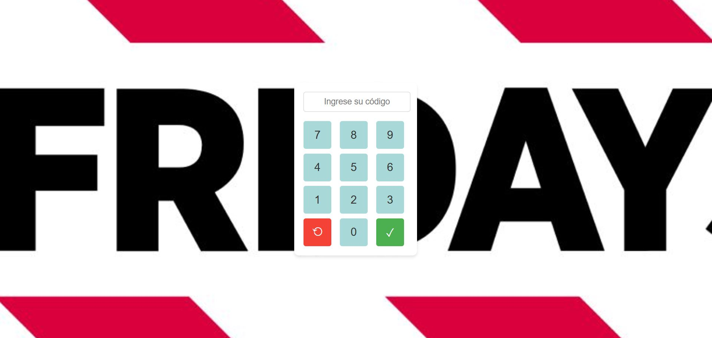
        </td>
    </tr>
    <tr>
        <td><strong>Asignación de Mesa</strong></td>
        <td>
            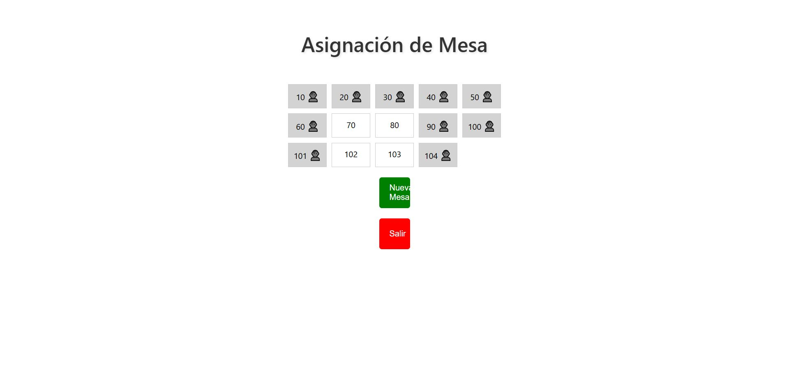
        </td>
    </tr>
    <tr>
        <td><strong>Selección de productos del Pedido</strong></td>
        <td>
            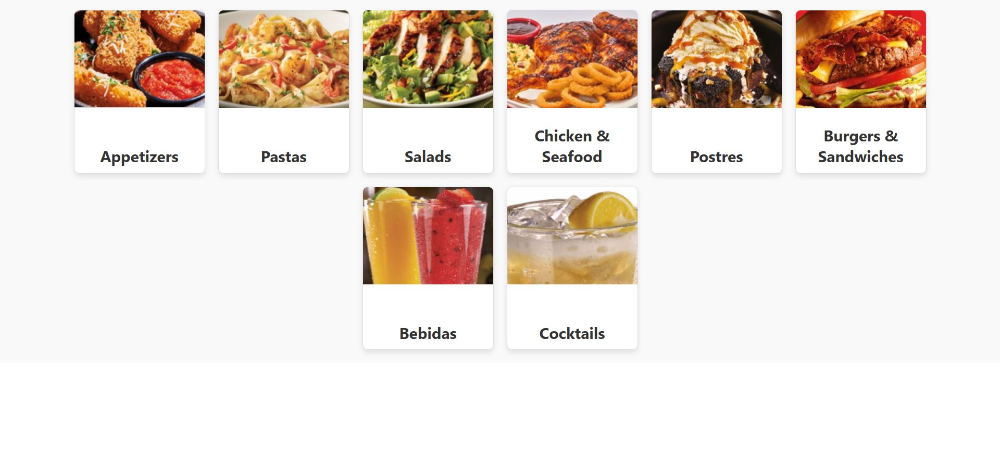
        </td>
    </tr>
    <tr>
        <td><strong>Selección de la cantidad del producto</strong></td>
        <td>
            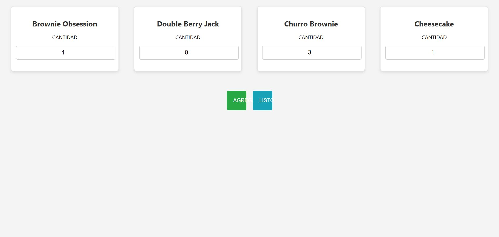
        </td>
    </tr>
    <tr>
        <td><strong>Summary del Pedido</strong></td>
        <td>
            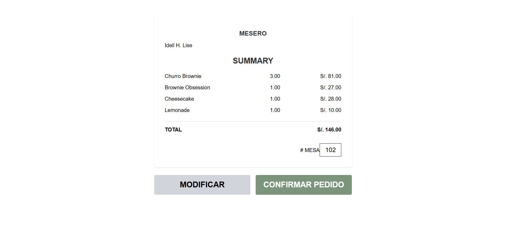
        </td>
    </tr>
</table>


# Módulo 4
## Pantalla de direccionamiento al módulo
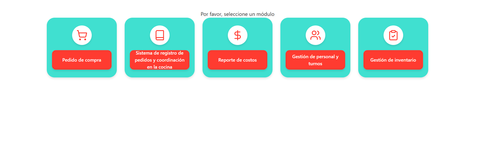

## Pantalla total de la funcionalidad implementada
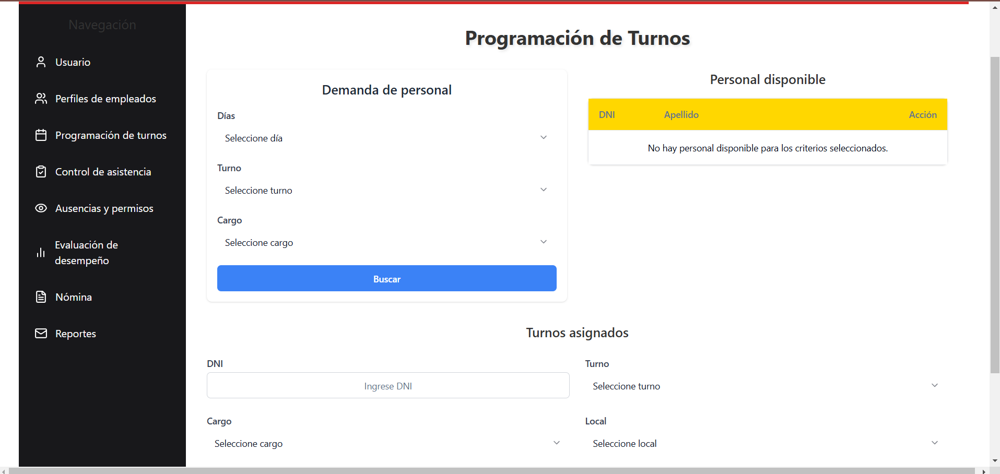

## Demanda de personal
Se ingresan los campos de día, turno y cargo para la busqueda de personal


## Personal disponible
Se muestra el DNI y el primer apellido del personal que cumple los requisitos de la búsqueda, además se tiene la opción de hacer la transacción de asignar el turno al personla que  cumple con los criterios de búsqueda.
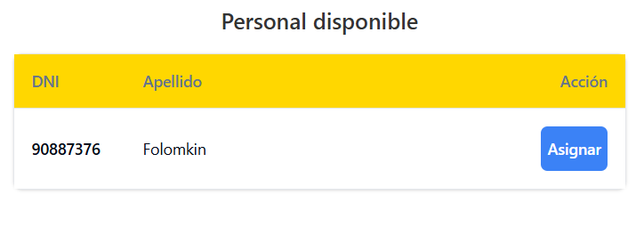


# Módulo 5
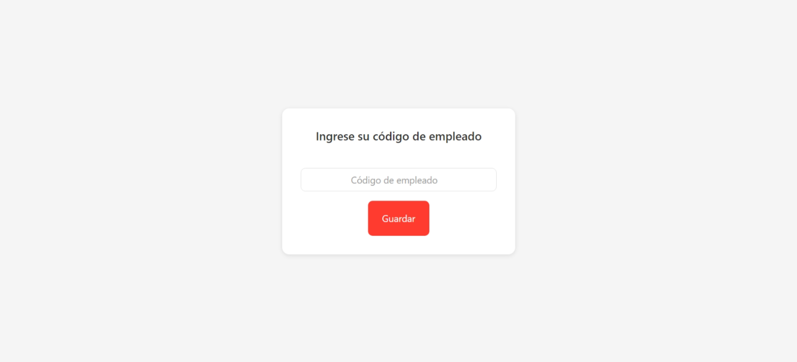
Se coloca el código del empleado que está usando la aplicación (Es un "parche" debido a la falta de login). Para la secuencia actual se usará el código de empleado = 33 que corresnponde al jefe de almacén de la sede Arequipa.

```sql
select concat(e.primer_nombre, ' ',e.primer_apellido) as Nombre, l.nombre_local , c.nombre_cargo 
from empleado e 
inner join "local" l on l.cod_local = e.cod_local 
inner join cargo c on c.cod_cargo = e.cod_cargo 
where e.codigo_empleado = 33
```

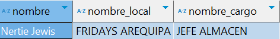

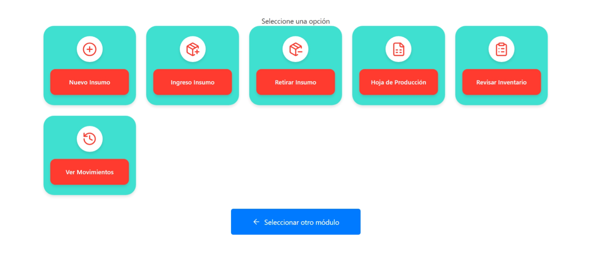
Actualmente solo se ha implementado la funcionalidad primaria: "Ingreso Insumo", usar el botón para iniciar el proceso.

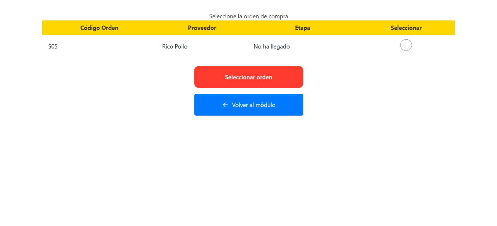
Lo primero que se muestra es una tabla con los datos de las órdenes de compra que deberían llegar ese mismo día
```sql
select oc.cod_ordencompra ,p.nombre_empresa, pi2.nombre_proceso from orden_compra oc 
inner join proveedor p on p.cod_proveedor = oc.cod_proveedor 
inner join proceso_ingreso pi2 on pi2.cod_proceso = oc.cod_proceso 
inner join empleado e on e.codigo_empleado = oc.codigo_empleado 
where e.cod_local = (select e2.cod_local from empleado e2  where e2.codigo_empleado=33)
and oc.fecha_requeridaentrega = '2024-11-28'
order by pi2.cod_proceso asc;
```
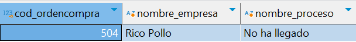

Se selecciona a la orden de compra y se le da a "Seleccionar orden"

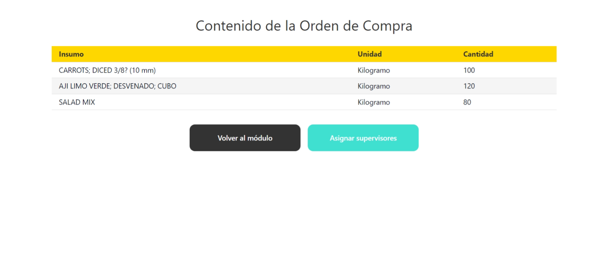

```sql
select i.nombre_insumo, um.nombre_unidad, oc2.cantidad_compra from orden_compra oc 
inner join orden_comprainsumo oc2 on oc2.cod_ordencompra = oc.cod_ordencompra
inner join insumo i on oc2.cod_insumo = i.cod_insumo 
inner join unidad_medidad um on um.cod_unidad = i.cod_unidad 
where oc.cod_ordencompra = 505
```

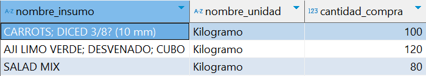

Luego de revisar los insumos que viene en la orden de compra se le da a "Asignar supervisores"

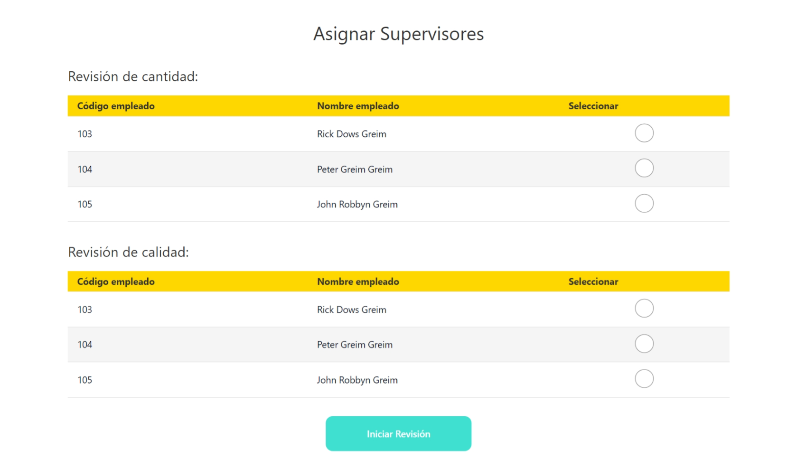
```sql
select 
e.codigo_empleado,
CONCAT(e.primer_nombre,' ', e.primer_apellido,' ', e.segundo_apellido) as "Nombre"
from empleado e 
inner join posee p on p.codigo_empleado = e.codigo_empleado 
where p.cod_habilidad = 6
and e.cod_cargo = 1
and e.cod_local = (select e2.cod_local from empleado e2  where e2.codigo_empleado=33)
```

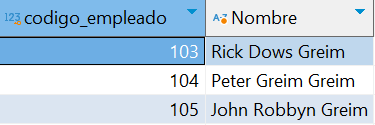

Se selecciona a un supervisor para cada proceso (Se puede repetir), para el caso actual se selecciona a Rick Dows Greim (Código de empleado =103) como supervisor encargado de la revisión de cantidad y a Peter Greim Greim (Código de empleado =104) como supervisor encargado de la revisión de calidad.

Al darle al botón se crean tuplas de la tabla Revision:

```sql
select * from revision r where r.cod_ordencompra = 505
```

Antes de darle al botón:
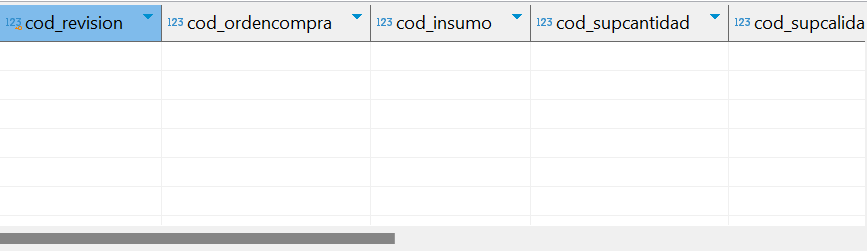

Después de darle al botón:
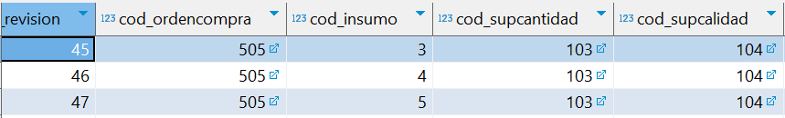

La siguiente pantalla a la que lleva es a la correspondiente a la revisión de cantidades recibidas, el usuario coloca las cantidades que se obtuvieron en las mediciones.

Para este caso se colocaron:

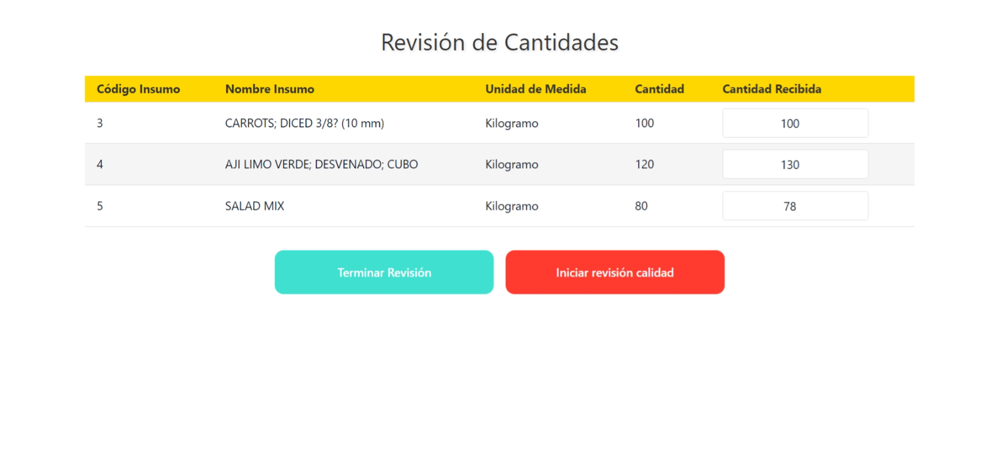

Luego se usa el botón "Terminar revisión"

```sql
select * from revision r where r.cod_ordencompra = 505
```

Antes de darle al botón:
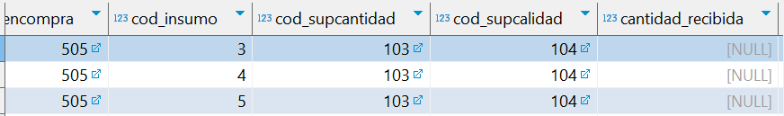

Después de darle al botón:


Luego se le da a "Iniciar revisión calidad" para pasar a la siguiente pantalla.
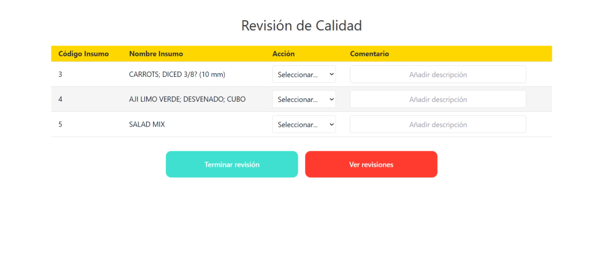

Se coloca una opción de la lista desplegable para categorizar el estado de la mercadería al momento de recibirla, además de colocar una descripción.

Para el caso actual se coloca lo siguiente:
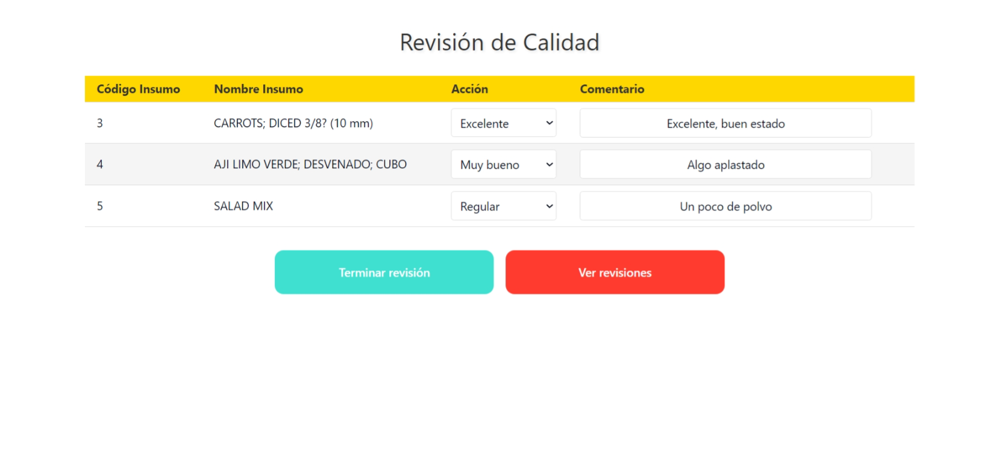

Una vez colocados todos los datos se le da a "Terminar revisión"

```sql
select * from revision r where r.cod_ordencompra = 505
```

Antes de darle al botón:


Luego de darle al botón:
![alt text]./Images_screen/Módulo5/(image-19.png)

Luego se le da a ver revisiones para ver un resumen de las revisiones hechas:

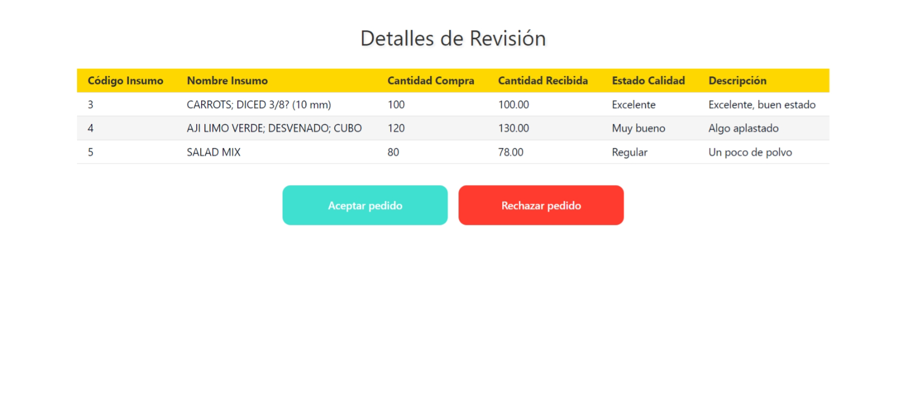

``` sql
SELECT 
    i.cod_insumo, 
    i.nombre_insumo, 
    oc2.cantidad_compra, 
    r.cantidad_recibida, 
    c.estado, 
    r.descripcion  
FROM 
    revision r
INNER JOIN 
    insumo i ON r.cod_insumo = i.cod_insumo 
INNER JOIN 
    orden_compra oc ON oc.cod_ordencompra = r.cod_ordencompra
INNER JOIN 
    orden_comprainsumo oc2 ON oc.cod_ordencompra = oc2.cod_ordencompra 
AND 
    oc2.cod_insumo = r.cod_insumo
INNER JOIN 
    calidad c ON c.cod_calidad = r.cod_calidad 
WHERE 
    r.cod_ordencompra = 505;
```


Luego se decide si se acepta o no, para este caso se da a "Aceptar pedido"

La siguiente pantalla es la siguiente:
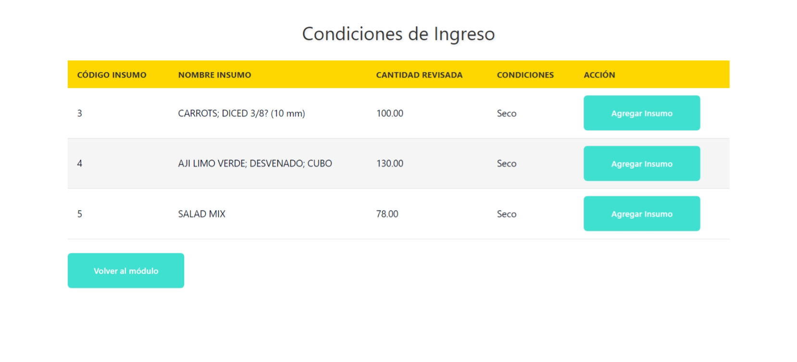

```sql
select distinct i.cod_insumo, i.nombre_insumo, r.cantidad_recibida, c.nombre_condiciones
from revision r
inner join insumo i on r.cod_insumo = i.cod_insumo
inner join condiciones c on c.cod_condiciones = i.cod_condiciones 
where r.cod_ordencompra = 505
```

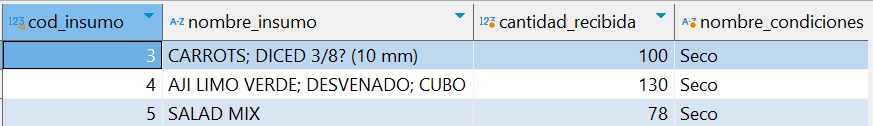

Luego se selecciona la opción de "Agregar insumo", en este caso se seleccionará el de la primera fila (Código insumo = 3)

Al darle el botón se muestra la siguiente pantalla:
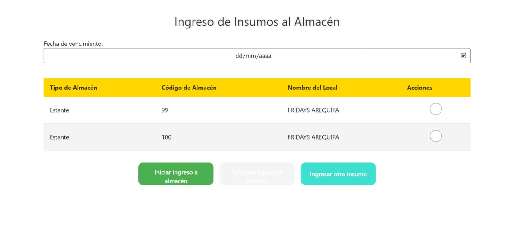

Las opciones de almacén son los que están en el mismo local del empleado que está usando la aplicación y que tienen compatibilidad con las condiciones de almacenamiento del insumo.
```sql
SELECT ta.nombre_tipo_almacen, a.cod_almacen, l.nombre_local 
FROM almacen a
INNER JOIN "local" l ON a.cod_local = l.cod_local
INNER JOIN tipo_almacen ta ON ta.cod_tipo_almacen = a.cod_tipo_almacen
INNER JOIN Compatibilidad c ON c.cod_tipo_almacen = ta.cod_tipo_almacen 
INNER JOIN condiciones co ON co.cod_condiciones = c.cod_condiciones
WHERE a.cod_local = (select e2.cod_local from empleado e2  where e2.codigo_empleado=33)
AND co.cod_condiciones = (
SELECT i.cod_condiciones
FROM insumo i
WHERE i.cod_insumo = 3
)
```

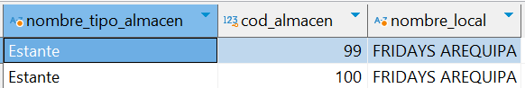

Luego se selecciona un almacénm y se pone la fecha de vencimiento de los insumos que se van a agregar:

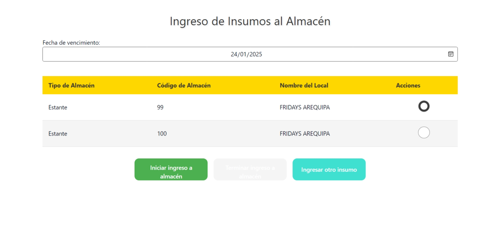

Luego se le da al botón  "Iniciar ingreso a almacén" para hacer 2 cosas: Crear el stock e iniciar con el registro del movimiento (similar a una transacción)
```sql
select * from stock s order by cod_stock desc
```

```sql
select * from movimiento m order by m.cod_movimiento desc
```

Antes de darle al botón:
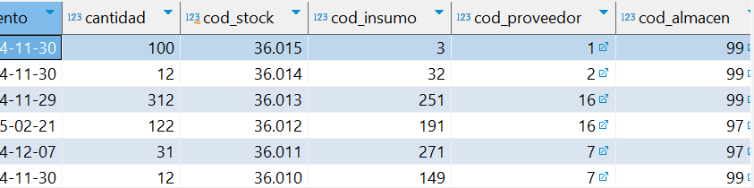

No hay movimiento debido a que todavía no se crea el stock.

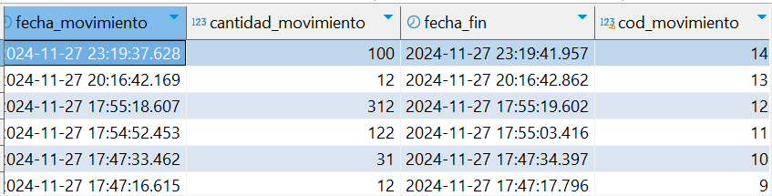

Después de darle al botón:

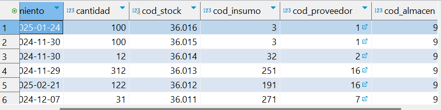

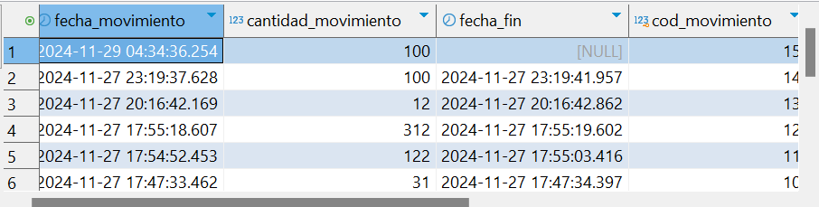


Finalmente, se le da a opción "Terminar ingreso a almacén" para guardar la hora del término de la actividad.

Antes de darle al botón:


Después de darle al botón:

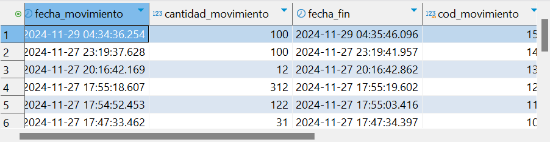


Una vez terminado el ingreso del insumo se selecciona la opción de "Ingresar otro insumo"

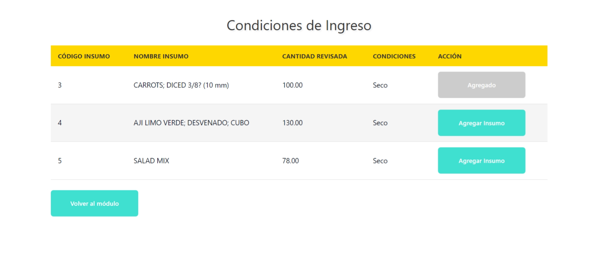

No se podrá seleccionar los insumos que ya hayan sido seleccionados con anterioridad.
Este proceso de ingreso se repetirá para cada uno de los insumos incluidos en la orden de compra.
