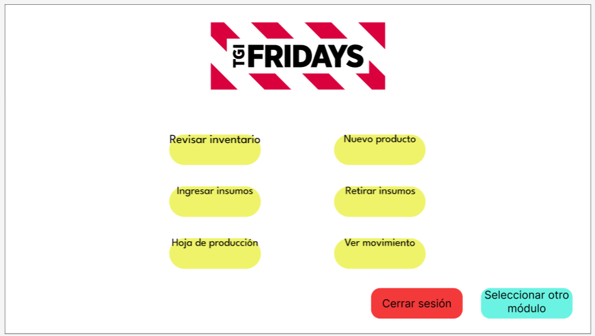
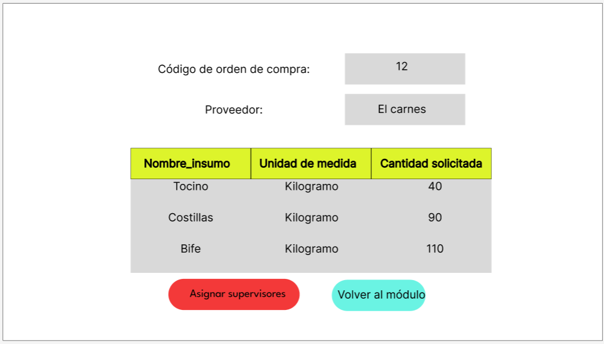
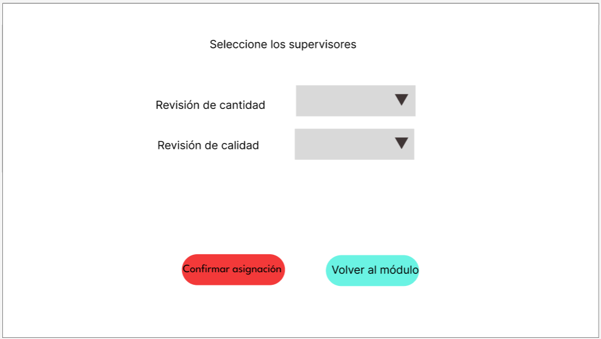
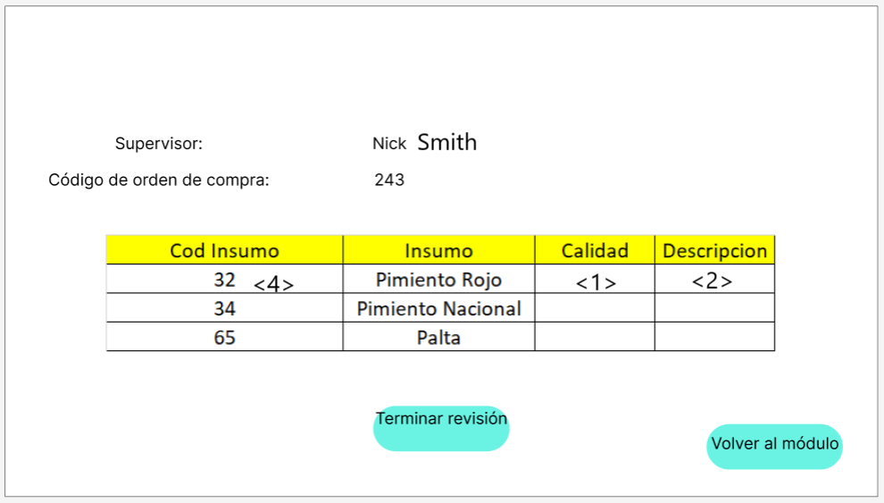
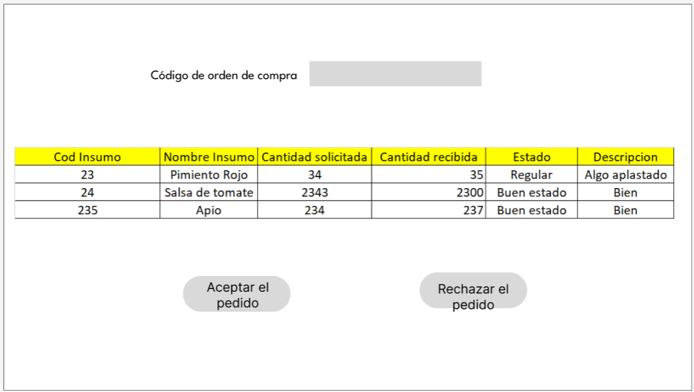
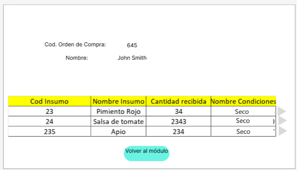

# Diferencias con el prototipo del Módulo 5

La siguiente interfaz no está en el prototipo:

La siguiente interfaz se cambió de diseño al implementarla:

Prototipo:

Aplicación:

La siguiente interfaz se cambió de diseño al implementarla:

Prototipo:

Aplicación:

Otro cambio:

Prototipo:

Aplicación

Se juntaron estas 2 interfaces por temas de tiempo:

Aplicación: 

Otro cambio, se omitió la información del código de supervisión y el código de la orden de compra. El cambio fue por temas de tiempo:

Prototipo:

Aplicación:

Otro cambio, se omitió la información del código de supervisión y el código de la orden de compra. El cambio fue por temas de tiempo:

Prototipo:

Aplicación:

Otro cambio, se omitió la información del código de orden de compra:

Prototipo:

Aplicación:

En esta interfaz se omitió mucha información que estaba presente en el prototipo:

Prototipo:

Aplicación:

En esta interfaz se omitió mucha información que estaba presente en el prototipo por temas de tiempo, además creo que no es información tan relevante:

Prototipo:

Aplicación:

