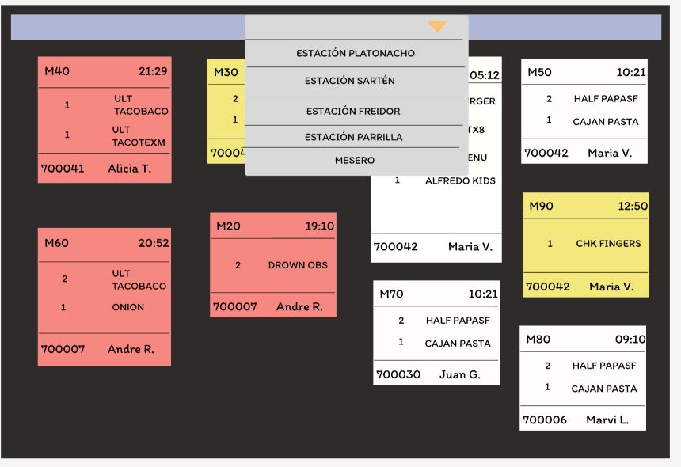

# 11.4. Próximos pasos

# Módulo 1

# Modulo 2: Sistema de Registro de Pedidos

El objetivo principal de la implementación actual fue cubrir el flujo básico de registro de pedidos de mesa, abarcando desde la autenticación del mesero hasta la confirmación final del pedido. Sin embargo, algunas funcionalidades relacionadas con la distribución de los ítems del pedido entre las estaciones de cocina quedaron pendientes, lo cual es esencial para completar la solución. A continuación, se muestran las pantallas de dicha funcionalidad

Esto es fundamental para garantizar que cada estación reciba las órdenes correspondientes de manera eficiente, lo que optimiza el proceso en un entorno real de restaurante. Por tanto, para cumplir con los otros requerimientos, se pueden abordar las siguientes actividades:

- Implementación de la distribución de ítems entre estaciones de cocina:Crear un sistema que asigne los pedidos de manera automática a las diferentes estaciones de cocina según el tipo de comida (entrantes, platos principales, postres, etc.).

- Realizar pruebas de integración para asegurarnos de que las pantallas y los sistemas de base de datos interactúan correctamente.
Asegurar que la distribución de pedidos se realice de forma eficiente y que la comunicación entre las estaciones de cocina sea fluida.

- Optimización del rendimiento: Asegurarnos de que el sistema maneje correctamente los picos de pedidos, especialmente durante las horas de mayor demanda.
Implementar técnicas de caching o colas de procesamiento para garantizar que el sistema sea escalable y no se vea afectado por altos volúmenes de pedidos.

# Módulo 4

- Implementar los casos de uso que faltan, en especial el login que brinde acceso a cierta parte de la apliación de acuerdo al rol que cumplen el personal que ingresa.
- Realizar pruebas de integración, para verificar que cumplan con las especificaciones de los casos de uso de la aplicación en general
- Mejoras en  las buenas practicas de programación, como los principios SOLID.
- Revisar la arquitectura de base de datos, agregando campos como considerar el historial de inicio de sesión de los empleados.
- Uniformización de las pantallas de los diferentes módulos.

# Módulo 5
Implementar los otros casos de uso: Elaboración de hoja de producción, salida de almacén, ingreso de un nuevo insumo, ver inventario, ver historial de movimientos.

Para los casos de salida de almacén y mejora del proceso de ingreso de debería hallar una manera de poder cuantificar la capacidad de cada almacén y actualizarla conforme entran o salen insumos (se debería agregar un atributo capacidad a la tabla almacén, quizás también se podría agregar un atributo espacio_por_unidad a cada insumo)

Se podría implementar login para controlar los permisos de acceso de cada usuario a las funciones según el cargo que tengan.
