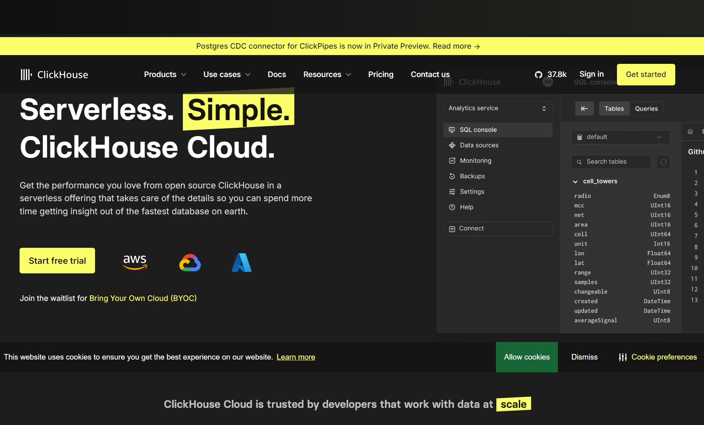
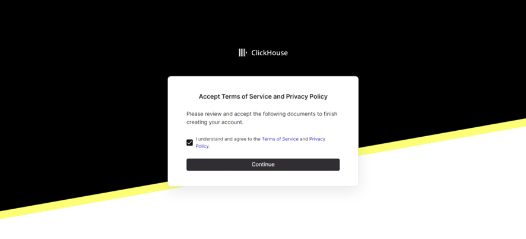
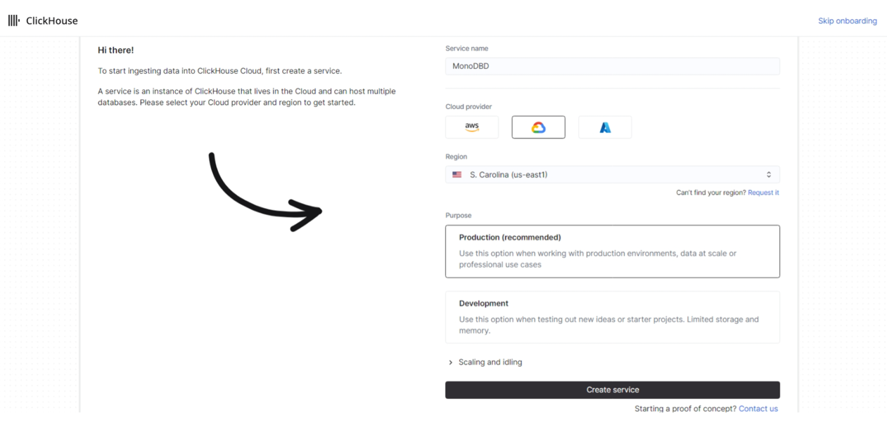
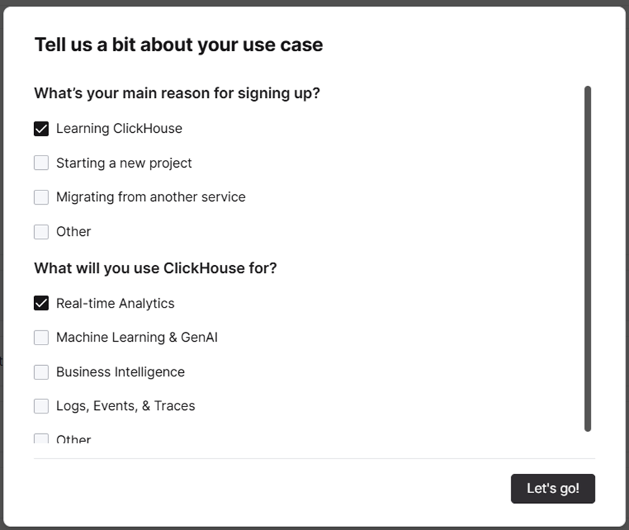
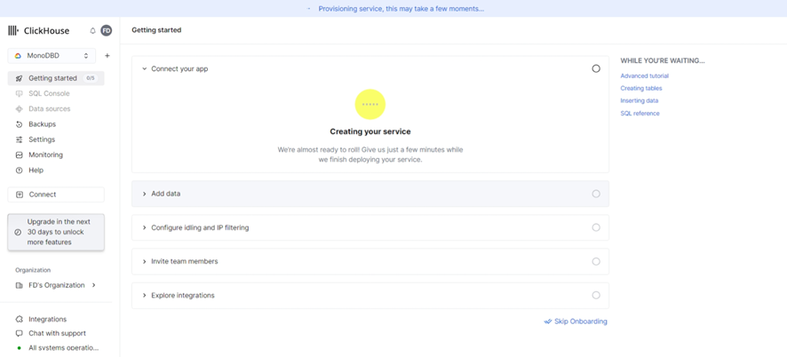

# 12.3. Configuración

Se usó ClickHouse cloud debido a que, según la [documentación](https://clickhouse.com/docs), es la manera más rápida de usar ClickHouse.

Para ingresar: [Click aquí](https://clickhouse.com/cloud)

Se seleccionó la opción "Start free trial", en nuestro caso usamos una cuenta de google compartida.

Se aceptaron los términos y condiciones.

Al servicio se le puso de nombre "MonoDBD", se seleccionó "Google Cloud" como nube, se seleccionó la región "S. Carolina (us-east1) y se seleccionó "Production", finalmente se usó el botón "Create service"

Una vez creado el servicio, se tiene que llenar una encuesta sobre el uso de ClickHouse.

Finalmente, se tiene que esperar la creación del servicio. Una vez terminado se hicieron los pasos indicados en [implementación](../12.4/12.4.md)
Sample content for section 12.3.