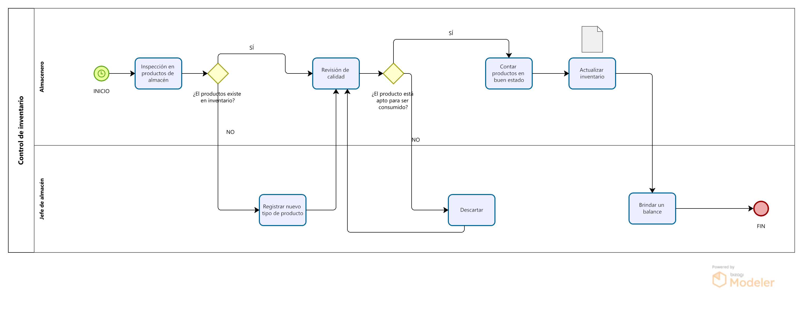

# 2.1. Procesos AS-IS

# Proceso de entrada de insumos

## Proceso de ingreso de insumos

<table border="1">
	<tbody>
		<tr>
			<td>Secuencia</td>
			<td>Actividad</td>
			<td>Descripción</td>
			<td>Responsable</td>
		</tr>
		<tr>
			<td>1</td>
			<td>Entrega de mercadería en el despacho</td>
			<td>Se recibe al camión transportista del proveedor</td>
			<td>Transportista</td>
		</tr>
		<tr>
			<td>2</td>
			<td>Revisión de la carga según orden de compra</td>
			<td>Se realiza una inspección para verificar la cantidad y calidad del producto</td>
			<td>Jefe de almacén</td>
		</tr>
        <tr>
			<td>3</td>
			<td>Llamar al área de compras</td>
			<td>Se llama al jefe de compras en caso el contenido de la carga sea distinto al indicado en la solicitud</td>
			<td>Jefe de almacén</td>
		</tr>
        <tr>
			<td>4</td>
			<td>Contestar llamada y dar órdenes</td>
			<td>Responde la llamada y da indicaciones para actuar.</td>
			<td>Área de compras</td>
		</tr>
        <tr>
			<td>5</td>
			<td>Realizar lo indicado por el área de compras</td>
			<td>Se obedecen las órdenes del área de compras</td>
			<td>Jefe de almacén</td>
		</tr>
        <tr>
			<td>6</td>
			<td>Firmar/Aceptar la solicitud</td>
			<td>Se aprueba la solicitud del llegado de la mercadería</td>
			<td>Jefe de almacén</td>
		</tr>
        <tr>
			<td>7</td>
			<td>Traslado al almacén</td>
			<td>Se traslada la mercadería a almacén</td>
			<td>Almacenero</td>
		</tr>
        <tr>
			<td>8</td>
			<td>Rechazar el pedido</td>
			<td>Debido a la mala calidad de la mercadería, el pedido es rechazado</td>
			<td>Jefe de almacén</td>
		</tr>
	</tbody>
</table>

# Proceso de salida de insumos

<table border="1">
	<tbody>
		<tr>
			<td>Secuencia</td>
			<td>Actividad</td>
			<td>Descripción</td>
			<td>Responsable</td>
		</tr>
		<tr>
			<td>1</td>
			<td>Llenar hoja de producción</td>
			<td>Se llena una hoja de producción con todos los platos que se prepararán.</td>
			<td>Jefe de almacén</td>
		</tr>
		<tr>
			<td>2</td>
			<td>Revisar hoja de producción</td>
			<td>La estación de cocina revisa la hoja de producción para ir haciendo preparativos para la cocina</td>
			<td>Estación de cocina</td>
		</tr>
        <tr>
			<td>3</td>
			<td>Realizar pedido interno</td>
			<td>La estación de cocina realiza el pedido de los insumos a almacén.</td>
			<td>Estación de cocina</td>
		</tr>
        <tr>
			<td>4</td>
			<td>Recepción del pedido interno</td>
			<td>Se recibe y se empieza a preparar el pedido de la estación de cocina.</td>
			<td>Almacenero</td>
		</tr>
        <tr>
			<td>5</td>
			<td>Notificar imposibilidad de cumplir el pedido interno</td>
			<td>Se informa a la estación de cocina que no es posible cumplir con el pedido.</td>
			<td>Almacenero</td>
		</tr>
        <tr>
			<td>6</td>
			<td>Notificar al jefe de almacén</td>
			<td>Se informa al jefe de almacén que no hay insumos disponible para la producción indicada en la hoja de producción. </td>
			<td>Almacenero</td>
		</tr>
        <tr>
			<td>7</td>
			<td>Notificar al área de compras</td>
			<td>El jefe de almacen informa la falta de disponibilidad de un insumo al área de compras.</td>
			<td>Jefe de almacén</td>
		</tr>
        <tr>
			<td>8</td>
			<td>Cambiar hoja de producción</td>
			<td>El jefe de almacén cambia la hoja de producción debido a la falta de insumos.</td>
			<td>Jefe de almacén</td>
		</tr>
        <tr>
			<td>9</td>
			<td>Buscar productos en almacén</td>
			<td>Los almaceneros buscan los insumos en almacén y arman el pedido indicado por la estación de cocina</td>
			<td>Almacenero</td>
		</tr>
        <tr>
			<td>10</td>
			<td>Entrega de insumos</td>
			<td>Se realiza la entrega de los insumos al área de cocina.</td>
			<td>Almacenero</td>
		</tr>
        <tr>
			<td>11</td>
			<td>Recepción de insumo</td>
			<td>La estación de cocina recibe los insumos solicitados al almacen.</td>
			<td>Estación de cocina</td>
		</tr>
	</tbody>
</table>

# Proceso de revisión y actualización de stock

<table border="1">
	<tbody>
		<tr>
			<td>Secuencia</td>
			<td>Actividad</td>
			<td>Descripción</td>
			<td>Responsable</td>
		</tr>
		<tr>
			<td>1</td>
			<td>Inspección de productos en almacén</td>
			<td>Semanalmente se realiza una inspección de almacen para actualizar inventario.</td>
			<td>Almacenero</td>
		</tr>
		<tr>
			<td>2</td>
			<td>Registrar nuevo tipo de producto</td>
			<td>Al identificarse un nuevo tipo de producto se registran sus datos en el inventario</td>
			<td>Jefe de almacén</td>
		</tr>
        <tr>
			<td>3</td>
			<td>Revisión de calidad</td>
			<td>Se revisa el estado actual de los insumos</td>
			<td>Almacenero</td>
		</tr>
        <tr>
			<td>4</td>
			<td>Descartar</td>
			<td>Se descarta y retira de almacen el insumo debido al mal estado actual.</td>
			<td>Almacenero</td>
		</tr>
        <tr>
			<td>5</td>
			<td>Contar productos en buen estado</td>
			<td>Se obtiene la cantidad de los productos en buen estado.</td>
			<td>Almacenero</td>
		</tr>
        <tr>
			<td>6</td>
			<td>Actualizar inventario</td>
			<td>Se actualizan los datos en inventario</td>
			<td>Almacenero</td>
		</tr>
        <tr>
			<td>7</td>
			<td>Brindar un balance</td>
			<td>Se brinda un balance de entrada-salida de insumos</td>
			<td>Jefe de almacén</td>
		</tr>
	</tbody>
</table>