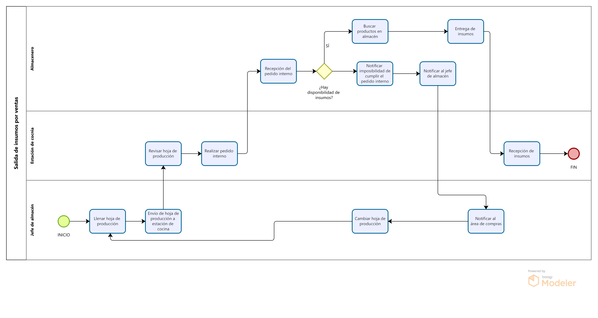

# 2.1. Procesos AS-IS

---

# Módulo 2: Sistema de Registro de Pedidos y Comunicación de Cocina

<table>
  <thead>
    <tr>
      <th>Nro</th>
      <th>Actividad</th>
      <th>Descripción</th>
	  <th>Responsable</th>
    </tr>
  </thead>
  <tbody>
    <tr>
      <td>1</td>
      <td>Requerimientos de la mesa</td>
      <td>El cliente expresa sus necesidades al mesero, indicando el pedido que desea.</td>
	  <td>Cliente</td>
    </tr>
    <tr>
      <td>2</td>
      <td>Tomar pedido de la mesa</td>
      <td>El mesero toma nota del pedido.</td>
	  <td>Mesero</td>
    </tr>
    <tr>
      <td>3</td>
      <td>Colocar hoja de comandas</td>
      <td>La hoja con los detalles del pedido se coloca en una estación visible en la cocina.</td>
	  <td>Mesero</td>
    </tr>
    <tr>
      <td>4</td>
      <td>Verificar pedido en cada estación</td>
      <td>El personal de cocina revisa la hoja de comanda y coordina entre estaciones.</td>
	  <td>Estación de cocina</td>
    </tr>
    <tr>
      <td>5</td>
      <td>Coordinar preparación entre estaciones</td>
      <td>Coordinación de cada estación de cócina para la preparación final del pedido de la mesa</td>
	  <td>Estación de cocina</td>
    </tr>
    <tr>
      <td>6</td>
      <td>Notificar que el pedido está listo</td>
      <td>Pedido listo para la entrega de la mesa</td>
	  <td>Estación de cocina</td>
    </tr>
    <tr>
      <td>7</td>
      <td>Entregar el pedido a la mesa</td>
      <td>El mesero entrega el pedido al cliente.</td>
	  <td>Mesero</td>
    </tr>
    <tr>
      <td>8</td>
      <td>Recibir pedido completado</td>
      <td>El cliente recibe el pedido solicitado.</td>
	  <td>Cliente</td>
    </tr>
  </tbody>
</table>

## Módulo 5: Sistema de gestión de inventario

## Proceso de entrada de insumos

<table border="1">
	<tbody>
		<tr>
			<td>Secuencia</td>
			<td>Actividad</td>
			<td>Descripción</td>
			<td>Responsable</td>
		</tr>
		<tr>
			<td>1</td>
			<td>Entrega de mercadería en el despacho</td>
			<td>Se recibe al camión transportista del proveedor</td>
			<td>Transportista</td>
		</tr>
		<tr>
			<td>2</td>
			<td>Revisión de la carga según orden de compra</td>
			<td>Se realiza una inspección para verificar la cantidad y calidad del producto</td>
			<td>Jefe de almacén</td>
		</tr>
        <tr>
			<td>3</td>
			<td>Llamar al área de compras</td>
			<td>Se llama al jefe de compras en caso el contenido de la carga sea distinto al indicado en la solicitud</td>
			<td>Jefe de almacén</td>
		</tr>
        <tr>
			<td>4</td>
			<td>Contestar llamada y dar órdenes</td>
			<td>Responde la llamada y da indicaciones para actuar.</td>
			<td>Área de compras</td>
		</tr>
        <tr>
			<td>5</td>
			<td>Realizar lo indicado por el área de compras</td>
			<td>Se obedecen las órdenes del área de compras</td>
			<td>Jefe de almacén</td>
		</tr>
        <tr>
			<td>6</td>
			<td>Firmar/Aceptar la solicitud</td>
			<td>Se aprueba la solicitud del llegado de la mercadería</td>
			<td>Jefe de almacén</td>
		</tr>
        <tr>
			<td>7</td>
			<td>Traslado al almacén</td>
			<td>Se traslada la mercadería a almacén</td>
			<td>Almacenero</td>
		</tr>
        <tr>
			<td>8</td>
			<td>Rechazar el pedido</td>
			<td>Debido a la mala calidad de la mercadería, el pedido es rechazado</td>
			<td>Jefe de almacén</td>
		</tr>
	</tbody>
</table>

## Proceso de salida de insumos

<table border="1">
	<tbody>
		<tr>
			<td>Secuencia</td>
			<td>Actividad</td>
			<td>Descripción</td>
			<td>Responsable</td>
		</tr>
		<tr>
			<td>1</td>
			<td>Llenar hoja de producción</td>
			<td>Se llena una hoja de producción con todos los platos que se prepararán.</td>
			<td>Jefe de almacén</td>
		</tr>
		<tr>
			<td>2</td>
			<td>Revisar hoja de producción</td>
			<td>La estación de cocina revisa la hoja de producción para ir haciendo preparativos para la cocina</td>
			<td>Estación de cocina</td>
		</tr>
        <tr>
			<td>3</td>
			<td>Realizar pedido interno</td>
			<td>La estación de cocina realiza el pedido de los insumos a almacén.</td>
			<td>Estación de cocina</td>
		</tr>
        <tr>
			<td>4</td>
			<td>Recepción del pedido interno</td>
			<td>Se recibe y se empieza a preparar el pedido de la estación de cocina.</td>
			<td>Almacenero</td>
		</tr>
        <tr>
			<td>5</td>
			<td>Notificar imposibilidad de cumplir el pedido interno</td>
			<td>Se informa a la estación de cocina que no es posible cumplir con el pedido.</td>
			<td>Almacenero</td>
		</tr>
        <tr>
			<td>6</td>
			<td>Notificar al jefe de almacén</td>
			<td>Se informa al jefe de almacén que no hay insumos disponible para la producción indicada en la hoja de producción. </td>
			<td>Almacenero</td>
		</tr>
        <tr>
			<td>7</td>
			<td>Notificar al área de compras</td>
			<td>El jefe de almacen informa la falta de disponibilidad de un insumo al área de compras.</td>
			<td>Jefe de almacén</td>
		</tr>
        <tr>
			<td>8</td>
			<td>Cambiar hoja de producción</td>
			<td>El jefe de almacén cambia la hoja de producción debido a la falta de insumos.</td>
			<td>Jefe de almacén</td>
		</tr>
        <tr>
			<td>9</td>
			<td>Buscar productos en almacén</td>
			<td>Los almaceneros buscan los insumos en almacén y arman el pedido indicado por la estación de cocina</td>
			<td>Almacenero</td>
		</tr>
        <tr>
			<td>10</td>
			<td>Entrega de insumos</td>
			<td>Se realiza la entrega de los insumos al área de cocina.</td>
			<td>Almacenero</td>
		</tr>
        <tr>
			<td>11</td>
			<td>Recepción de insumo</td>
			<td>La estación de cocina recibe los insumos solicitados al almacen.</td>
			<td>Estación de cocina</td>
		</tr>
	</tbody>
</table>

## Proceso de revisión y actualización de stock

<table border="1">
	<tbody>
		<tr>
			<td>Secuencia</td>
			<td>Actividad</td>
			<td>Descripción</td>
			<td>Responsable</td>
		</tr>
		<tr>
			<td>1</td>
			<td>Inspección de productos en almacén</td>
			<td>Semanalmente se realiza una inspección de almacen para actualizar inventario.</td>
			<td>Almacenero</td>
		</tr>
		<tr>
			<td>2</td>
			<td>Registrar nuevo tipo de producto</td>
			<td>Al identificarse un nuevo tipo de producto se registran sus datos en el inventario</td>
			<td>Jefe de almacén</td>
		</tr>
        <tr>
			<td>3</td>
			<td>Revisión de calidad</td>
			<td>Se revisa el estado actual de los insumos</td>
			<td>Almacenero</td>
		</tr>
        <tr>
			<td>4</td>
			<td>Descartar</td>
			<td>Se descarta y retira de almacen el insumo debido al mal estado actual.</td>
			<td>Almacenero</td>
		</tr>
        <tr>
			<td>5</td>
			<td>Contar productos en buen estado</td>
			<td>Se obtiene la cantidad de los productos en buen estado.</td>
			<td>Almacenero</td>
		</tr>
        <tr>
			<td>6</td>
			<td>Actualizar inventario</td>
			<td>Se actualizan los datos en inventario</td>
			<td>Almacenero</td>
		</tr>
        <tr>
			<td>7</td>
			<td>Brindar un balance</td>
			<td>Se brinda un balance de entrada-salida de insumos</td>
			<td>Jefe de almacén</td>
		</tr>
	</tbody>
</table>

## Módulo 4: Proceso de gestión de turnos

<table border="1">
  <thead>
    <tr>
      <th>ORDEN</th>
      <th>ACTIVIDAD</th>
      <th>DESCRIPCIÓN</th>
      <th>RESPONSABLE</th>
    </tr>
  </thead>
  <tbody>
    <tr>
      <td>1</td>
      <td>Identificación de necesidad de personal</td>
      <td>El gerente identifica la necesidad de personal basándose en las previsiones de demanda, por ejemplo, fines de semana, eventos especiales o demanda habitual.</td>
      <td>Gerente de restaurante</td>
    </tr>
    <tr>
      <td>2</td>
      <td>Asignación de turnos</td>
      <td>El gerente utiliza un software de gestión de personal para crear los horarios, basados en la disponibilidad de los empleados; sin embargo, la asignación final de los turnos depende de la intervención manual del gerente. Los empleados son notificados por correo electrónico.</td>
      <td>Gerente de restaurante</td>
    </tr>
    <tr>
      <td>3</td>
      <td>Evaluación manual de la solicitud</td>
      <td>El gerente evalúa la solicitud de cambio de turno realizada por un empleado.</td>
      <td>Gerente de restaurante</td>
    </tr>
    <tr>
      <td>4</td>
      <td>Actualización del sistema</td>
      <td>Si la solicitud de cambio de turno procede, se actualiza el sistema con un nuevo personal signado por el gerente.</td>
      <td>Gerente de restaurante</td>
    </tr>
    <tr>
      <td>5</td>
      <td>Notificación al empleado sobre la solicitud</td>
      <td>Envío de un correo de la aceptación o no de la solicitud de cambio de turno y los detalles de esta.</td>
      <td>Gerente de restaurante</td>
    </tr>
    <tr>
      <td>6</td>
      <td>Control de asistencia</td>
      <td>Se realiza mediante tarjetas de fichaje, las ausencias y retrasos son registrados automáticamente, pero las justificaciones o ajustes deben ser procesados por el gerente.</td>
      <td>Empleado</td>
    </tr>
    <tr>
      <td>7</td>
      <td>Revisión manual de gerente sobre falta o atraso</td>
      <td>El gerente procesa el caso, revisa la justificación del empleado en caso de haberla.</td>
      <td>Gerente de restaurante</td>
    </tr>
    <tr>
      <td>8</td>
      <td>Notificación al empleado sobre el atraso o falta</td>
      <td>Si se comprueba la falta o atraso sin justificación, se notifica al empleado por correo electrónico.</td>
      <td>Gerente de restaurante</td>
    </tr>
    <tr>
      <td>9</td>
      <td>Registrar horas trabajadas</td>
      <td>Se generan reportes automáticos de las horas trabajadas con un software y los envía al gerente y al encargado de nómina.</td>
      <td>Gerente de restaurante</td>
    </tr>
    <tr>
      <td>10</td>
      <td>Exportar datos a nómina</td>
      <td>El encargado de nómina revisa y exporta los datos a un sistema de nómina para el cálculo final.</td>
      <td>Encargado de nómina</td>
    </tr>
    <tr>
      <td>11</td>
      <td>Evaluación de desempeño</td>
      <td>El gerente realiza la evaluación del desempeño basada en los datos de asistencia y otras métricas.</td>
      <td>Gerente de restaurante</td>
    </tr>
  </tbody>
</table>
