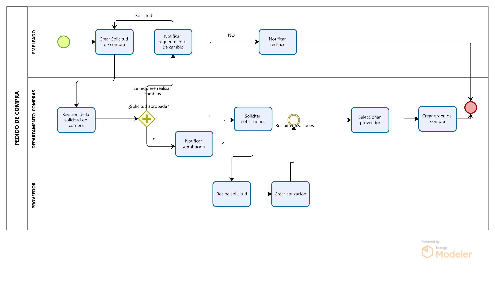
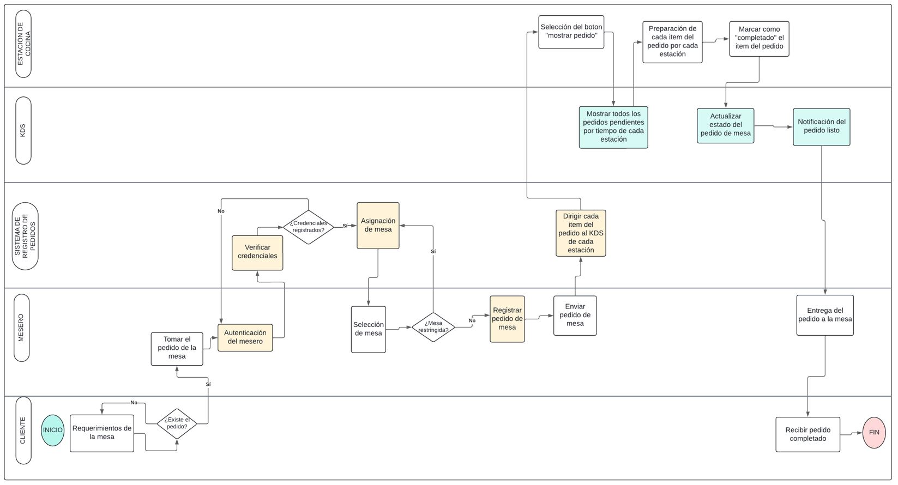
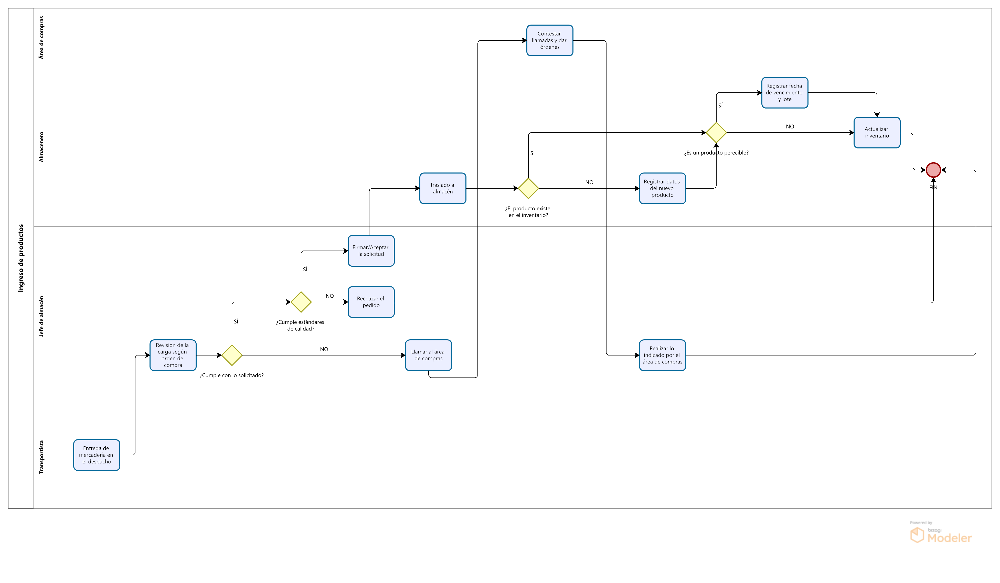
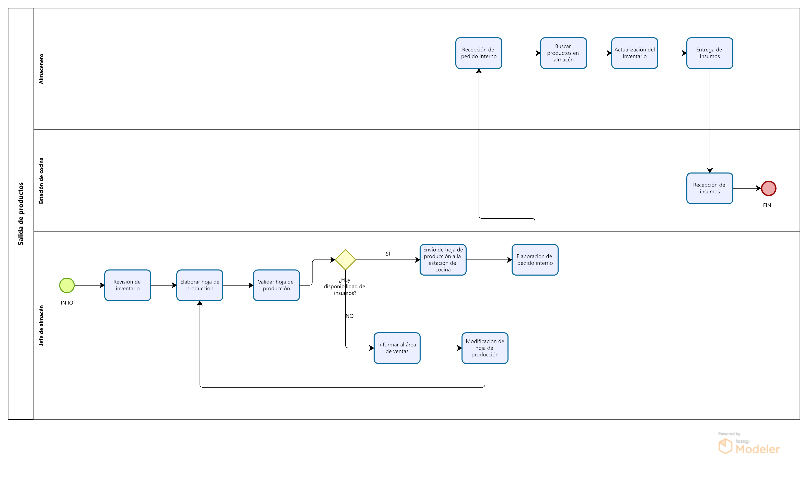
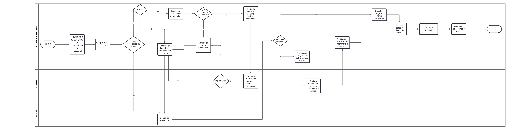
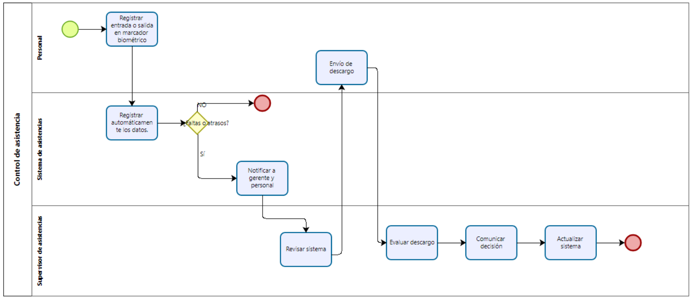
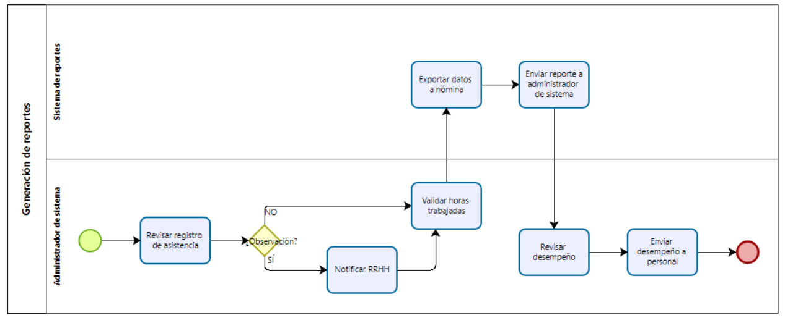
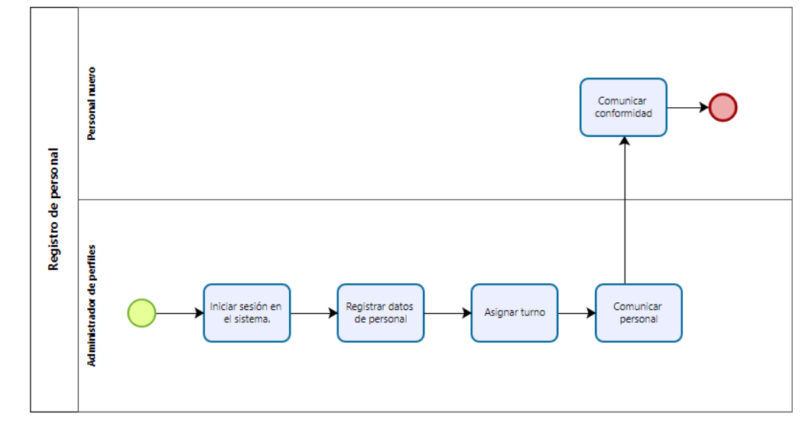
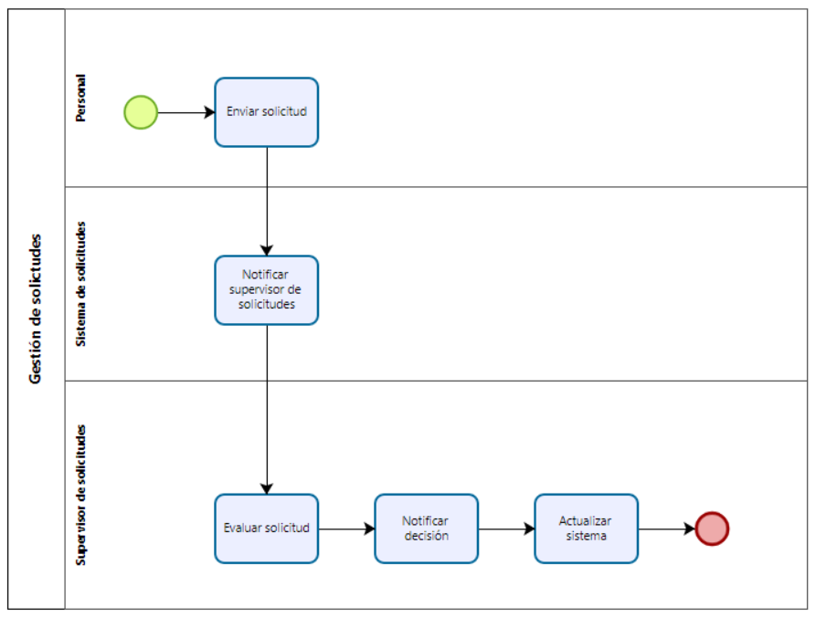

# 2.2. Procesos TO-BE

---

# Módulo 1: Sistema de Pedidos de compra

<table>
  <thead>
    <tr>
      <th>Nro</th>
      <th>Actividad</th>
      <th>Descripción</th>
	  <th>Responsable</th>
    </tr>
  </thead>
  <tbody>
    <tr>
      <td>1</td>
      <td>Creacion solicitud de compra</td>
      <td>El gerente de cocina selecciona los productos que estan bajos de stock.</td>
    <td>Gerente de cocina</td>
    </tr>
    <tr>
      <td>2</td>
      <td>Revision de solicitud de compra</td>
      <td>El gerente general tiene la autoridad de autorizar o denegar la solicitud</td>
	  <td>Gerente general</td>
    </tr>
    <tr>
      <td>3</td>
      <td>Notificar requerimiento de cambio</td>
      <td>Se solicita modificacion de la solicitud</td>
	  <td>Gerente de cocina</td>
    </tr>
    <tr>
      <td>4</td>
      <td>Notificar rechazo</td>
      <td>El gerente de cocina termina el proceso de pedido de compra.</td>
	  <td>Gerente de cocina</td>
    </tr>
    <tr>
      <td>5</td>
      <td>Notificar aprobación</td>
      <td>El area de compras obtiene la arobacion del gerente general y procede a solicitar cotizaciones</td>
	  <td>Area de compras</td>
    </tr>
    <tr>
      <td>6</td>
      <td>Solicitar cotizaciones</td>
      <td>Se solicita cotizaciones a los proveedores registrados</td>
	  <td>Area de compras</td>
    </tr>
    <tr>
      <td>7</td>
      <td>Revision del reporte de costos</td>
      <td>El area de compras revisa cada cotizacion y compara cada los costos de cada uno. </td>
	  <td>Area de compras</td>
    </tr>
    <tr>
      <td>8</td>
      <td>Seleccionar proveedores</td>
      <td>Se selecciona el mejor proveedor, se debe mostrar la fecha de entrega y costo de cotizacion.</td>
	  <td>Area de compras</td>
    </tr>
    <tr>
      <td>9</td>
      <td>Crear orden de compra</td>
      <td>Se guarda toda la informacion añadida anteriormente y se crea un numero de orden, fecha y modo de pago.</td>
	  <td>Area de compras</td>
    </tr>
  </tbody>
</table>

# Módulo 2: Sistema de Registro de Pedidos y Comunicación de Cocina

<table>
  <thead>
    <tr>
      <th>Nro</th>
      <th>Actividad</th>
      <th>Descripción</th>
	  <th>Responsable</th>
    </tr>
  </thead>
  <tbody>
    <tr>
      <td>1</td>
      <td>Requerimientos de la mesa</td>
      <td>El cliente expresa sus necesidades al mesero, indicando el pedido que desea.</td>
	  <td>Cliente</td>
    </tr>
    <tr>
      <td>2</td>
      <td>Tomar pedido de la mesa</td>
      <td>El mesero toma nota del pedido.</td>
	  <td>Mesero</td>
    </tr>
	<tr>
      <td>3</td>
      <td>Autenticación del mesero</td>
      <td>El mesero se autentica para entrar al sistema.</td>
	  <td>Mesero</td>
    </tr>
    <tr>
      <td>4</td>
      <td>Verificar credenciales</td>
      <td>El sistema verifica que el mesero esté autenticado antes de registrar el pedido.</td>
	  <td>Sistema de Registro de Pedidos</td>
    </tr>
    <tr>
      <td>5</td>
      <td>Asignación de mesa</td>
      <td>El sistema asigna el pedido a la mesa correspondiente.</td>
	  <td>Sistema de Registro de Pedidos</td>
    </tr>
	<tr>
      <td>6</td>
      <td>Selección de mesa</td>
      <td>El mesero selecciona su mesa correspondiente.</td>
	  <td>Mesero</td>
    </tr>
    <tr>
      <td>7</td>
      <td>Registrar pedido de mesa</td>
      <td>El mesero registra electrónicamente el pedido en el sistema.</td>
	  <td>Mesero</td>
    </tr>
    <tr>
      <td>8</td>
      <td>Enviar pedido de mesa</td>
      <td>El mesero confirma el pedido de la mesa.</td>
	  <td>Mesero</td>
    </tr>
	<tr>
      <td>9</td>
      <td>Dirigir cada item del pedido al KDS de cada estación</td>
      <td>El pedido registrado se envía automáticamente al KDS de cada estación de cocina.</td>
	  <td>Sistema de Registro de Pedidos</td>
    </tr>
	<tr>
      <td>10</td>
      <td>Selección del boton "mostar pedido"</td>
      <td>Cada estación de cocina desea visualizar sus pedidos.</td>
	  <td>Estación de cocina</td>
    </tr>
	<tr>
      <td>11</td>
      <td>Mostrar todos los pedidos pendientes por tiempo de cada estación</td>
      <td>El KDS muestra cada item del pedido por estación.</td>
	  <td>KDS</td>
    </tr>
    <tr>
      <td>12</td>
      <td>Preparación del pedido por cada estación</td>
      <td>Cada estación de cocina comienza a preparar los ítems del pedido.</td>
	  <td>Estación de cocina</td>
    </tr>
    <tr>
      <td>13</td>
      <td>Marcar como "completado" el ítem del pedido</td>
      <td>El pedido está emplatado por cada estación.</td>
	  <td>Estación de cocina</td>
    </tr>
    <tr>
      <td>14</td>
      <td>Actualizar estado del pedido de mesa</td>
      <td>El sistema actualiza el estado del pedido.</td>
	  <td>KDS</td>
    </tr>
    <tr>
      <td>15</td>
      <td>Notificar pedido listo</td>
      <td>El sistema avisa al mesero que el pedido está listo para ser entregado.</td>
	  <td>KDS</td>
    </tr>
    <tr>
      <td>16</td>
      <td>Entregar el pedido a la mesa</td>
      <td>El mesero entrega el pedido al cliente.</td>
	  <td>Mesero</td>
    </tr>
    <tr>
      <td>17</td>
      <td>Recibir pedido completado</td>
      <td>El cliente recibe el pedido solicitado.</td>
	  <td>Cliente</td>
    </tr>
  </tbody>
</table>

## Módulo 3: Reporte de costos

<table border="1">
  <thead>
    <tr>
      <th>ORDEN</th>
      <th>ACTIVIDAD</th>
      <th>DESCRIPCIÓN</th>
      <th>RESPONSABLE</th>
    </tr>
  </thead>
  <tbody>
    <tr>
      <td>1</td>
      <td>Requerimientos Reporte de Costos</td>
      <td>El Gerente ase el requerimiento para el reporte de costos</td>
      <td>Gerente</td>
    </tr>
    <tr>
      <td>2</td>
      <td>Recibir pedido del reporte de costos</td>
      <td>El empleado toma la orden de realizar el reporte de costos</td>
      <td>Empleado</td>
    </tr>
    <tr>
      <td>3</td>
      <td>Recolección de datos</td>
      <td>El empleado recolecta los gastos hechos por el restaurante.</td>
      <td>Empleado</td>
    </tr>
    <tr>
      <td>4</td>
      <td>Clasificación de costos</td>
      <td>El empleado clasifica los gastos según la estructura de costos establecido.</td>
      <td>Empleado</td>
    </tr>
    <tr>
      <td>5</td>
      <td>Detallar los requerimientos de costos pedidos</td>
      <td>Se detalla la estructura de costos que el gerente pidió en la solicitud.</td>
      <td>Empleado</td>
    </tr>
    <tr>
      <td>6</td>
      <td>Calcular costos según requerimiento </td>
      <td>El sistema calcula los costos según las categorías que el requerimiento solicita.</td>
      <td>Sistema</td>
    </tr>
    <tr>
      <td>7</td>
      <td>Análisis de costos </td>
      <td>El sistema analiza los costos que se calcularon para el reporte de costos </td>
      <td>Sistema </td>
    </tr>
    <tr>
      <td>8</td>
      <td>Revisión de costos</td>
      <td>El empleado reviso el reporte antes de enviar el reporte.</td>
      <td>Empleado</td>
    </tr>
    <tr>
      <td>9</td>
      <td>Preparar el informe</td>
      <td>El empleado prepara el informe para su entrega.</td>
      <td>Empleado</td>
    </tr>
    <tr>
      <td>10</td>
      <td>Entrega del reporte de costos</td>
      <td>El Empleado entrega el reporte de costos revisado y aprobado.</td>
      <td>Empleado</td>
    </tr>
    <tr>
      <td>11</td>
      <td>Recibir el reporte de costos</td>
      <td>El gerente recibe el reporte de costos </td>
      <td>Gerente </td>
    </tr>
  </tbody>
</table>

## Módulo 5: Sistema de gestión de inventarios

## Entrada de inventario

<table border="1">
	<tbody>
		<tr>
			<td>Secuencia</td>
			<td>Actividad</td>
			<td>Descripción</td>
			<td>Responsable</td>
		</tr>
		<tr>
			<td>1</td>
			<td>Entrega de mercadería en el despacho</td>
			<td>Se recibe al camión transportista del proveedor.</td>
			<td>Transportista</td>
		</tr>
		<tr>
			<td>2</td>
			<td>Revisión de la carga según orden de compra</td>
			<td>Se realiza una inspección para verificar la cantidad y calidad del producto</td>
			<td>Jefe de almacén</td>
		</tr>
        <tr>
			<td>3</td>
			<td>Llamar al área de compras</td>
			<td>Se llama al jefe de compras en caso el contenido de la carga sea distinto al indicado en la solicitud</td>
			<td>Almacenero</td>
		</tr>
        <tr>
			<td>4</td>
			<td>Contestar llamadas y dar órdenes</td>
			<td>Responde la llamada y da indicaciones para actuar.</td>
			<td>Área de compras</td>
		</tr>
        <tr>
			<td>5</td>
			<td>Realizar lo indicado por el área de compras</td>
			<td>Se obedecen las órdenes del área de compras.</td>
			<td>Jefe de almacén</td>
		</tr>
    </tr>
        <tr>
			<td>6</td>
			<td>Revisión de calidad</td>
			<td>Se revisa si toda la mercadería cumple con los estándares de calidad necesarios.</td>
			<td>Almacenero</td>
		</tr>
        <tr>
			<td>7</td>
			<td>Rechazar el pedido</td>
			<td>Debido a la mala calidad de la mercadería, el pedido es rechazado.</td>
			<td>Jefe de almacén</td>
		</tr>
        <tr>
			<td>8</td>
			<td>Firmar/Aceptar la solicitud</td>
			<td>Se aprueba la solicitud del llegado de la mercadería.</td>
			<td>Jefe de almacén</td>
		</tr>
		<tr>
			<td>9</td>
			<td>Traslado a almacén</td>
			<td>Se traslada la mercadería a almacén</td>
			<td>Almacenero</td>
		</tr>
		<tr>
			<td>10</td>
			<td>Registrar datos del nuevo producto</td>
			<td>Al identificarse un nuevo tipo de producto se registran sus datos en el inventario.</td>
			<td>Almacenero</td>
		</tr>
		<tr>
			<td>11</td>
			<td>Actualizar inventario</td>
			<td>Se actualizan los datos en inventario.</td>
			<td>Almacenero</td>
		</tr>
		<tr>
			<td>12</td>
			<td>Registrar fecha de vencimiento y lote</td>
			<td>Se registra la fecha de vencimiento y el lote en caso el producto sea perecible.</td>
			<td>Almacenero</td>
		</tr>
	</tbody>
</table>

## Salida de insumos

<table border="1">
	<tbody>
		<tr>
			<td>Secuencia</td>
			<td>Actividad</td>
			<td>Descripción</td>
			<td>Responsable</td>
		</tr>
		<tr>
			<td>1</td>
			<td>Revisión de inventario</td>
			<td>El jefe de almacén revisa la base de datos del inventario en el módulo de gestión de inventario.</td>
			<td>Jefe de almacén</td>
		</tr>
		<tr>
			<td>2</td>
			<td>Elaborar hoja de producción</td>
			<td>El jefe de almacén elabora la hoja de producción con la opción de elaborar hoja de producción del módulo de gestión de inventario.</td>
			<td>Jefe de almacén</td>
		</tr>
        <tr>
			<td>3</td>
			<td>Validar hoja de producción</td>
			<td>Se valida que los insumos para la hoja de producción esté disponible.</td>
			<td>Jefe de almacén</td>
		</tr>
        <tr>
			<td>4</td>
			<td>Informar al área de ventas</td>
			<td>Se informa al área de ventas la falta de disponibilidad de un insumo.</td>
			<td>Jefe de almacén</td>
		</tr>
        <tr>
			<td>5</td>
			<td>Modificación de la hoja de producción</td>
			<td>Se modifica la hoja de producción debido a la falta de insumos.</td>
			<td>Jefe de alamcén</td>
		</tr>
        <tr>
			<td>6</td>
			<td>Envío de hoja de producción a estación de cocina</td>
			<td>Se envía la hoja de producción a la estación de cocina.</td>
			<td>Jefe de almacén</td>
		</tr>
        <tr>
			<td>7</td>
			<td>Elaboración de pedido interno</td>
			<td>Se elabora un pedido para retirar los insumos de almacén.</td>
			<td>Jefe de almacén</td>
		</tr>
		<tr>
			<td>8</td>
			<td>Recepción de pedido interno.</td>
			<td>El almacenero recibe el pedido de los insumos.</td>
			<td>Almacenero</td>
		</tr>
		<tr>
			<td>9</td>
			<td>Buscar productos en almacén</td>
			<td>El almacenero busca y retira productos del almacén según el pedido recibido.</td>
			<td>Almacenero</td>
		</tr>
		<tr>
			<td>10</td>
			<td>Actualización del inventario</td>
			<td>Se actualizan los datos en inventario.</td>
			<td>Jefe de almacén</td>
		</tr>
		<tr>
			<td>11</td>
			<td>Entrega de insumos</td>
			<td>Se brinda un balance de entrada-salida de insumos</td>
			<td>Jefe de almacén</td>
		</tr>
		<tr>
			<td>12</td>
			<td>Recepción de insumos</td>
			<td>La estación de cocina recibe los insumos para preparar los platos indicados en la hoja de producción.</td>
			<td>Estación de cocina</td>
		</tr>
	</tbody>
</table>

## Módulo 4: Proceso de gestión de turnos

<table border="1">
  <thead>
    <tr>
      <th>ORDEN</th>
      <th>ACTIVIDAD</th>
      <th>DESCRIPCIÓN</th>
      <th>RESPONSABLE</th>
    </tr>
  </thead>
  <tbody>
    <tr>
      <td>1</td>
      <td>Predicción automática de la necesidad de personal</td>
      <td>El sistema de gestión de recursos humanos utiliza datos históricos y algoritmos de predicción para anticipar la demanda de personal.</td>
      <td>Sistema automatizado</td>
    </tr>
    <tr>
      <td>2</td>
      <td>Asignación de turnos</td>
      <td>El sistema, basado en la disponibilidad de los empleados, asigna turnos de forma completamente automática.</td>
      <td>Sistema automatizado</td>
    </tr>
    <tr>
      <td>3</td>
      <td>Búsqueda automática de reemplazo</td>
      <td>Si un empleado solicita un cambio de turno, el sistema automáticamente evalúa la disponibilidad de otros empleados para realizar el cambio, propone reemplazos.</td>
      <td>Sistema automatizado</td>
    </tr>
    <tr>
      <td>4</td>
      <td>Envío de alerta al gerente sobre reemplazo</td>
      <td>Si el sistema no encuentra reemplazo, emite una alerta para que el gerente intervenga solo en ese caso específico.</td>
      <td>Sistema automatizado</td>
    </tr>
    <tr>
      <td>5</td>
      <td>Revisión manual del gerente sobre el reemplazo</td>
      <td>En caso de que el sistema no haya encontrado un reemplazo automático, el gerente determina una solución pertinente.</td>
      <td>Gerente de restaurante</td>
    </tr>
    <tr>
      <td>6</td>
      <td>Cambio de turno automático</td>
      <td>Si el sistema encuentra un reemplazo, cambia el turno solicitado.</td>
      <td>Sistema automatizado</td>
    </tr>
    <tr>
      <td>7</td>
      <td>Notificación al empleado sobre cambio de turno</td>
      <td>Notificación al empleado sobre el resultado de la solicitud, así como, si es necesario, informar al personal que cubrirá el turno.</td>
      <td>Sistema automatizado</td>
    </tr>
    <tr>
      <td>8</td>
      <td>Control de asistencia</td>
      <td>Los empleados registran su asistencia mediante un sistema biométrico o con tarjetas RFID.</td>
      <td>Empleado</td>
    </tr>
    <tr>
      <td>9</td>
      <td>Notificación al gerente sobre faltas o atrasos</td>
      <td>Las alertas automáticas se emiten cuando un empleado no se presenta a tiempo o registra una ausencia no justificada.</td>
      <td>Sistema automatizado</td>
    </tr>
    <tr>
      <td>10</td>
      <td>Revisión manual del gerente sobre falta o atraso</td>
      <td>El gerente revisa la alerta sobre la falta o retraso, y de ser necesario, revisa el descargo de los empleados.</td>
      <td>Gerente de restaurante</td>
    </tr>
    <tr>
      <td>11</td>
      <td>Notificación al empleado sobre falta o atraso</td>
      <td>Notificación automática al empleado sobre el resultado de la alerta emitida por falta o atraso.</td>
      <td>Sistema automatizado</td>
    </tr>
    <tr>
      <td>12</td>
      <td>Cálculo y registro de horas trabajadas</td>
      <td>El sistema de gestión recopila y calcula automáticamente las horas trabajadas (incluyendo horas extras), y valida en tiempo real que los empleados cumplan con las horas asignadas.</td>
      <td>Sistema automatizado</td>
    </tr>
    <tr>
      <td>13</td>
      <td>Exportar datos y cálculo de nómina</td>
      <td>Con los datos registrados se realiza la nómina para la asignación de los salarios.</td>
      <td>Sistema automatizado</td>
    </tr>
    <tr>
      <td>14</td>
      <td>Generación de reportes y envío</td>
      <td>Los reportes finales, nómina, se generan automáticamente y se envían al gerente y a los empleados en sus cuentas personales.</td>
      <td>Sistema automatizado</td>
    </tr>
  </tbody>
</table>

## Módulo 4: Gestión de Personal y Turnos

## Proceso de control de asistencia

<table border="1">
  <thead>
    <tr>
      <th>ORDEN</th>
      <th>ACTIVIDAD</th>
      <th>DESCRIPCIÓN</th>
      <th>RESPONSABLE</th>
    </tr>
  </thead>
  <tbody>
    <tr>
      <td>1</td>
      <td>Registro de entrada o salida mediante el marcador digital</td>
      <td>El personal marca su llegada o salida de laborar en el local, para ello se utliza un marcado digital.</td>
      <td>Personal</td>
    </tr>
    <tr>
      <td>2</td>
      <td>Registro automático de los datos</td>
      <td>El sistema registra la entrada o salida almacenando la hora,  fecha, DNI del personal que se ha registrado </td>
      <td>Sistema de asistencia</td>
    </tr>
    <tr>
    <td>3</td>
    <td>Notificar a gerente y personal</td>
    <td>Si en caso hay una falta o atraso el sistema envía automáticamente una notificación de correo electrónico al gerente del local como también al personal con falta o atraso.</td>
    <td>Sistema de asistencia</td>
    </tr>
    <tr>
      <td>4</td>
      <td>Envío de descargo o justificación</td>
      <td>Una vez notificado la inasistencia o tardanza, el personal envía su descargo por medio del sistema de asistencia. El descargo contiene el nombre, DNI  y la justificación de la falta</td>
      <td>Personal</td>
    </tr>
    <tr>
      <td>5</td>
      <td>Evaluación de descargo</td>
      <td>El supervisor de asistencia evalúa el descargo presentado por el personal.</td>
      <td>Supervisor de asistencia</td>
    </tr>
    <tr>
      <td>6</td>
      <td>Comunicación de la decisión</td>
      <td>A partir de la evaluación realizada al descargo, el supervisor de asistencia comunica al personal sobre su decisión.</td>
      <td>Supervisor de asistencia</td>
    </tr>
    <tr>
      <td>7</td>
      <td>Actualización del sistema</td>
      <td>Se actualiza el sistema, registrando el resultado de la evaluación realizada al descargo.</td>
      <td>Supervisor de asistencia</td>
    </tr>
  </tbody>
</table>

## Proceso de gestión de reportes

<table border="1">
  <thead>
    <tr>
      <th>ORDEN</th>
      <th>ACTIVIDAD</th>
      <th>DESCRIPCIÓN</th>
      <th>RESPONSABLE</th>
    </tr>
  </thead>
  <tbody>
    <tr>
      <td>1</td>
      <td>Revisión de registro de asistencia</td>
      <td>El administrador de sistema revisa los datos de asistencia registrados en el sistema, datos como la cantidad de faltas, tardanzas y permisos.</td>
      <td>Administrador de sistema</td>
    </tr>
    <tr>
      <td>2</td>
      <td>Notificación a RRHH</td>
      <td>Si el administrador de sistema encuentra datos inconsistentes comunica al área de Recursos humanos, para la verificación correspondendiente. </td>
      <td>Administrador de sistema</td>
    </tr>
    <tr>
      <td>3</td>
      <td>Validación de horas trabajadas</td>
      <td>Una vez comunicado a RRHH o en caso no hay ninguna observación se procede a la validación de las horas trabajadas del personal.</td>
      <td>Administrador de sistema</td>
    </tr>
    <tr>
      <td>4</td>
      <td>Exportar datos a nómina</td>
      <td>El sistema exporta automáticamente los un reporte de datos a nómina de las horas, trabajada, tardanzas justificadas e injustificas, ausencias y permisos.</td>
      <td>Sistema de reportes</td>
    </tr>
    <tr>
      <td>5</td>
      <td>Enviar reporte a administrador de sistema</td>
      <td>El reporte también es enviado al administrador mediante el sistema de reportes</td>
      <td>Sistema de reportes</td>
    </tr>
      <tr>
      <td>6</td>
      <td>Revisar desempeño</td>
      <td>El administrador del sistema evalúa el desempeño del personal, para ello toma en cuenta la puntualidad, tardanzas, horas extra.</td>
      <td>Administrador de sistema</td>
    </tr>
      <tr>
      <td>7</td>
      <td>Enviar desempeño a personal</td>
      <td>Por medio del sistema se envía el desempeño del personal, con una retroalimentación sobre su trabajo.</td>
      <td>Administrador de sistema</td>
    </tr>
  </tbody>
</table>

## Proceso de registro de personal

<table border="1">
  <thead>
    <tr>
      <th>ORDEN</th>
      <th>ACTIVIDAD</th>
      <th>DESCRIPCIÓN</th>
      <th>RESPONSABLE</th>
    </tr>
  </thead>
  <tbody>
    <tr>
      <td>1</td>
      <td>Iniciar sesión en el sistema</td>
      <td>El administrador de perfiles accede al sistema de gestión de perfiles, mediante el ingreso del un usuario y contraseña.</td>
      <td>Admnistrador de perfiles</td>
    </tr>
    <tr>
      <td>2</td>
      <td>Registrar datos del personal</td>
      <td>El administrador de perfiles registra los datos del personal como el cargo, disponibilidad, currículo, DNI, nombre y apellido, dirección, edad, habilidades, experiencia.</td>
      <td>Administrador de perfiles</td>
    </tr>
    <tr>
      <td>3</td>
      <td>Asignación de turno</td>
      <td>A partir de la disponibilidad y la necesidad de personal el administrador de perfiles asigna un horario, o lo genera automáticamente por el sistema, para el personal.</td>
      <td>Administrador de perfiles</td>
    </tr>
    <tr>
      <td>4</td>
      <td>Comunicar asignación de turno</td>
      <td>Se comunica al personal mediante el sistema la asignación del turno a laboral.</td>
      <td>Administrador de perfiles</td>
    </tr>
    <tr>
      <td>5</td>
      <td>Comunicar conformidad </td>
      <td>El personal comunica la conformidad con la asiganción del turno a laborar, se realiza mediante el sistema</td>
      <td>Personal</td>
    </tr>
  </tbody>
</table>

## Proceso de gestión de solicitudes

<table border="1">
  <thead>
    <tr>
      <th>ORDEN</th>
      <th>ACTIVIDAD</th>
      <th>DESCRIPCIÓN</th>
      <th>RESPONSABLE</th>
    </tr>
  </thead>
  <tbody>
    <tr>
      <td>1</td>
      <td>Envío de solicitud</td>
      <td>El personal envía, mediante el sistema, una solicitud de acuerdo a su necesidad, como un cambio de turno o permiso.</td>
      <td>Personal</td>
    </tr>
      <tr>
      <td>2</td>
      <td>Notificar supervisor de solicitudes</td>
      <td>El sistema automáticamente envía mediante una notificación de que se ha presentado una solicitud.</td>
      <td>Sistema de solicitudes</td>
    </tr>
    <tr>
      <td>3</td>
      <td>Evaluación de solicitud</td>
      <td>El supervisor de solictudes evalúa la solicitud, teniendo en cuenta las necesidades del local y del solicitante.</td>
      <td>Supervisor de solicitudes</td>
    </tr>
    <tr>
      <td>3</td>
      <td>Notificar Decisión</td>
      <td>Se comunica al solicitante, por medio del sistema, la decisión sobre la solicitud.</td>
      <td>Supervisor de solicitudes</td>
    </tr>
    <tr>
      <td>4</td>
      <td>Actualizar Sistema</td>
      <td>Se actualiza el sistema con la  decisión que se tienen que registrar sobre el resultado de la solicitud.</td>
      <td>Supervisor de solicitudes</td>
    </tr>
  </tbody>
</table>
