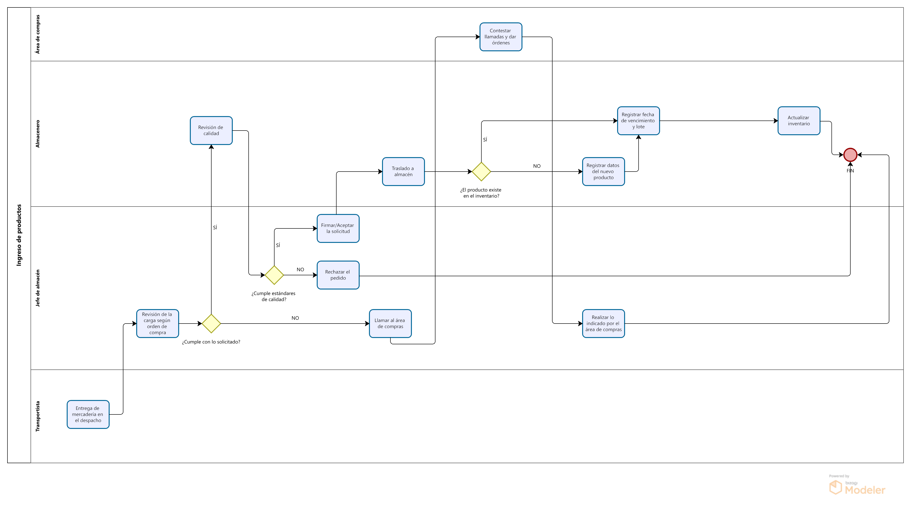

# 2.2. Procesos TO-BE

## Entrada de inventario

<table border="1">
	<tbody>
		<tr>
			<td>Secuencia</td>
			<td>Actividad</td>
			<td>Descripción</td>
			<td>Responsable</td>
		</tr>
		<tr>
			<td>1</td>
			<td>Entrega de mercadería en el despacho</td>
			<td>Se recibe al camión transportista del proveedor.</td>
			<td>Transportista</td>
		</tr>
		<tr>
			<td>2</td>
			<td>Revisión de la carga según orden de compra</td>
			<td>Se realiza una inspección para verificar la cantidad y calidad del producto</td>
			<td>Jefe de almacén</td>
		</tr>
        <tr>
			<td>3</td>
			<td>Llamar al área de compras</td>
			<td>Se llama al jefe de compras en caso el contenido de la carga sea distinto al indicado en la solicitud</td>
			<td>Almacenero</td>
		</tr>
        <tr>
			<td>4</td>
			<td>Contestar llamadas y dar órdenes</td>
			<td>Responde la llamada y da indicaciones para actuar.</td>
			<td>Área de compras</td>
		</tr>
        <tr>
			<td>5</td>
			<td>Realizar lo indicado por el área de compras</td>
			<td>Se obedecen las órdenes del área de compras.</td>
			<td>Jefe de almacén</td>
		</tr>
        <tr>
			<td>6</td>
			<td>Rechazar el pedido</td>
			<td>Debido a la mala calidad de la mercadería, el pedido es rechazado.</td>
			<td>Jefe de almacén</td>
		</tr>
        <tr>
			<td>7</td>
			<td>Firmar/Aceptar la solicitud</td>
			<td>Se aprueba la solicitud del llegado de la mercadería.</td>
			<td>Jefe de almacén</td>
		</tr>
		<tr>
			<td>8</td>
			<td>Traslado a almacén</td>
			<td>Se traslada la mercadería a almacén</td>
			<td>Almacenero</td>
		</tr>
		<tr>
			<td>9</td>
			<td>Registrar datos del nuevo producto</td>
			<td>Al identificarse un nuevo tipo de producto se registran sus datos en el inventario.</td>
			<td>Almacenero</td>
		</tr>
		<tr>
			<td>10</td>
			<td>Actualizar inventario</td>
			<td>Se actualizan los datos en inventario.</td>
			<td>Almacenero</td>
		</tr>
		<tr>
			<td>11</td>
			<td>Registrar fecha de vencimiento y lote</td>
			<td>Se registra la fecha de vencimiento y el lote en caso el producto sea perecible.</td>
			<td>Almacenero</td>
		</tr>
	</tbody>
</table>

## Salida de insumos

<table border="1">
	<tbody>
		<tr>
			<td>Secuencia</td>
			<td>Actividad</td>
			<td>Descripción</td>
			<td>Responsable</td>
		</tr>
		<tr>
			<td>1</td>
			<td>Revisión de inventario</td>
			<td>El jefe de almacén revisa la base de datos del inventario en el módulo de gestión de inventario.</td>
			<td>Jefe de almacén</td>
		</tr>
		<tr>
			<td>2</td>
			<td>Elaborar hoja de producción</td>
			<td>El jefe de almacén elabora la hoja de producción con la opción de elaborar hoja de producción del módulo de gestión de inventario.</td>
			<td>Jefe de almacén</td>
		</tr>
        <tr>
			<td>3</td>
			<td>Validar hoja de producción</td>
			<td>Se valida que los insumos para la hoja de producción esté disponible.</td>
			<td>Jefe de almacén</td>
		</tr>
        <tr>
			<td>4</td>
			<td>Informar al área de ventas</td>
			<td>Se informa al área de ventas la falta de disponibilidad de un insumo.</td>
			<td>Jefe de almacén</td>
		</tr>
        <tr>
			<td>5</td>
			<td>Modificación de la hoja de producción</td>
			<td>Se modifica la hoja de producción debido a la falta de insumos.</td>
			<td>Jefe de alamcén</td>
		</tr>
        <tr>
			<td>6</td>
			<td>Envío de hoja de producción a estación de cocina</td>
			<td>Se envía la hoja de producción a la estación de cocina.</td>
			<td>Jefe de almacén</td>
		</tr>
        <tr>
			<td>7</td>
			<td>Elaboración de pedido interno</td>
			<td>Se elabora un pedido para retirar los insumos de almacén.</td>
			<td>Jefe de almacén</td>
		</tr>
		<tr>
			<td>8</td>
			<td>Recepción de pedido interno.</td>
			<td>El almacenero recibe el pedido de los insumos.</td>
			<td>Almacenero</td>
		</tr>
		<tr>
			<td>9</td>
			<td>Buscar productos en almacén</td>
			<td>El almacenero busca y retira productos del almacén según el pedido recibido.</td>
			<td>Almacenero</td>
		</tr>
		<tr>
			<td>10</td>
			<td>Actualización del inventario</td>
			<td>Se actualizan los datos en inventario.</td>
			<td>Jefe de almacén</td>
		</tr>
		<tr>
			<td>11</td>
			<td>Entrega de insumos</td>
			<td>Se brinda un balance de entrada-salida de insumos</td>
			<td>Jefe de almacén</td>
		</tr>
		<tr>
			<td>12</td>
			<td>Recepción de insumos</td>
			<td>La estación de cocina recibe los insumos para preparar los platos indicados en la hoja de producción.</td>
			<td>Estación de cocina</td>
		</tr>
	</tbody>
</table>

---
# Módulo 2: Sistema de Registro de Pedidos y Comunicación de Cocina

<table>
  <thead>
    <tr>
      <th>Nro</th>
      <th>Actividad</th>
      <th>Descripción</th>
	  <th>Responsable</th>
    </tr>
  </thead>
  <tbody>
    <tr>
      <td>1</td>
      <td>Requerimientos de la mesa</td>
      <td>El cliente expresa sus necesidades al mesero, indicando el pedido que desea.</td>
    </tr>
    <tr>
      <td>2</td>
      <td>Tomar pedido de la mesa</td>
      <td>El mesero toma nota del pedido.</td>
    </tr>
	<tr>
      <td>3</td>
      <td>Autenticación del mesero</td>
      <td>El mesero se autentica para entrar al sistema.</td>
    </tr>
    <tr>
      <td>4</td>
      <td>Verificar credenciales</td>
      <td>El sistema verifica que el mesero esté autenticado antes de registrar el pedido.</td>
    </tr>
    <tr>
      <td>5</td>
      <td>Asignación de mesa</td>
      <td>El sistema asigna el pedido a la mesa correspondiente.</td>
    </tr>
	<tr>
      <td>6</td>
      <td>Selección de mesa</td>
      <td>El mesero selecciona su mesa correspondiente.</td>
    </tr>
    <tr>
      <td>7</td>
      <td>Registrar pedido de mesa</td>
      <td>El mesero registra electrónicamente el pedido en el sistema.</td>
    </tr>
    <tr>
      <td>8</td>
      <td>Enviar pedido de mesa</td>
      <td>El mesero confirma el pedido de la mesa.</td>
    </tr>
	<tr>
      <td>9</td>
      <td>Dirigir cada item del pedido al KDS de cada estación</td>
      <td>El pedido registrado se envía automáticamente al KDS de cada estación de cocina.</td>
    </tr>
	<tr>
      <td>10</td>
      <td>Selección del boton "mostar pedido"</td>
      <td>Cada estación de cocina desea visualizar sus pedidos.</td>
    </tr>
	<tr>
      <td>11</td>
      <td>Mostrar todos los pedidos pendientes por tiempo de cada estación</td>
      <td>El KDS muestra cada item del pedido por estación.</td>
    </tr>
    <tr>
      <td>12</td>
      <td>Preparación del pedido por cada estación</td>
      <td>Cada estación de cocina comienza a preparar los ítems del pedido.</td>
    </tr>
    <tr>
      <td>13</td>
      <td>Marcar como "completado" el ítem del pedido</td>
      <td>El pedido está emplatado por cada estación.</td>
    </tr>
    <tr>
      <td>14</td>
      <td>Actualizar estado del pedido de mesa</td>
      <td>El sistema actualiza el estado del pedido.</td>
    </tr>
    <tr>
      <td>15</td>
      <td>Notificar pedido listo</td>
      <td>El sistema avisa al mesero que el pedido está listo para ser entregado.</td>
    </tr>
    <tr>
      <td>16</td>
      <td>Entregar el pedido a la mesa</td>
      <td>El mesero entrega el pedido al cliente.</td>
    </tr>
    <tr>
      <td>17</td>
      <td>Recibir pedido completado</td>
      <td>El cliente recibe el pedido solicitado.</td>
    </tr>
  </tbody>
</table>

---