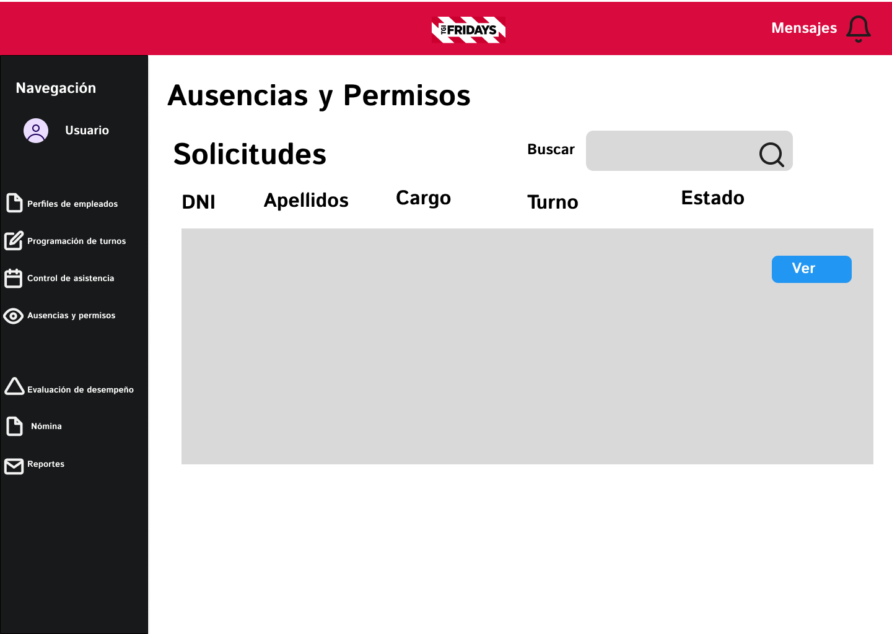
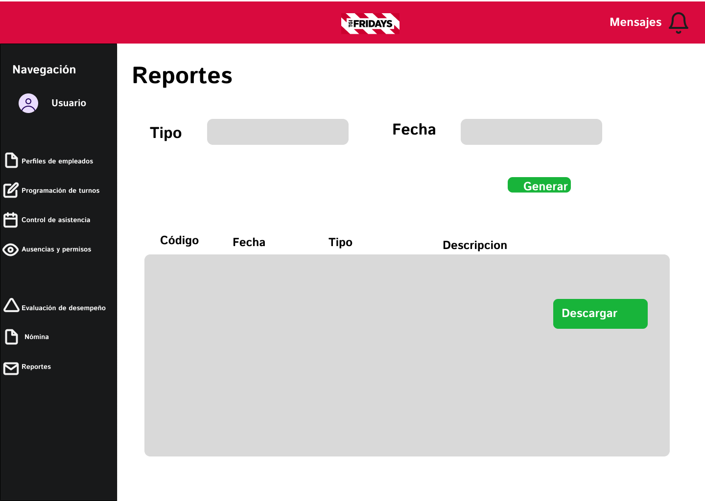

# REQUERIMIENTOS

## CASOS DE USO

<!DOCTYPE html>
<html lang="es">
<head>
    <meta charset="UTF-8">
    <meta name="viewport" content="width=device-width, initial-scale=1.0">
</head>
<body>
    <h2>
    1. Caso de uso: Inicio de sesión
    </h2>
    <table>
        <tbody>
            <tr>
                <td>Realised Usser task</td>
                <td>Autenticaicón y acceso al módulo de gestión de personal y turnos</td>
            </tr>
            <tr>
                <td>Initiatiing Actors</td>
                <td>Administrador o gerente</td>
            </tr>
            <tr>
                <td>Participating Actors</td>
                <td>
                    <ul>
                        <li>
                        Administrador o gerente
                        </li>
                        <li>
                        Sistema de autenticación</li>
                     </ul>
                </td>
            </tr>
            <tr>
                <td>Flow of Events</td>
                <td>
                    <ol>
                        <li>
                        El administrador o gerente accede a la pantalla de inicio de sesión del sistema.</li>
                       <li> El sistema solicita al usuario que ingrese su nombre de usuario y contraseña.</li>
                        <li>El usuario ingresa sus credenciales y hace clic en el botón de inicio de sesión.</li>
                        <li>El sistema verifica las credenciales ingresadas comparándolas con las almacenadas en la base de datos.</li>
                        <li>Si las credenciales son correctas, el sistema otorga acceso al módulo y redirige al usuario a la página principal del módulo de gestión de personal y turnos.</li>
                        <li>Si las credenciales son incorrectas, el sistema muestra un mensaje de error y solicita al usuario que vuelva a ingresar las credenciales.</li>
                        <li>El sistema permite al usuario solicitar la recuperación de contraseña en caso de olvido.
                        </li>
                    </ol>
                </td>
            </tr>
            <tr>
                <td>Exceptions</td>
                <td>
                    <ul>
                        <li>Credenciales Incorrectas: Si el nombre de usuario o la contraseña son incorrectos, el sistema muestra un mensaje de error y permite reintentar el inicio de sesión..</li>
                        <li>Cuenta Bloqueada: Si el usuario excede el número permitido de intentos fallidos de inicio de sesión, el sistema bloquea temporalmente la cuenta y muestra un mensaje indicando que la cuenta ha sido bloqueada. El usuario debe contactar al administrador para desbloquearla.</li>
                        <li>Recuperación de Contraseña: Si el usuario ha olvidado su contraseña, puede solicitar un enlace para la recuperación de la contraseña a través del correo electrónico registrado. El sistema envía el enlace para la recuperación y permite cambiar la contraseña.
                        </li>
                    </ul>
                </td>
            </tr>
            <tr>
                <td>Preconditions</td>
                <td>
                    <ul>
                        <li>El usuario debe estar registrado en el sistema con un nombre de usuario y contraseña válidos.</li>
                        <li>El sistema debe estar en funcionamiento y accesible a través de una red segura.</li>
                    </ul>
                </td>
            </tr>
            <tr>
                <td>Postcondition</td>
                <td>
                    <ul>
                        <li> El gerente ha sido autenticado y tiene acceso a las funcionalidades del sistema de gestión de personal y turnos.</li>
                    </ul>
                </td>
            </tr>
            <tr>
                <td>Includes Use Case</td>
                <td>
                    <ul>
                        <li>
                        Recuperación de Contraseña
                        </li>
                    </ul>
                </td>
            </tr>
            <tr>
                <td>Used Services</td>
                <td>
                    <ul>
                        <li>Servicio de autenticación y autorización</li>
                        <li>Servicio de gestión de contraseñas</li>
                    </ul>
                </td>
            </tr>
            <tr>
                <td>Non-funtional requirement</td>
                <td>
                    <ul>
                        <li>Seguridad: Las credenciales de los usuarios deben ser cifradas y almacenadas de forma segura.</li>
                        <li>Usabilidad: La interfaz de inicio de sesión debe ser clara y fácil de usar.</li>
                        <li>Performance: El proceso de autenticación debe ser rápido, con tiempos de respuesta mínimos.</li>
                        <li>Accesibilidad: El sistema debe ser accesible solo para usuarios autorizados.</li>
                    </ul>
                </td>
            </tr>
        </tbody>
    </table>
    <!CASO DE USO NUMERO 2>
    <h2>
     2. Recuperación de contraseña
    </h2>
    <table>
        <tbody>
            <tr>
                <td>Realised Usser task</td>
                <td>Recuperar el acceso a la cuenta mediante el restablecimiento de la contraseña.</td>
            </tr>
            <tr>
                <td>Initiatiing Actors</td>
                <td>Administrador o gerente que ha olvidado su contraseña.</td>
            </tr>
            <tr>
                <td>Participating Actors</td>
                <td>
                    <ul>
                        <li>
                        Administrador o gerente
                        </li>
                        <li>
                        Sistema de autenticación</li>
                        <li>Servicio de correo electrónico</li>
                     </ul>
                </td>
            </tr>
            <tr>
                <td>Flow of Events</td>
                <td>
                    <ol>
                        <li>
                        El usuario accede a la pantalla de inicio de sesión y selecciona la opción de recuperación de contraseña..
                        </li>
                        <li>
                        El sistema solicita al usuario que ingrese su dirección de correo electrónico registrada.</li>
                       <li> El usuario ingresa su dirección de correo electrónico y envía la solicitud.</li>
                        <li>El sistema genera un enlace de recuperación de contraseña y lo envía al correo electrónico del usuario.</li>
                        <li>El usuario recibe el correo electrónico y hace clic en el enlace de recuperación.</li>
                        <li>El sistema redirige al usuario a una pantalla para ingresar una nueva contraseña.</li>
                        <li>El usuario ingresa una nueva contraseña y la confirma.</li>
                        <li>El sistema actualiza la contraseña en la base de datos y permite al usuario iniciar sesión con la nueva contraseña.
                        </li>
                    </ol>
                </td>
            </tr>
            <tr>
                <td>Exceptions</td>
                <td>
                    <ul>
                        <li>Correo Electrónico No Registrado: Si el correo electrónico ingresado no está registrado, el sistema muestra un mensaje de error indicando que la dirección no se encuentra en la base de datos.</li>
                        <li>Enlace Expirado: Si el usuario intenta usar un enlace de recuperación que ha expirado, el sistema muestra un mensaje indicando que el enlace es inválido y permite solicitar uno nuevo.</li>
                        </li>
                    </ul>
                </td>
            </tr>
            <tr>
                <td>Preconditions</td>
                <td>
                    <ul>
                        <li>El usuario debe tener una cuenta registrada con una dirección de correo electrónico válida.</li>
                        <li>El sistema debe tener la capacidad de enviar correos electrónicos de recuperación.</li>
                    </ul>
                </td>
            </tr>
            <tr>
                <td>Postcondition</td>
                <td>
                    <ul>
                        <li> Se ha restablecido su contraseña correctamente y puede iniciar sesión con la nueva contraseña.</li>
                    </ul>
                </td>
            </tr>
            <tr>
                <td>Includes Use Case</td>
                <td>
                    <ul>
                        <li>
                        N/A
                        </li>
                    </ul>
                </td>
            </tr>
            <tr>
                <td>Used Services</td>
                <td>
                    <ul>
                        <li>Servicio de gestión de contraseñas</li>
                        <li>Servicio de correo electrónico</li>
                    </ul>
                </td>
            </tr>
            <tr>
                <td>Non-funtional requirement</td>
                <td>
                    <ul>
                        <li>Seguridad: El enlace de recuperación debe ser único y tener una validez limitada en el tiempo.</li>
                        <li>Usabilidad: El proceso de recuperación debe ser sencillo y guiado.</li>
                        <li>Performance: El correo electrónico de recuperación debe enviarse de manera oportuna.</li>
                    </ul>
                </td>
            </tr>
        </tbody>
    </table>
    <!CASO DE USE NUMERO 3>
    <h2>
        3. Caso de Uso: Gestion de Perfiles de Empleados
    </h2>
    <table>
        <tbody>
            <tr>
                <td>Realised Usser task</td>
                <td>A Crear, visualizar, editar y eliminar perfiles de empleados.</td>
            </tr>
            <tr>
                <td>Initiatiing Actors</td>
                <td>Administrador o gerente</td>
            </tr>
            <tr>
                <td>Participating Actors</td>
                <td>
                    <ul>
                        <li>
                        Administrador o gerente
                        </li>
                        <li>
                        Sistema de gestión de perfiles</li>
                     </ul>
                </td>
            </tr>
            <tr>
                <td>Flow of Events</td>
                <td>
                    <ol>
                        <li>
                       El administrador o gerente accede al módulo de gestión de perfiles de empleados.</li>
                       <li> El sistema muestra una lista de empleados y opciones para crear, editar o eliminar perfiles..</li>
                        <li>Para crear un nuevo perfil, el administrador o gerente ingresa la información personal del empleado y guarda el perfil.</li>
                        <li>Para editar un perfil existente, el administrador o gerente selecciona el empleado, realiza las modificaciones necesarias y guarda los cambios.</li>
                        <li>Para eliminar un perfil, el administrador o gerente selecciona el empleado y confirma la eliminación del perfil.</li>
                    </ol>
                </td>
            </tr>
            <tr>
                <td>Exceptions</td>
                <td>
                    <ul>
                        <li>Datos Incompletos: Si se ingresan datos incompletos durante la creación o edición del perfil, el sistema muestra un mensaje de error solicitando completar la información requerida.</li>
                        <li>Eliminación No Permitida: Si se intenta eliminar un perfil que tiene datos asociados o restricciones, el sistema muestra un mensaje de error indicando que la eliminación no es posible.</li>
                    </ul>
                </td>
            </tr>
            <tr>
                <td>Preconditions</td>
                <td>
                    <ul>
                        <li>El usuario debe tener permisos de administrador o gerente para gestionar perfiles de empleados.</li>
                    </ul>
                </td>
            </tr>
            <tr>
                <td>Postcondition</td>
                <td>
                    <ul>
                        <li>La información de los perfiles de empleados ha sido actualizada correctamente en el sistema.</li>
                    </ul>
                </td>
            </tr>
            <tr>
                <td>Includes Use Case</td>
                <td>
                    <ul>
                        <li>
                        N/A
                        </li>
                    </ul>
                </td>
            </tr>
            <tr>
                <td>Used Services</td>
                <td>
                    <ul>
                        <li>Servicio de gestión de perfiles de empleados</li>
                    </ul>
                </td>
            </tr>
            <tr>
                <td>Non-funtional requirement</td>
                <td>
                    <ul>
                        <li>Seguridad: La edición y eliminación de perfiles deben estar restringidas a usuarios autorizados.</li>
                        <li>Usabilidad: La interfaz de gestión de perfiles debe ser intuitiva y fácil de usar.</li>
                    </ul>
                </td>
            </tr>
        </tbody>
    </table>
        <!CASO DE USE NUMERO 4>
    <h2>
        4. Caso de Uso: Asignación y Programación de Turnos
    </h2>
    <table>
        <tbody>
            <tr>
                <td>Realised Usser task</td>
                <td> Crear y asignar turnos de trabajo a los empleados.</td>
            </tr>
            <tr>
                <td>Initiatiing Actors</td>
                <td>Administrador o gerente</td>
            </tr>
            <tr>
                <td>Participating Actors</td>
                <td>
                    <ul>
                        <li>
                        Administrador o gerente
                        </li>
                        <li>
                        Sistema de programación de turnos</li>
                     </ul>
                </td>
            </tr>
            <tr>
                <td>Flow of Events</td>
                <td>
                    <ol>
                        <li>
                       El administrador o gerente accede al módulo de asignación y programación de turnos.</li>
                       <li> El sistema muestra la disponibilidad de los empleados y la demanda de turnos.</li>
                        <li>El administrador o gerente crea un nuevo horario de trabajo, asigna turnos a los empleados según roles, habilidades y disponibilidad.</li>
                        <li>El sistema permite al administrador o gerente ajustar los turnos y asignar días libres o intercambiar turnos entre empleados.</li>
                        <li>El sistema guarda la programación de turnos y notifica a los empleados sobre sus turnos asignados.</li>
                    </ol>
                </td>
            </tr>
            <tr>
                <td>Exceptions</td>
                <td>
                    <ul>
                        <li>Disponibilidad Insuficiente: Si no hay suficiente disponibilidad de empleados para cubrir todos los turnos, el sistema muestra un mensaje de advertencia y permite ajustar la programación.</li>
                        <li>Turnos Conflictivos: Si hay conflictos en la asignación de turnos (por ejemplo, asignación de múltiples turnos a un mismo empleado en el mismo período), el sistema muestra un mensaje de error y permite corregir el conflicto.</li>
                    </ul>
                </td>
            </tr>
            <tr>
                <td>Preconditions</td>
                <td>
                    <ul>
                        <li>El usuario debe tener permisos de administrador o gerente para crear y asignar turnos.</li>
                        <li>El sistema debe tener información actualizada sobre la disponibilidad de los empleados.</li>
                    </ul>
                </td>
            </tr>
            <tr>
                <td>Postcondition</td>
                <td>
                    <ul>
                        <li> Los turnos han sido asignados o reprogramados según las reglas definidas y las preferencias de los empleados.</li>
                    </ul>
                </td>
            </tr>
            <tr>
                <td>Includes Use Case</td>
                <td>
                    <ul>
                        <li>
                        Notificaciones de Turnos
                        </li>
                    </ul>
                </td>
            </tr>
            <tr>
                <td>Used Services</td>
                <td>
                    <ul>
                        <li>Servicio de programación de turnos</li>
                    </ul>
                </td>
            </tr>
            <tr>
                <td>Non-funtional requirement</td>
                <td>
                    <ul>
                        <li>Seguridad: La asignación de turnos debe estar restringida a usuarios autorizados.</li>
                        <li>Performance: La creación y asignación de turnos deben realizarse de manera eficiente, sin demoras significativas.</li>
                    </ul>
                </td>
            </tr>
        </tbody>
    </table>
          <!CASO DE USE NUMERO 4>
    <h2>
        5. Caso de Uso: Control de Asistencia
    </h2>
    <table>
        <tbody>
            <tr>
                <td>Realised Usser task</td>
                <td> Registrar y gestionar las entradas y salidas de los empleados, así como sus horas trabajadas.</td>
            </tr>
            <tr>
                <td>Initiating Actors</td>
                <td>Empleado y sistema de control de asistencia.</td>
            </tr>
            <tr>
                <td>Participating Actors</td>
                <td>
                    <ul>
                        <li>
                        Empleado
                        </li>
                        <li>
                        Sistema de control de asistencia</li>
                     </ul>
                </td>
            </tr>
            <tr>
                <td>Flow of Events</td>
                <td>
                    <ol>
                        <li>
                       El empleado utiliza un reloj biométrico o digital para registrar su entrada al trabajo.</li>
                       <li> El sistema registra automáticamente la hora de entrada y salida del empleado.</li>
                        <li>El sistema calcula las horas trabajadas, incluyendo descansos y horas extras.</li>
                        <li>El administrador o gerente revisa los registros de asistencia y genera reportes detallados.</li>
                    </ol>
                </td>
            </tr>
            <tr>
                <td>Exceptions</td>
                <td>
                    <ul>
                        <li>Registro Fallido: Si el reloj biométrico o digital no puede registrar la entrada o salida, el sistema muestra un mensaje de error y solicita al empleado que intente nuevamente.</li>
                        <li>Horas No Registradas: Si hay discrepancias en el registro de horas, el sistema permite a los empleados solicitar correcciones y notifica al administrador para su revisión.</li>
                    </ul>
                </td>
            </tr>
            <tr>
                <td>Preconditions</td>
                <td>
                    <ul>
                        <li>El sistema debe estar configurado con relojes biométricos o digitales funcionales.</li>
                        <li>El empleado debe estar registrado en el sistema con una cuenta activa.</li>
                    </ul>
                </td>
            </tr>
            <tr>
                <td>Postcondition</td>
                <td>
                    <ul>
                        <li> La entrada y salida del empleado ha sido registrada exitosamente, y la asistencia está actualizada en el sistema</li>
                    </ul>
                </td>
            </tr>
            <tr>
                <td>Includes Use Case</td>
                <td>
                    <ul>
                        <li>
                        Reportes de Asistencia
                        </li>
                    </ul>
                </td>
            </tr>
            <tr>
                <td>Used Services</td>
                <td>
                    <ul>
                        <li>Servicio de control de asistencia</li>
                    </ul>
                </td>
            </tr>
            <tr>
                <td>Non-funtional requirement</td>
                <td>
                    <ul>
                        <li>Seguridad: Los registros de asistencia deben ser seguros y accesibles solo para usuarios autorizados.</li>
                        <li>Performance: El sistema debe registrar las entradas y salidas de manera precisa y oportuna.</li>
                    </ul>
                </td>
            </tr>
        </tbody>
    </table>
    <!CASO DE USO NUMERO 6>
        <h2>
        6. Caso de Uso: Gestión de Ausencias y Permisos
    </h2>
    <table>
        <tbody>
            <tr>
                <td>Realised Usser task</td>
                <td>  Solicitar y gestionar ausencias y permisos de los empleados.</td>
            </tr>
            <tr>
                <td>Initiating Actors</td>
                <td>Empleado y gerente</td>
            </tr>
            <tr>
                <td>Participating Actors</td>
                <td>
                    <ul>
                        <li>
                        Empleado
                        </li>
                        <li>Gerente</li>
                        <li>
                        Sistema de gestión de permisos</li>
                     </ul>
                </td>
            </tr>
            <tr>
                <td>Flow of Events</td>
                <td>
                    <ol>
                        <li>
                       El empleado solicita vacaciones, permisos por enfermedad u otras ausencias a través del sistema.</li>
                       <li> El sistema notifica al gerente sobre la solicitud de ausencia.</li>
                        <li>El gerente revisa la solicitud y la aprueba o rechaza.</li>
                        <li> El sistema actualiza el estado de la solicitud y notifica al empleado sobre la decisión.</li>
                    </ol>
                </td>
            </tr>
            <tr>
                <td>Exceptions</td>
                <td>
                    <ul>
                        <li>Solicitud No Aprobada: Si el gerente rechaza una solicitud, el sistema muestra un mensaje indicando que la solicitud no ha sido aprobada y proporciona una razón.</li>
                        <li>Solicitud Incompleta: Si la solicitud de ausencia está incompleta, el sistema muestra un mensaje solicitando la información faltante.</li>
                    </ul>
                </td>
            </tr>
            <tr>
                <td>Preconditions</td>
                <td>
                    <ul>
                        <li>El empleado debe estar registrado en el sistema con una cuenta activa.</li>
                        <li>EEl gerente debe tener permisos para aprobar o rechazar solicitudes de ausencia.</li>
                    </ul>
                </td>
            </tr>
            <tr>
                <td>Postcondition</td>
                <td>
                    <ul>
                        <li> Las solicitudes de ausencias han sido registradas y aprobadas/rechazadas, actualizando la disponibilidad del empleado.</li>
                    </ul>
                </td>
            </tr>
            <tr>
                <td>Includes Use Case</td>
                <td>
                    <ul>
                        <li>
                       N/A
                        </li>
                    </ul>
                </td>
            </tr>
            <tr>
                <td>Used Services</td>
                <td>
                    <ul>
                        <li>Servicio de gestión de permisos y ausencias</li>
                    </ul>
                </td>
            </tr>
            <tr>
                <td>Non-funtional requirement</td>
                <td>
                    <ul>
                        <li>Seguridad: Las solicitudes de ausencia deben ser gestionadas de forma segura y accesible solo para usuarios autorizados.</li>
                        <li>Usabilidad: El proceso de solicitud y gestión de permisos debe ser claro y sencillo para los empleados y gerentes.</li>
                    </ul>
                </td>
            </tr>
        </tbody>
    </table>
     <!CASO DE USO NUMERO 7>
     <h2>
        7. Caso de Uso: Evaluación del Desempeño
    </h2>
    <table>
        <tbody>
            <tr>
                <td>Realised Usser task</td>
                <td>  Monitorear y evaluar el desempeño de los empleados basado en asistencia y puntualidad.</td>
            </tr>
            <tr>
                <td>Initiating Actors</td>
                <td>Gerente o supervisor</td>
            </tr>
            <tr>
                <td>Participating Actors</td>
                <td>
                    <ul>
                        <li>
                         Gerente o supervisor
                        </li>
                       <li> Sistema de evaluación de desempeño</li>
                     </ul>
                </td>
            </tr>
            <tr>
                <td>Flow of Events</td>
                <td>
                    <ol>
                        <li>
                       El gerente o supervisor accede al módulo de evaluación de desempeño.</li>
                       <li> El sistema muestra los indicadores clave de rendimiento del empleado, como puntualidad y asistencia.</li>
                        <li>El gerente o supervisor proporciona feedback sobre el desempeño del empleado.</li>
                        <li> El sistema actualiza la evaluación del empleado y proporciona informes de rendimiento.</li>
                    </ol>
                </td>
            </tr>
            <tr>
                <td>Exceptions</td>
                <td>
                    <ul>
                        <li>Datos Incompletos: Si faltan datos necesarios para la evaluación, el sistema muestra un mensaje solicitando la información faltante.</li>
                    </ul>
                </td>
            </tr>
            <tr>
                <td>Preconditions</td>
                <td>
                    <ul>
                        <li>El sistema debe tener registros completos de asistencia y puntualidad de los empleados.</li>
                    </ul>
                </td>
            </tr>
            <tr>
                <td>Postcondition</td>
                <td>
                    <ul>
                        <li> Los indicadores clave de rendimiento han sido registrados, generando datos relevantes para evaluaciones futuras.</li>
                    </ul>
                </td>
            </tr>
            <tr>
                <td>Includes Use Case</td>
                <td>
                    <ul>
                        <li>
                       N/A
                        </li>
                    </ul>
                </td>
            </tr>
            <tr>
                <td>Used Services</td>
                <td>
                    <ul>
                        <li>Servicio de evaluación de desempeño</li>
                    </ul>
                </td>
            </tr>
            <tr>
                <td>Non-funtional requirement</td>
                <td>
                    <ul>
                        <li>Seguridad: La evaluación del desempeño debe ser segura y accesible solo para usuarios autorizados.</li>
                        <li>El módulo de evaluación debe ser fácil de usar y entender para los gerentes y supervisores.</li>
                    </ul>
                </td>
            </tr>
        </tbody>
    </table>
      <!CASO DE USO NUMERO 8>
        <h2>
        8. Caso de Uso: Integración con Nómina
    </h2>
    <table>
        <tbody>
            <tr>
                <td>Realised Usser task</td>
                <td> Exportar horas trabajadas y ajustar la nómina de acuerdo con horas extra y bonificaciones.</td>
            </tr>
            <tr>
                <td>Initiating Actors</td>
                <td>Administrador o gerente</td>
            </tr>
            <tr>
                <td>Participating Actors</td>
                <td>
                    <ul>
                        <li>
                         Administrador o gerente
                        </li>
                       <li> Sistema de nómina</li>
                     </ul>
                </td>
            </tr>
            <tr>
                <td>Flow of Events</td>
                <td>
                    <ol>
                        <li>
                       El sistema exporta automáticamente las horas trabajadas y los datos de asistencia al sistema de nómina.</li>
                       <li> El administrador o gerente de nómina revisa y ajusta la nómina, incluyendo horas extra y bonificaciones.</li>
                        <li>El sistema actualiza la nómina y calcula los salarios correspondientes.</li>
                        <li> El sistema refleja las deducciones por ausencias injustificadas y ajusta los pagos en consecuencia.</li>
                    </ol>
                </td>
            </tr>
            <tr>
                <td>Exceptions</td>
                <td>
                    <ul>
                        <li>Datos Inconsistentes: Si hay discrepancias en los datos exportados, el sistema muestra un mensaje de error y permite corregir las inconsistencias.</li>
                    </ul>
                </td>
            </tr>
            <tr>
                <td>Preconditions</td>
                <td>
                    <ul>
                        <li>El sistema de nómina debe estar integrado y configurado para recibir datos del sistema de gestión de personal y turnos.</li>
                    </ul>
                </td>
            </tr>
            <tr>
                <td>Postcondition</td>
                <td>
                    <ul>
                        <li> Las horas trabajadas, horas extras, y bonificaciones han sido exportadas correctamente al sistema de nómina.</li>
                    </ul>
                </td>
            </tr>
            <tr>
                <td>Includes Use Case</td>
                <td>
                    <ul>
                        <li>
                       N/A
                        </li>
                    </ul>
                </td>
            </tr>
            <tr>
                <td>Used Services</td>
                <td>
                    <ul>
                        <li>Servicio de integración con nómina</li>
                    </ul>
                </td>
            </tr>
            <tr>
                <td>Non-funtional requirement</td>
                <td>
                    <ul>
                        <li>Seguridad: La integración con nómina debe ser segura y accesible solo para usuarios autorizados.</li>
                        <li>Performance: La exportación y ajuste de nómina deben realizarse de manera eficiente.</li>
                    </ul>
                </td>
            </tr>
        </tbody>
    </table>
       <!CASO DE USO NUMERO 9>
        <h2>
        9. Caso de Uso: Notificación y Comunicación
    </h2>
    <table>
        <tbody>
            <tr>
                <td>Realised Usser task</td>
                <td> Enviar notificaciones a empleados sobre cambios en sus turnos y gestionar la comunicación.</td>
            </tr>
            <tr>
                <td>Initiating Actors</td>
                <td>Sistema de gestión de notificaciones</td>
            </tr>
            <tr>
                <td>Participating Actors</td>
                <td>
                    <ul>
                        <li>
                         Administrador o gerente
                        </li>
                        <li>Empleados</li>
                       <li> Sistema de gestión de notificaciones</li>
                     </ul>
                </td>
            </tr>
            <tr>
                <td>Flow of Events</td>
                <td>
                    <ol>
                        <li>
                       El sistema envía notificaciones a los empleados sobre cambios en sus turnos o horarios.</li>
                       <li> El sistema envía alertas automáticas si un empleado no se presenta a su turno o si se requiere personal adicional.</li>
                        <li>El administrador o gerente recibe y gestiona las solicitudes de cambio de turno y permisos, comunicándose con los empleados según sea necesario.</li>
                    </ol>
                </td>
            </tr>
            <tr>
                <td>Exceptions</td>
                <td>
                    <ul>
                        <li>Notificación Fallida: Si la notificación no puede enviarse, el sistema muestra un mensaje de error y permite reintentar el envío.</li>
                    </ul>
                </td>
            </tr>
            <tr>
                <td>Preconditions</td>
                <td>
                    <ul>
                        <li>El sistema debe tener configurados los métodos de notificación y comunicación (correo electrónico, SMS, etc.).</li>
                    </ul>
                </td>
            </tr>
            <tr>
                <td>Postcondition</td>
                <td>
                    <ul>
                        <li>  Los empleados han sido notificados de los cambios en sus turnos, y cualquier solicitud o incidente ha sido gestionado.</li>
                    </ul>
                </td>
            </tr>
            <tr>
                <td>Includes Use Case</td>
                <td>
                    <ul>
                        <li>
                       N/A
                        </li>
                    </ul>
                </td>
            </tr>
            <tr>
                <td>Used Services</td>
                <td>
                    <ul>
                        <li>Servicio de notificación y comunicación</li>
                    </ul>
                </td>
            </tr>
            <tr>
                <td>Non-funtional requirement</td>
                <td>
                    <ul>
                        <li>Usabilidad: El sistema de notificaciones debe ser claro y fácil de usar para los empleados y gerentes.</li>
                        <li>Performance: Las notificaciones deben enviarse de manera oportuna y eficiente.</li>
                    </ul>
                </td>
            </tr>
        </tbody>
    </table>
        <!CASO DE USO NUMERO 10>
        <h2>
        10. Caso de Uso: Reporte y Análisis
    </h2>
    <table>
        <tbody>
            <tr>
                <td>Realised Usser task</td>
                <td> Generar informes detallados sobre asistencia, turnos y costos laborales.</td>
            </tr>
            <tr>
                <td>Initiating Actors</td>
                <td>Administrador o gerente.</td>
            </tr>
            <tr>
                <td>Participating Actors</td>
                <td>
                    <ul>
                        <li>
                         Administrador o gerente </li>
                       <li> Sistema de generación de reportes</li>
                     </ul>
                </td>
            </tr>
            <tr>
                <td>Flow of Events</td>
                <td>
                    <ol>
                        <li>
                       El administrador o gerente accede al módulo de generación de reportes.</li>
                       <li> El sistema muestra opciones para generar diferentes tipos de informes (horas trabajadas, ausencias, cumplimiento de turnos).</li>
                        <li>El administrador o gerente selecciona los criterios para el reporte y solicita la generación.</li>
                        <li>El sistema genera el informe solicitado y lo muestra para revisión.</li>
                        <li>El administrador o gerente puede exportar el informe a formatos como PDF o Excel.</li>
                    </ol>
                </td>
            </tr>
            <tr>
                <td>Exceptions</td>
                <td>
                    <ul>
                        <li>Datos Incompletos: Si hay falta de datos necesarios para el informe, el sistema muestra un mensaje de advertencia y permite ajustar los criterios.</li>
                    </ul>
                </td>
            </tr>
            <tr>
                <td>Preconditions</td>
                <td>
                    <ul>
                        <li>El sistema debe tener datos completos y actualizados sobre asistencia, turnos y costos laborales.</li>
                    </ul>
                </td>
            </tr>
            <tr>
                <td>Postcondition</td>
                <td>
                    <ul>
                        <li> Se han generado informes detallados sobre la asignación de turnos, la asistencia y el cumplimiento.</li>
                    </ul>
                </td>
            </tr>
            <tr>
                <td>Includes Use Case</td>
                <td>
                    <ul>
                        <li>
                       N/A
                        </li>
                    </ul>
                </td>
            </tr>
            <tr>
                <td>Used Services</td>
                <td>
                    <ul>
                        <li>Servicio de generación de reportes y análisis</li>
                    </ul>
                </td>
            </tr>
            <tr>
                <td>Non-funtional requirement</td>
                <td>
                    <ul>
                        <li>Seguridad: Los informes deben ser accesibles solo para usuarios autorizados.</li>
                        <li>Performance: La generación de reportes debe ser eficiente y rápida.</li>
                    </ul>
                </td>
            </tr>
        </tbody>
    </table>
           <!CASO DE USO NUMERO 11>
        <h2>
        11. Caso de Uso: Escalabilidad y Adaptibilidad
    </h2>
    <table>
        <tbody>
            <tr>
                <td>Realised Usser task</td>
                <td>Ajustar la asignación de turnos conforme a cambios en la plantilla de empleados.</td>
            </tr>
            <tr>
                <td>Initiating Actors</td>
                <td>Administrador o gerente.</td>
            </tr>
            <tr>
                <td>Participating Actors</td>
                <td>
                    <ul>
                        <li>
                         Administrador o gerente </li>
                       <li> Sistema de gestión de turnos</li>
                     </ul>
                </td>
            </tr>
            <tr>
                <td>Flow of Events</td>
                <td>
                    <ol>
                        <li>
                       El administrador o gerente accede al módulo de asignación de turnos.</li>
                       <li> El sistema muestra la plantilla actual de empleados y permite realizar ajustes.</li>
                        <li>El administrador o gerente ajusta la asignación de turnos para incluir nuevos empleados o modificar turnos existentes.</li>
                        <li>El sistema actualiza la programación de turnos y notifica a los empleados afectados.</li>
                    </ol>
                </td>
            </tr>
            <tr>
                <td>Exceptions</td>
                <td>
                    <ul>
                        <li>Falta de Información: Si faltan datos sobre nuevos empleados o cambios en la plantilla, el sistema muestra un mensaje solicitando completar la información.</li>
                    </ul>
                </td>
            </tr>
            <tr>
                <td>Preconditions</td>
                <td>
                    <ul>
                        <li>El sistema debe tener información actualizada sobre la plantilla de empleados y sus disponibilidades.</li>
                    </ul>
                </td>
            </tr>
            <tr>
                <td>Postcondition</td>
                <td>
                    <ul>
                        <li> Los cambios en la plantilla han sido reflejados en el sistema y los turnos han sido ajustados de acuerdo con la nueva capacidad.</li>
                    </ul>
                </td>
            </tr>
            <tr>
                <td>Includes Use Case</td>
                <td>
                    <ul>
                        <li>
                         Asiganación y Programación de Turnos
                        </li>
                    </ul>
                </td>
            </tr>
            <tr>
                <td>Used Services</td>
                <td>
                    <ul>
                        <li>Servicio de gestión de turnos</li>
                    </ul>
                </td>
            </tr>
            <tr>
                <td>Non-funtional requirement</td>
                <td>
                    <ul>
                        <li>Seguridad: Los ajustes en la programación de turnos deben estar protegidos y accesibles solo para usuarios autorizados.</li>
                        <li>Performance: Los ajustes y actualizaciones deben realizarse de manera eficiente y sin demoras significativas.</li>
                    </ul>
                </td>
            </tr>
        </tbody>
    </table>
         <!CASO DE USO NUMERO 12>
        <h2>
        12. Caso de Uso: Funcionalidades Específicas
    </h2>
    <table>
        <tbody>
            <tr>
                <td>Realised Usser task</td>
                <td>Gestionar turnos por roles específicos y prever demanda futura.</td>
            </tr>
            <tr>
                <td>Initiating Actors</td>
                <td>Administrador o gerente.</td>
            </tr>
            <tr>
                <td>Participating Actors</td>
                <td>
                    <ul>
                        <li>
                         Administrador o gerente </li>
                       <li> Sistema de gestión de turnos</li>
                     </ul>
                </td>
            </tr>
            <tr>
                <td>Flow of Events</td>
                <td>
                    <ol>
                        <li>
                      El administrador o gerente accede al módulo de gestión de turnos por roles específicos.</li>
                       <li> El sistema muestra la demanda por área y permite asignar turnos según roles específicos.</li>
                        <li>El administrador o gerente ajusta la asignación para asegurar suficiente personal durante períodos de alta demanda.</li>
                        <li>El sistema ajusta la planificación de turnos y proporciona previsiones basadas en patrones históricos.</li>
                    </ol>
                </td>
            </tr>
            <tr>
                <td>Exceptions</td>
                <td>
                    <ul>
                        <li>Demanda Inesperada: Si hay un aumento inesperado en la demanda, el sistema muestra una advertencia y permite ajustar la planificación de manera rápida.</li>
                    </ul>
                </td>
            </tr>
            <tr>
                <td>Preconditions</td>
                <td>
                    <ul>
                        <li>El sistema debe tener datos históricos de demanda y disponibilidad de personal.</li>
                    </ul>
                </td>
            </tr>
            <tr>
                <td>Postcondition</td>
                <td>
                    <ul>
                        <li> Los turnos han sido asignados de acuerdo con los roles específicos y se han realizado previsiones basadas en patrones históricos.</li>
                    </ul>
                </td>
            </tr>
            <tr>
                <td>Includes Use Case</td>
                <td>
                    <ul>
                        <li>
                         Asiganación y Programación de Turnos
                        </li>
                    </ul>
                </td>
            </tr>
            <tr>
                <td>Used Services</td>
                <td>
                    <ul>
                        <li>Servicio de planificación y previsión de demanda</li>
                    </ul>
                </td>
            </tr>
            <tr>
                <td>Non-funtional requirement</td>
                <td>
                    <ul>
                        <li>Seguridad: La gestión de turnos específicos debe estar restringida a usuarios autorizados.</li>
                        <li>Performance: La previsión y ajuste de turnos deben realizarse de manera eficiente.</li>
                    </ul>
                </td>
            </tr>
        </tbody>
    </table>
</body>
</html>

## Prototipos

[PROTOTIPOS EN FIGMA](https://www.figma.com/design/xIH8zEzTMVhIH4KvnL8K3z/Untitled?node-id=0-1&node-type=canvas&t=reftO2a5exc0LdWj-0)

## Página principal

## Perfiles de usuario

## Asistencia

## Turnos

## Ausencias y  permisos

## Desempeño Personal

## Nómina

## Reportes

