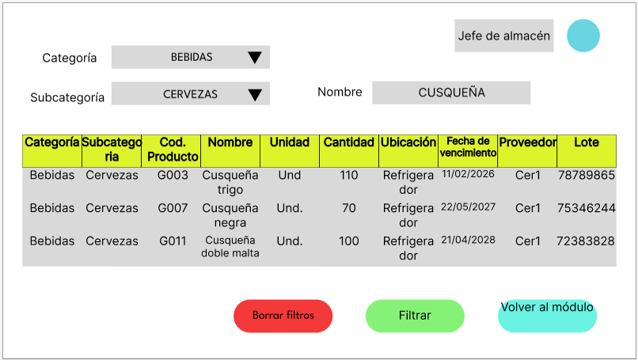
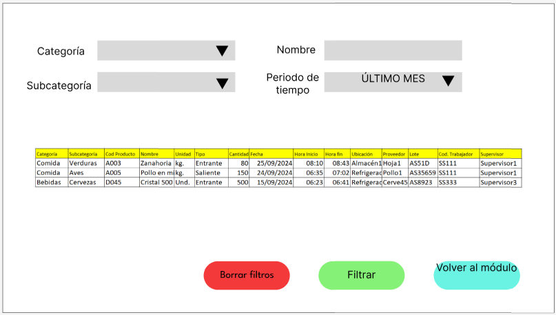

# 4.5. Módulo 5
# Módulo 5: Gestión de inventario
# Requerimientos por casos de uso

## 1) Ingreso de productos

<table border="1">
	<tbody>
		<tr>
			<td>Nombre</td>
			<td colspan="2">Ingreso de productos</td>
		</tr>
		<tr>
			<td>Tarea realizada por el usuario</td>
			<td colspan="2">Ingresar los datos de los productos que pasarán a formar parte del inventario</td>
		</tr>
		<tr>
			<td>Actor inicializador</td>
			<td colspan="2">Usuario</td>
		</tr>
		<tr>
			<td>Actores participantes</td>
			<td colspan="2">N/A</td>
		</tr>
		<tr>
			<td rowspan="4">Flujo de eventos</td>
			<td>Actores</td>
			<td>Sistema</td>
		</tr>
		<tr>
			<td>1. El usuario selecciona "Ingreso de productos" en el módulo.</td>
			<td>-</td>
		</tr>
		<tr>
			<td>2. El usuario coloca la categoría, subcategoria, nombre, cantidad, fecha de vencimiento, proveedor, ubicación en el almacén y lote  de los productos que se agregarán al inventario.</td>
			<td>-</td>
		</tr>
		<tr>
			<td>-</td>
			<td>3. El sistema actualizará la base de datos.</td>
		</tr>
		<tr>
			<td>Excepciones</td>
			<td colspan="2"></td>
		</tr>
		<tr>
			<td>Precondición</td>
			<td colspan="2">Solo se podrá ingresar productos ya existentes en el inventario, si el producto no existe seleccionar la opción "Registrar nuevo producto" en el módulo.</td>
		</tr>
		<tr>
			<td>Postcondición</td>
			<td colspan="2">El inventario se ha actualizado</td>
		</tr>
		<tr>
			<td>Casos de uso incluidos</td>
			<td colspan="2">-</td>
		</tr>
		<tr>
			<td>Servicios utilizados</td>
			<td colspan="2">"Ingreso de Insumos" "ActualizarInventario"</td>
		</tr>
		<tr>
			<td>Requerimientos no funcionales</td>
			<td colspan="2">Tiempo de respuesta, usabilidad, manejo de errores</td>
		</tr>
	</tbody>
</table>

## 2) Salida de productos

<table border="1">
	<tbody>
		<tr>
			<td>Nombre</td>
			<td colspan="2">Salida de productos</td>
		</tr>
		<tr>
			<td>Tarea realizada por el usuario</td>
			<td colspan="2">Ingresar los datos de los productos que dejarán de formar parte del inventario</td>
		</tr>
		<tr>
			<td>Actor inicializador</td>
			<td colspan="2">Usuario</td>
		</tr>
		<tr>
			<td>Actores participantes</td>
			<td colspan="2">N/A</td>
		</tr>
		<tr>
			<td rowspan="4">Flujo de eventos</td>
			<td>Actores</td>
			<td>Sistema</td>
		</tr>
		<tr>
			<td>1. El usuario selecciona "Retiro de productos" en el módulo.</td>
			<td>-</td>
		</tr>
		<tr>
			<td>2. El usuario coloca la categoría, subcategoría, nombre, proveedor, lote, unidad y cantidad de los productos que se retirarán del inventario.</td>
			<td>-</td>
		</tr>
		<tr>
			<td>-</td>
			<td>3. El sistema actualizará la base de datos.</td>
		</tr>
		<tr>
			<td>Excepciones</td>
			<td colspan="2"></td>
		</tr>
		<tr>
			<td>Precondición</td>
			<td colspan="2">Solo se podrá retirar productos existentes y con cantidades mayores a 0 en el inventario.</td>
		</tr>
		<tr>
			<td>Postcondición</td>
			<td colspan="2">La base de datos se ha actualizado</td>
		</tr>
		<tr>
			<td>Casos de uso incluidos</td>
			<td colspan="2">-</td>
		</tr>
		<tr>
			<td>Servicios utilizados</td>
			<td colspan="2">"Salida de insumos" "Actualizar inventario"</td>
		</tr>
		<tr>
			<td>Requerimientos no funcionales</td>
			<td colspan="2">Tiempo de respuesta, usabilidad, manejo de errores</td>
		</tr>
	</tbody>
</table>

## 3) Ingresar nuevo producto

<table border="1">
	<tbody>
		<tr>
			<td>Nombre</td>
			<td colspan="2">Ingresar nuevo producto</td>
		</tr>
		<tr>
			<td>Tarea realizada por el usuario</td>
			<td colspan="2">Ingresar los datos de un nuevo producto que pasará a formar parte del inventario</td>
		</tr>
		<tr>
			<td>Actor inicializador</td>
			<td colspan="2">Usuario</td>
		</tr>
		<tr>
			<td>Actores participantes</td>
			<td colspan="2">N/A</td>
		</tr>
		<tr>
			<td rowspan="4">Flujo de eventos</td>
			<td>Actores</td>
			<td>Sistema</td>
		</tr>
		<tr>
			<td>1. El usuario selecciona "Registro de producto" en el módulo.</td>
			<td>-</td>
		</tr>
		<tr>
			<td>2. El usuario coloca la categoría, la subcategoría, el nombre, la unidad de medida y las condiciones de conservación delproducto que se agregará al inventario.</td>
			<td>-</td>
		</tr>
		<tr>
			<td>-</td>
			<td>3. El sistema actualizará la base de datos.</td>
		</tr>
		<tr>
			<td>Excepciones</td>
			<td colspan="2"></td>
		</tr>
		<tr>
			<td>Precondición</td>
			<td colspan="2">Solo se podrá ingresar productos no existentes en el inventario.</td>
		</tr>
		<tr>
			<td>Postcondición</td>
			<td colspan="2">Un nuevo tipo de producto está disponible en la base de datos</td>
		</tr>
		<tr>
			<td>Casos de uso incluidos</td>
			<td colspan="2">-</td>
		</tr>
		<tr>
			<td>Servicios utilizados</td>
			<td colspan="2">"Creación de producto" "Actualizar inventario"</td>
		</tr>
		<tr>
			<td>Requerimientos no funcionales</td>
			<td colspan="2">Tiempo de respuesta, usabilidad, manejo de errores</td>
		</tr>
	</tbody>
</table>

## 4) Revisar inventario

<table border="1">
	<tbody>
		<tr>
			<td>Nombre</td>
			<td colspan="2">Revisar inventario</td>
		</tr>
		<tr>
			<td>Tarea realizada por el usuario</td>
			<td colspan="2">Colocar los datos en una barra de búsqueda si desea filtrar los productos.</td>
		</tr>
		<tr>
			<td>Actor inicializador</td>
			<td colspan="2">Usuario</td>
		</tr>
		<tr>
			<td>Actores participantes</td>
			<td colspan="2">N/A</td>
		</tr>
		<tr>
			<td rowspan="5">Flujo de eventos</td>
			<td>Actores</td>
			<td>Sistema</td>
		</tr>
		<tr>
			<td>1. El usuario selecciona "Revisar inventario" en el módulo.</td>
			<td>-</td>
		</tr>
		<tr>
			<td>-</td>
			<td>2. El sistema muestra la categoría, subcategoría, código del producto, nombre, unidad de medida, cantidad, fecha de vencimiento, proveedor,ubicación y lote de todos los productos .</td>
		</tr>
		<tr>
			<td>3. El usuario coloca la categoría, subcategoría y escribe el nombre del producto para filtrar los resultados.</td>
			<td>-</td>
		</tr>
		<tr>
			<td>-</td>
			<td>4. El sistema filtra y muestra los datos de los productos buscados.</td>
		</tr>
		<tr>
			<td>Excepciones</td>
			<td colspan="2"></td>
		</tr>
		<tr>
			<td>Precondición</td>
			<td colspan="2">El producto a buscar debe existir en el inventario</td>
		</tr>
		<tr>
			<td>Postcondición</td>
			<td colspan="2">Se muestra el estado actual del inventario</td>
		</tr>
		<tr>
			<td>Casos de uso incluidos</td>
			<td colspan="2">-</td>
		</tr>
		<tr>
			<td>Servicios utilizados</td>
			<td colspan="2">"Buscar", "FiltrarCategoría", "FiltrarSubcategoría"</td>
		</tr>
		<tr>
			<td>Requerimientos no funcionales</td>
			<td colspan="2">Tiempo de respuesta, usabilidad, manejo de errores</td>
		</tr>
	</tbody>
</table>
<!--
## 5) Balance
<table border="1">
	<tbody>
		<tr>
			<td>Nombre</td>
			<td colspan="2">Balance de inventario</td>
		</tr>
		<tr>
			<td>Tarea realizada por el usuario</td>
			<td colspan="2">Buscar los datos del producto del que desea ver su balance y seleccionar un periodo de tiempo</td>
		</tr>
		<tr>
			<td>Actor inicializador</td>
			<td colspan="2">Usuario</td>
		</tr>
		<tr>
			<td>Actores participantes</td>
			<td colspan="2">N/A</td>
		</tr>
		<tr>
			<td rowspan="5">Flujo de eventos</td>
			<td>Actores</td>
			<td>Sistema</td>
		</tr>
		<tr>
			<td>1. El usuario selecciona "Balance de inventario" en el módulo.</td>
			<td>-</td>
		</tr>
		<tr>
			<td>-</td>
			<td>2. El sistema muestra categoría, subcategoría, código del producto, nombre del producto, unidad de medida y la cantidad entrante y saliente durante el mes anterior por defecto, calculando un balance.</td>
		</tr>
		<tr>
			<td>3. El usuario coloca la categoría, subcategoría, escribe el nombre del producto y elige el periodo de tiempo, y selecciona la opción filtrar.</td>
			<td>-</td>
		</tr>
		<tr>
			<td>-</td>
			<td>4. El sistema filtra los productos y muestra el balance durante el periodo de tiempo seleccionado.</td>
		</tr>
		<tr>
			<td>Excepciones</td>
			<td colspan="2"> El producto a buscar debe existir en el inventario</td>
		</tr>
		<tr>
			<td>Precondición</td>
			<td colspan="2">Solo se podrá retirar productos existentes y con cantidades mayores a 0 en el inventario.</td>
		</tr>
		<tr>
			<td>Postcondición</td>
			<td colspan="2">-</td>
		</tr>
		<tr>
			<td>Casos de uso incluidos</td>
			<td colspan="2">-</td>
		</tr>
		<tr>
			<td>Servicios utilizados</td>
			<td colspan="2">"Filtrar categoría", "Filtrar subcategoría", "Buscar" "Balance de producto"</td>
		</tr>
		<tr>
			<td>Requisitos no funcionales</td>
			<td colspan="2">Tiempo de respuesta, usabilidad, manejo de errores</td>
		</tr>
	</tbody>
</table>
-->

## 5) Elaborar hoja de producción

<table border="1">
	<tbody>
		<tr>
			<td>Nombre</td>
			<td colspan="2">Elaborar hoja de producción</td>
		</tr>
		<tr>
			<td>Tarea realizada por el usuario</td>
			<td colspan="2">Colocar las recetas a preparar, indicando cantidad de cada uno.</td>
		</tr>
		<tr>
			<td>Actor inicializador</td>
			<td colspan="2">Usuario</td>
		</tr>
		<tr>
			<td>Actores participantes</td>
			<td colspan="2">N/A</td>
		</tr>
		<tr>
			<td rowspan="5">Flujo de eventos</td>
			<td>Actores</td>
			<td>Sistema</td>
		</tr>
		<tr>
			<td>1. El usuario selecciona "Hoja de producción" en el módulo.</td>
			<td>-</td>
		</tr>
		<tr>
			<td>2. El usuario coloca el nombre de la receta y la cantidad prevista de los platos que se producirán durante el día.</td>
			<td>-</td>
		</tr>
		<tr>
			<td>-</td>
			<td>3. El sistema verifica la disponibilidad de insumos.</td>
		</tr>
		<tr>
			<td>4. El usuario selecciona la opción de enviar hoja de producción a la estación de cocina y al área de almacén.</td>
			<td>-</td>
		</tr>
		<tr>
			<td>Excepciones</td>
			<td colspan="2"></td>
		</tr>
		<tr>
			<td>Precondición</td>
			<td colspan="2">Los platos deben estar registrados y el inventario debe estar actualizado.</td>
		</tr>
		<tr>
			<td>Postcondición</td>
			<td colspan="2">Se generan una hoja de producción con los platos a preparar y un pedido con los insumos a utilizar.</td>
		</tr>
		<tr>
			<td>Casos de uso incluidos</td>
			<td colspan="2">-</td>
		</tr>
		<tr>
			<td>Servicios utilizados</td>
			<td colspan="2">"Verificar disponibilidad"</td>
		</tr>
		<tr>
			<td>Requerimientos no funcionales</td>
			<td colspan="2">Tiempo de respuesta, usabilidad, manejo de errores</td>
		</tr>
	</tbody>
</table>

## Requerimientos no funcionales

# Prototipo
## Ingreso insumo

Pantalla con los datos vacíos:

Pantalla con los datos llenos:

Pantalla con los datos por confirmar:

Pantalla con los datos confirmados:

## Retiro de insumos

## Nuevo producto:
Pantalla con lo datos vacíos:

Pantalla con los datos llenos:

Pantalla con los datos por confirmar:

Pantalla con los datos confirmados:

Enlace al archivo en Figma: [AQUÍ](https://www.figma.com/design/rm3WcYopPAFZJYwf9MsJ2Q/PROTOTIPO-INVENTARIO?node-id=0-1&t=QDb9xQueMKJs5Ps8-1)

Enlace a la presentación en Figma: [AQUÍ](https://www.figma.com/proto/rm3WcYopPAFZJYwf9MsJ2Q/PROTOTIPO-INVENTARIO?node-id=2-2&node-type=canvas&t=8viUc1JI6sjvU4Uq-1&scaling=contain&content-scaling=fixed&page-id=0%3A1)

