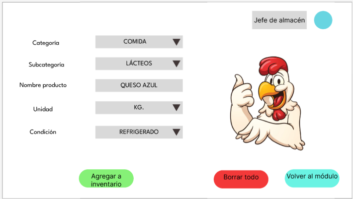

# 4.5. Módulo 5
# Módulo 5: Gestión de inventario
# Requerimientos por casos de uso
## 1) Ingresar nuevo producto (R501)

<table border="1">
	<tbody>
		<tr>
			<td>Nombre</td>
			<td colspan="2">Ingresar nuevo producto</td>
		</tr>
		<tr>
			<td>Tarea realizada por el usuario</td>
			<td colspan="2">Ingresar los datos de un nuevo producto que pasará a formar parte del inventario</td>
		</tr>
		<tr>
			<td>Actor inicializador</td>
			<td colspan="2">Jefe de Almacén</td>
		</tr>
		<tr>
			<td>Actores participantes</td>
			<td colspan="2">N/A</td>
		</tr>
		<tr>
			<td rowspan="7">Flujo de eventos</td>
			<td>Actores</td>
			<td>Sistema</td>
		</tr>
		<tr>
			<td>1. El usuario selecciona "Registro de producto" en el módulo.</td>
			<td>-</td>
		</tr>
		<tr>
			<td>2. El usuario coloca la categoría, la subcategoría, el nombre, la unidad de medida, las condiciones de conservación, el umbral mínimo y la tolerancia del insumoque se agregará al inventario.</td>
			<td>-</td>
		</tr>
		<tr>
			<td>3. El usuario selecciona la opción "Agregar a inventario".</td>
			<td>-</td>
		</tr>
		<tr>
			<td>-</td>
			<td>4. El sistema pide la verificación del tipo de producto que se agregará al inventario.</td>
		</tr>
		<tr>
			<td>5. El usuario confirma los datos, en caso de error selecciona cambiar datos.</td>
			<td></td>
		</tr>
		<tr>
			<td>-</td>
			<td>6. El sistema actualizará la base de datos.</td>
		</tr>
		<tr>
			<td>Excepciones</td>
			<td colspan="2"></td>
		</tr>
		<tr>
			<td>Precondición</td>
			<td colspan="2">Solo se podrá ingresar productos no existentes en el inventario. El usuario debe tener el cargo de "Jefe de almacén"</td>
		</tr>
		<tr>
			<td>Postcondición</td>
			<td colspan="2">Un nuevo tipo de producto está disponible en la base de datos</td>
		</tr>
		<tr>
			<td>Casos de uso incluidos</td>
			<td colspan="2">-</td>
		</tr>
		<tr>
			<td>Servicios utilizados</td>
			<td colspan="2">"Creación de producto" "Actualizar inventario"</td>
		</tr>
		<tr>
			<td>Requerimientos no funcionales</td>
			<td colspan="2">Tiempo de respuesta, usabilidad, manejo de errores</td>
		</tr>
	</tbody>
</table>

## 2) Revisión de orden de compra y asignación de supervisores (R502)

<table border="1">
	<tbody>
		<tr>
			<td>Nombre</td>
			<td colspan="2">Revisión orden de compra y asignación de supervisores</td>
		</tr>
		<tr>
			<td>Tarea realizada por el usuario</td>
			<td colspan="2">Seleccionar la orden de compra correspondiente y asignar a los supervisores</td>
		</tr>
		<tr>
			<td>Actor inicializador</td>
			<td colspan="2">Jefe de Almacén</td>
		</tr>
		<tr>
			<td>Actores participantes</td>
			<td colspan="2">N/A</td>
		</tr>
		<tr>
			<td rowspan="6">Flujo de eventos</td>
			<td>Actores</td>
			<td>Sistema</td>
		</tr>
		<tr>
			<td>1. El usuario selecciona "Ingreso de insumos" en el módulo.</td>
			<td>-</td>
		</tr>
		<tr>
			<td>2. El usuario revisa las órdenes de compra, diferenciando principalmante al proveedor, y selecciona la orden de compra. Luego usa el botón "Seleccionar orden"</td>
			<td>-</td>
		</tr>
		<tr>
			<td>-</td>
			<td>3. El sistema muestra el código de orden de compra, proveedor, nombre del insumo, unidad de medida del insumo y la cantidad que fue solicitada, luego de la confirmación con el camionero selecciona asignar supervisores</td>
		</tr>
		<tr>
			<td>-</td>
			<td>4. El sistema muestra unas listas desplegables indicando el código del empleado, nombre, habilidad y cargo. Luego, el jefe de almacen puede seleccionar a los empleados con habilidades necesarias para la tarea.</td>
		</tr>
		<tr>
			<td></td>
			<td>5. El sistema habilita las tareas a los supervisores.</td>
		</tr>
		<tr>
			<td>Excepciones</td>
			<td colspan="2"></td>
		</tr>
		<tr>
			<td>Precondición</td>
			<td colspan="2">Solo se podrá asignar la supervisión a empleados con habilidad de supervisión y cargo relacionado a almacen</td>
		</tr>
		<tr>
			<td>Postcondición</td>
			<td colspan="2">Unas asignaciones de tareas han sido creadas</td>
		</tr>
		<tr>
			<td>Casos de uso incluidos</td>
			<td colspan="2">-</td>
		</tr>
		<tr>
			<td>Servicios utilizados</td>
			<td colspan="2">"Asignar supervición"</td>
		</tr>
		<tr>
			<td>Requerimientos no funcionales</td>
			<td colspan="2">Tiempo de respuesta, usabilidad, manejo de errores</td>
		</tr>
	</tbody>
</table>

## 3) Revisión Cantidad (R503)

<table border="1">
	<tbody>
		<tr>
			<td>Nombre</td>
			<td colspan="2">Revisión cantidad</td>
		</tr>
		<tr>
			<td>Tarea realizada por el usuario</td>
			<td colspan="2">Ingresar las cantidades recibidas por parte del proveedor</td>
		</tr>
		<tr>
			<td>Actor inicializador</td>
			<td colspan="2">Supervisor</td>
		</tr>
		<tr>
			<td>Actores participantes</td>
			<td colspan="2">N/A</td>
		</tr>
		<tr>
			<td rowspan="8">Flujo de eventos</td>
			<td>Actores</td>
			<td>Sistema</td>
		</tr>
		<tr>
			<td>1. El usuario selecciona "Ingreso de insumos" en el módulo.</td>
			<td>-</td>
		</tr>
		<tr>
			<td>2. El usuario selecciona la opción "RevisiónCantidad" que le aparece disponible.</td>
			<td>-</td>
		</tr>
		<tr>
			<td>-</td>
			<td>3. El sistema muestra una tabla indicando el código de la orden de compra, el nombre del insumo, la unidad de medida del insumo y la cantidad solicitada en la orden de compra; además, la última columna estará vacía y el usuario podrá colocar las cantidades que obtenga en el conteo</td>
		</tr>
		<tr>
			<td>4. El usuario realiza el conteo y coloca las cantidades obtenidas.</td>
			<td>-</td>
		</tr>
		<tr>
			<td>5. Una vez terminado el conteo el supervisor selecciona la opción "Terminar revisión".</td>
			<td></td>
		</tr>
		<tr>
			<td>-</td>
			<td>6. EL sistema registra el conteo y guarda la fecha y hora</td>
		</tr>
		<tr>
		<tr>
			<td>Excepciones</td>
			<td colspan="2"></td>
		</tr>
		<tr>
			<td>Precondición</td>
			<td colspan="2">Solo se podrá contar productos existentes en inventario e incluidos en la orden de compra"</td>
		</tr>
		<tr>
			<td>Postcondición</td>
			<td colspan="2">La tabla Revisión_cantidad se habrá actualizado</td>
		</tr>
		<tr>
			<td>Casos de uso incluidos</td>
			<td colspan="2">-</td>
		</tr>
		<tr>
			<td>Servicios utilizados</td>
			<td colspan="2">"Revisión cantidad"</td>
		</tr>
		<tr>
			<td>Requerimientos no funcionales</td>
			<td colspan="2">Tiempo de respuesta, usabilidad, manejo de errores</td>
		</tr>
	</tbody>
</table>

## 4) Revisión calidad (R504)

<table border="1">
	<tbody>
		<tr>
			<td>Nombre</td>
			<td colspan="2">Revisión calidad</td>
		</tr>
		<tr>
			<td>Tarea realizada por el usuario</td>
			<td colspan="2">Calificar la calidad de los insumos recibidos por parte del proveedor</td>
		</tr>
		<tr>
			<td>Actor inicializador</td>
			<td colspan="2">Supervisor</td>
		</tr>
		<tr>
			<td>Actores participantes</td>
			<td colspan="2">N/A</td>
		</tr>
		<tr>
			<td rowspan="7">Flujo de eventos</td>
			<td>Actores</td>
			<td>Sistema</td>
		</tr>
		<tr>
			<td>1. El usuario selecciona "Ingreso de insumos" en el módulo.</td>
			<td>-</td>
		</tr>
		<tr>
			<td>2. El usuario selecciona la opción "RevisiónCalidad" que le aparece disponible.</td>
			<td>-</td>
		</tr>
		<tr>
			<td>-</td>
			<td>3. El sistema muestra una tabla indicando el código de la orden de compra, el nombre del insumo, el nombre del supervisor; además incluirá 2 columnas editables: la primera cuenta con una lista desplegable para calificar la calidad y la otra, un campo de texto para escribir la descripción.</td>
		</tr>
		<tr>
			<td>4. El usuario realiza realiza la revisión y coloca la calificación y descripción correspondiente a cada insumo de la orden de compra.</td>
			<td>-</td>
		</tr>
		<tr>
			<td>5. Una vez terminado el conteo el supervisor selecciona la opción "Terminar revisión".</td>
			<td></td>
		</tr>
		<tr>
			<td>-</td>
			<td>6. EL sistema registra el conteo y guarda la fecha y hora</td>
		</tr>
		<tr>
		<tr>
			<td>Excepciones</td>
			<td colspan="2"></td>
		</tr>
		<tr>
			<td>Precondición</td>
			<td colspan="2">Solo se podrá  prrevisar insumos existentes en inventario e incluidos en la orden de compra"</td>
		</tr>
		<tr>
			<td>Postcondición</td>
			<td colspan="2">La tabla Revisión_calidad se habrá actualizado</td>
		</tr>
		<tr>
			<td>Casos de uso incluidos</td>
			<td colspan="2">-</td>
		</tr>
		<tr>
			<td>Servicios utilizados</td>
			<td colspan="2">"Revisión calidad"</td>
		</tr>
		<tr>
			<td>Requerimientos no funcionales</td>
			<td colspan="2">Tiempo de respuesta, usabilidad, manejo de errores</td>
		</tr>
	</tbody>
</table>

## 5) Ingreso de insumos (R505)

<table border="1">
	<tbody>
		<tr>
			<td>Nombre</td>
			<td colspan="2">Ingreso de productos</td>
		</tr>
		<tr>
			<td>Tarea realizada por el usuario</td>
			<td colspan="2">Ingresar los datos de los productos que pasarán a formar parte del inventario</td>
		</tr>
		<tr>
			<td>Actor inicializador</td>
			<td colspan="2">Supervisor</td>
		</tr>
		<tr>
			<td>Actores participantes</td>
			<td colspan="2">N/A</td>
		</tr>
		<tr>
			<td rowspan="10">Flujo de eventos</td>
			<td>Actores</td>
			<td>Sistema</td>
		</tr>
		<tr>
			<td>1. El usuario selecciona "Ingreso de productos" en el módulo.</td>
			<td>-</td>
		</tr>
		<tr>
			<td>2. El usuario selecciona "Iniciar ingreso a almacén" en el módulo.</td>
			<td>-</td>
		</tr>
		<tr>
			<td>-</td>
			<td>3. El sistema muestra el codigo de la orden de compra y una tabla con los insumos incluidos y sus cantidades recibidas. La tabla está ordenada por la cantidad recibida en orden descendente.</td>
		</tr>
		<tr>
			<td>4. El usuario selecciona un insumo y selecciona "insertar"</td>
			<td>-</td>
		</tr>
		<tr>
			<td>-</td>
			<td>5. El sistema muestra una interfaz donde se muestra la categoría, la subcategoría, el nombre del insumo, la unidad de medida, la cantidad recibida, la condición de conservación, el proveedor y el código de stock.</td>
		</tr>
		<tr>
			<td>6. EL usuario debe ingresar la fecha de vencimiento y el almacén donde se ingresará el producto, luego presiona el botón "Iniciar ingreso a almacén"</td>
			<td>-</td>
		</tr>
		<tr>
			<td>-</td>
			<td>7. El sistema registrará la hora de ingreso a almacén</td>
		</tr>
		<tr>
			<td>8. Luego de acomodar el insumo, el usuario selecciona "Terminar ingreso a almacen".</td>
			<td>-</td>
		</tr>
		<tr>
			<td>-</td>
			<td>8. El sistema guarda la hora y lo lleva a la interfaz inicial y se repite hasta terminar el ingreso de todos los insumos.</td>
		</tr>
		<tr>
			<td>Excepciones</td>
			<td colspan="2"></td>
		</tr>
		<tr>
			<td>Precondición</td>
			<td colspan="2">Solo se podrá ingresar productos ya existentes en el inventario, si el producto no existe seleccionar la opción "Registrar nuevo producto" en el módulo. El usuario debe tener el cargo de "Supervisor"</td>
		</tr>
		<tr>
			<td>Postcondición</td>
			<td colspan="2">El inventario se ha actualizado</td>
		</tr>
		<tr>
			<td>Casos de uso incluidos</td>
			<td colspan="2">-</td>
		</tr>
		<tr>
			<td>Servicios utilizados</td>
			<td colspan="2">"Ingreso de Insumos" "ActualizarInventario"</td>
		</tr>
		<tr>
			<td>Requerimientos no funcionales</td>
			<td colspan="2">Tiempo de respuesta, usabilidad, manejo de errores</td>
		</tr>
	</tbody>
</table>

## 6) Salida de productos (R506)

<table border="1">
	<tbody>
		<tr>
			<td>Nombre</td>
			<td colspan="2">Salida de productos</td>
		</tr>
		<tr>
			<td>Tarea realizada por el usuario</td>
			<td colspan="2">Ingresar los datos de los productos que dejarán de formar parte del inventario</td>
		</tr>
		<tr>
			<td>Actor inicializador</td>
			<td colspan="2">Jefe de Almacen</td>
		</tr>
		<tr>
			<td>Actores participantes</td>
			<td colspan="2">N/A</td>
		</tr>
		<tr>
			<td rowspan="12">Flujo de eventos</td>
			<td>Actores</td>
			<td>Sistema</td>
		</tr>
		<tr>
			<td>1. El usuario selecciona "Salida de productos" en el módulo.</td>
			<td>-</td>
		</tr>
		<tr>
			<td>-</td>
			<td>El sistema carga los datos de la hoja de producción elaborada ese mismo día, mostrando los insumos y las cantidades necesarias para su preparación por la cantidad necesaria en forma descendente</td>
		</tr>
		<tr>
			<td>3. El usuario selecciona el insumo que desea retirar</td>
			<td>-</td>
		</tr>
		<tr>
			<td>-</td>
			<td>4. El sistema muestra la categoría, subcategoria, nombre, cantidad de los insumos que se retirarán del inventario.</td>
		</tr>
		<tr>
			<td>5. El usuario selecciona el "Triángulo" en la parte de almacen. que abre una lista de almacenes con ese insumo</td>
			<td>-</td>
		</tr>
		<tr>
			<td>-</td>
			<td>6. El sistema muestra las ubicaciones de los insumos en el local.</td>
		</tr>
		<tr>
			<td>7. El usuario selecciona una ubicación.</td>
			<td>-</td>
		</tr>
		<tr>
			<td>8. El usuario selecciona la opción de "Iniciar salida de almacen".</td>
			<td>-</td>
		</tr>
		<tr>
			<td>-</td>
			<td>9. El sistema guarda la hora de ingreso a almacen.</td>
		</tr>
		<tr>
			<td>10. Luego de realizar el retiro de insumos, el usuario selecciona "Terminar salida de almacen".</td>
			<td>-</td>
		</tr>
		<tr>
			<td>-</td>
			<td>11. El sistema guarda a hora de cierre y lo manda a interfaz inicial para repetir hasta retirar todos los insumos.</td>
		</tr>
		<tr>
			<td>Excepciones</td>
			<td colspan="2"></td>
		</tr>
		<tr>
			<td>Precondición</td>
			<td colspan="2">Solo se podrá retirar productos existentes y con cantidades mayores a 0 en el inventario.El usuario debe tener el cargo de "Jefe de almacén"</td>
		</tr>
		<tr>
			<td>Postcondición</td>
			<td colspan="2">La base de datos se ha actualizado</td>
		</tr>
		<tr>
			<td>Casos de uso incluidos</td>
			<td colspan="2">-</td>
		</tr>
		<tr>
			<td>Servicios utilizados</td>
			<td colspan="2">"Salida de insumos" "Actualizar inventario"</td>
		</tr>
		<tr>
			<td>Requerimientos no funcionales</td>
			<td colspan="2">Tiempo de respuesta, usabilidad, manejo de errores</td>
		</tr>
	</tbody>
</table>

## 7) Revisar inventario extendido (R507)

<table border="1">
	<tbody>
		<tr>
			<td>Nombre</td>
			<td colspan="2">Revisar inventario</td>
		</tr>
		<tr>
			<td>Tarea realizada por el usuario</td>
			<td colspan="2">Colocar los datos en una barra de búsqueda si desea filtrar los productos.</td>
		</tr>
		<tr>
			<td>Actor inicializador</td>
			<td colspan="2">Usuario</td>
		</tr>
		<tr>
			<td>Actores participantes</td>
			<td colspan="2">N/A</td>
		</tr>
		<tr>
			<td rowspan="5">Flujo de eventos</td>
			<td>Actores</td>
			<td>Sistema</td>
		</tr>
		<tr>
			<td>1. El usuario selecciona "Revisar inventario" en el módulo.</td>
			<td>-</td>
		</tr>
		<tr>
			<td>-</td>
			<td>2. El sistema muestra la categoría, subcategoría, código del insumo, nombre del insumo, unidad de medida, cantidad, fecha de vencimiento, proveedor,ubicación y código de stock de todos los insumos.</td>
		</tr>
		<tr>
			<td>3. El usuario coloca la categoría, subcategoría y escribe el nombre del producto (no es necesario que coloque todos los filtros)para filtrar los resultados.</td>
			<td>-</td>
		</tr>
		<tr>
			<td>-</td>
			<td>4. El sistema filtra y muestra los datos de los productos buscados.</td>
		</tr>
		<tr>
			<td>Excepciones</td>
			<td colspan="2"></td>
		</tr>
		<tr>
			<td>Precondición</td>
			<td colspan="2">El producto a buscar debe existir en el inventario</td>
		</tr>
		<tr>
			<td>Postcondición</td>
			<td colspan="2">Se muestra el estado actual del inventario</td>
		</tr>
		<tr>
			<td>Casos de uso incluidos</td>
			<td colspan="2">-</td>
		</tr>
		<tr>
			<td>Servicios utilizados</td>
			<td colspan="2">"Buscar", "FiltrarCategoría", "FiltrarSubcategoría"</td>
		</tr>
		<tr>
			<td>Requerimientos no funcionales</td>
			<td colspan="2">Tiempo de respuesta, usabilidad, manejo de errores</td>
		</tr>
	</tbody>
</table>

## 8) Revisar inventario compacto (R508)

<table border="1">
	<tbody>
		<tr>
			<td>Nombre</td>
			<td colspan="2">Revisar inventario compacto</td>
		</tr>
		<tr>
			<td>Tarea realizada por el usuario</td>
			<td colspan="2">Colocar los datos en una barra de búsqueda si desea filtrar los productos.</td>
		</tr>
		<tr>
			<td>Actor inicializador</td>
			<td colspan="2">Usuario</td>
		</tr>
		<tr>
			<td>Actores participantes</td>
			<td colspan="2">N/A</td>
		</tr>
		<tr>
			<td rowspan="5">Flujo de eventos</td>
			<td>Actores</td>
			<td>Sistema</td>
		</tr>
		<tr>
			<td>1. El usuario selecciona "Revisar inventario" en el módulo, luego selecciona la opción "Ver inventario compacto"</td>
			<td>-</td>
		</tr>
		<tr>
			<td>2. El sistema calcula la cantidad de insumos que hay por cada insumo, sumando las cantidades que tiene cada stock.</td>
			<td></td>
		</tr>
		<tr>
			<td>-</td>
			<td>3. El sistema muestra el código de insumo, el nombre de insumo, la categoría, la subcategoría,  la unidad, la cantidad total y la ubicación de todos los insumos.</td>
		</tr>
		<tr>
			<td>3. El usuario coloca la categoría, subcategoría y escribe el nombre del producto (no es necesario que coloque todos los filtros)para filtrar los resultados.</td>
			<td>-</td>
		</tr>
		<tr>
			<td>-</td>
			<td>4. El sistema filtra y muestra los datos de los productos buscados.</td>
		</tr>
		<tr>
			<td>Excepciones</td>
			<td colspan="2"></td>
		</tr>
		<tr>
			<td>Precondición</td>
			<td colspan="2">El producto a buscar debe existir en el inventario</td>
		</tr>
		<tr>
			<td>Postcondición</td>
			<td colspan="2">Se muestra el estado actual del inventario</td>
		</tr>
		<tr>
			<td>Casos de uso incluidos</td>
			<td colspan="2">-</td>
		</tr>
		<tr>
			<td>Servicios utilizados</td>
			<td colspan="2">"Buscar", "FiltrarCategoría", "FiltrarSubcategoría"</td>
		</tr>
		<tr>
			<td>Requerimientos no funcionales</td>
			<td colspan="2">Tiempo de respuesta, usabilidad, manejo de errores</td>
		</tr>
	</tbody>
</table>

## 8) Ver historial de movimientos (R509)
<table border="1">
	<tbody>
		<tr>
			<td>Nombre</td>
			<td colspan="2">Ver historial de movimientos</td>
		</tr>
		<tr>
			<td>Tarea realizada por el usuario</td>
			<td colspan="2">Buscar los datos del producto del que desea ver su historial de movimientos y seleccionar un periodo de tiempo para mostrarlo.</td>
		</tr>
		<tr>
			<td>Actor inicializador</td>
			<td colspan="2">Usuario</td>
		</tr>
		<tr>
			<td>Actores participantes</td>
			<td colspan="2">N/A</td>
		</tr>
		<tr>
			<td rowspan="5">Flujo de eventos</td>
			<td>Actores</td>
			<td>Sistema</td>
		</tr>
		<tr>
			<td>1. El usuario selecciona "Ver historial de movimientos" en el módulo.</td>
			<td>-</td>
		</tr>
		<tr>
			<td>-</td>
			<td>2. El sistema muestra categoría, subcategoría, código del producto, nombre del producto, unidad de medida, tipo de movimiento, cantidad, fecha, hora inicio, hora fin, ubicación, proveedor, lote, código del trabajador, supervisor de cada uno de los movimientos realizados en el periodo seleccionado.</td>
		</tr>
		<tr>
			<td>3. El usuario coloca la categoría, subcategoría, escribe el nombre del producto y selecciona la opción filtrar.</td>
			<td>-</td>
		</tr>
		<tr>
			<td>-</td>
			<td>4. El sistema filtra los productos y muestra el historial de movimientos.</td>
		</tr>
		<tr>
			<td>Excepciones</td>
			<td colspan="2">-</td>
		</tr>
		<tr>
			<td>Precondición</td>
			<td colspan="2">Solo se podrá buscar productos existentes en el inventario. El usuario debe tener el cargo de "Jefe de almacén"</td>
		</tr>
		<tr>
			<td>Postcondición</td>
			<td colspan="2">Se muestra el historial de movimientos de los insumos.</td>
		</tr>
		<tr>
			<td>Casos de uso incluidos</td>
			<td colspan="2">-</td>
		</tr>
		<tr>
			<td>Servicios utilizados</td>
			<td colspan="2">"Filtrar categoría", "Filtrar subcategoría", "Filtrar periodo", "Buscar", "Historial de movimientos"</td>
		</tr>
		<tr>
			<td>Requisitos no funcionales</td>
			<td colspan="2">Tiempo de respuesta, usabilidad, manejo de errores</td>
		</tr>
	</tbody>
</table>

## 10) Elaborar hoja de producción (R510)

<table border="1">
	<tbody>
		<tr>
			<td>Nombre</td>
			<td colspan="2">Elaborar hoja de producción</td>
		</tr>
		<tr>
			<td>Tarea realizada por el usuario</td>
			<td colspan="2">Colocar las recetas a preparar, indicando cantidad de cada uno.</td>
		</tr>
		<tr>
			<td>Actor inicializador</td>
			<td colspan="2">Usuario</td>
		</tr>
		<tr>
			<td>Actores participantes</td>
			<td colspan="2">N/A</td>
		</tr>
		<tr>
			<td rowspan="6">Flujo de eventos</td>
			<td>Actores</td>
			<td>Sistema</td>
		</tr>
		<tr>
			<td>1. El usuario selecciona "Hoja de producción" en el módulo.</td>
			<td>-</td>
		</tr>
		<tr>
			<td>2. El usuario coloca el nombre de la receta y la cantidad prevista de los platos que se producirán durante el día.</td>
			<td>-</td>
		</tr>
		<tr>
			<td>-</td>
			<td>3. El sistema verifica la disponibilidad de insumos.</td>
		</tr>
		<tr>
			<td>4. Si no hay disponibilidad para lo indicado en la hoja de producción se tiene que modificar la hoja.</td>
			<td>-</td>
		</tr>
		<tr>
			<td>5. El usuario selecciona la opción de enviar hoja de producción a cocina.</td>
			<td>-</td>
		</tr>
		<tr>
			<td>Excepciones</td>
			<td colspan="2"></td>
		</tr>
		<tr>
			<td>Precondición</td>
			<td colspan="2">Los platos deben estar registrados y el inventario debe estar actualizado.</td>
		</tr>
		<tr>
			<td>Postcondición</td>
			<td colspan="2">Se generan una hoja de producción con los platos a preparar y un pedido con los insumos a utilizar.</td>
		</tr>
		<tr>
			<td>Casos de uso incluidos</td>
			<td colspan="2">-</td>
		</tr>
		<tr>
			<td>Servicios utilizados</td>
			<td colspan="2">"Verificar disponibilidad"</td>
		</tr>
		<tr>
			<td>Requerimientos no funcionales</td>
			<td colspan="2">Tiempo de respuesta, usabilidad, manejo de errores</td>
		</tr>
	</tbody>
</table>

## 10) Revisar insumos de la hoja de producción

<table border="1">
	<tbody>
		<tr>
			<td>Nombre</td>
			<td colspan="2">Revisar insumos de la hoja de producción</td>
		</tr>
		<tr>
			<td>Tarea realizada por el usuario</td>
			<td colspan="2">Seleccionar la hoja de la que se calcularan los insumos necesarios.</td>
		</tr>
		<tr>
			<td>Actor inicializador</td>
			<td colspan="2">Jefe de Almacén</td>
		</tr>
		<tr>
			<td>Actores participantes</td>
			<td colspan="2">N/A</td>
		</tr>
		<tr>
			<td rowspan="6">Flujo de eventos</td>
			<td>Actores</td>
			<td>Sistema</td>
		</tr>
		<tr>
			<td>1. El usuario selecciona "Hoja de producción" en el módulo.</td>
			<td>-</td>
		</tr>
		<tr>
			<td>2. El usuario selecciona "Mostrar hojas pasadas" </td>
			<td>-</td>
		</tr>
		<tr>
			<td>-</td>
			<td>3. El sistema muestra una lista de hojas de producción con su fecha de elaboración.</td>
		</tr>
		<tr>
			<td>4. El usuario selecciona una lista y selecciona el botón "Calcular insumos".</td>
			<td>-</td>
		</tr>
		<tr>
			<td>-</td>
			<td>5. El sistema muestra el codigo de la hoja de producción, los insumos y la cantidad necesaria.</td>
		</tr>
		<tr>
			<td>Excepciones</td>
			<td colspan="2"></td>
		</tr>
		<tr>
			<td>Precondición</td>
			<td colspan="2">Los platos deben estar registrados y el inventario debe estar actualizado.</td>
		</tr>
		<tr>
			<td>Postcondición</td>
			<td colspan="2">Se generan una lista de insumos para hacer las preparaciones del día.</td>
		</tr>
		<tr>
			<td>Casos de uso incluidos</td>
			<td colspan="2">-</td>
		</tr>
		<tr>
			<td>Servicios utilizados</td>
			<td colspan="2">"Verificar disponibilidad"</td>
		</tr>
		<tr>
			<td>Requerimientos no funcionales</td>
			<td colspan="2">Tiempo de respuesta, usabilidad, manejo de errores</td>
		</tr>
	</tbody>
</table>

## Requerimientos no funcionales

# Prototipo
## Ingreso de productos

Pantalla con los datos vacíos:

Pantalla con los datos llenos:

Pantalla con los datos por confirmar:

Pantalla con los datos confirmados:

## Salida de productos:

Pantalla con datos vacíos:

Pantalla con los datos llenos:

Pantalla con los datos por confirmar:

Pantalla con los datos confirmados:

## Nuevo producto:
Pantalla con lo datos vacíos:

Pantalla con los datos llenos:

Pantalla con los datos por confirmar:

Pantalla con los datos confirmados:

## Revisar inventario

Pantalla sin filtros:

Pantalla con filtros:

## Ver historial de movimientos

Pantalla sin filtros:

Pantalla con filtros:

## Elaborar hoja de producción

Pantalla inicial - Hoja de producción vacía:

Hoja de producción con recetas:

Error al verificar hoja de producción:

Modificar hoja de producción 1:

Modificar hoja de producción 2:

Modificar hoja de producción 3:

Verificar hoja de producción:

Enviar hoja de producción:

### Hoja automática

Pantalla inicial:

Pantalla con datos:

Cantidades calculadas:

Enviado:

Enlace al archivo en Figma: [AQUÍ](https://www.figma.com/design/rm3WcYopPAFZJYwf9MsJ2Q/PROTOTIPO-INVENTARIO?node-id=0-1&t=QDb9xQueMKJs5Ps8-1)

Enlace a la presentación en Figma: [AQUÍ](https://www.figma.com/proto/rm3WcYopPAFZJYwf9MsJ2Q/PROTOTIPO-INVENTARIO?node-id=2-2&node-type=canvas&t=8viUc1JI6sjvU4Uq-1&scaling=contain&content-scaling=fixed&page-id=0%3A1)

