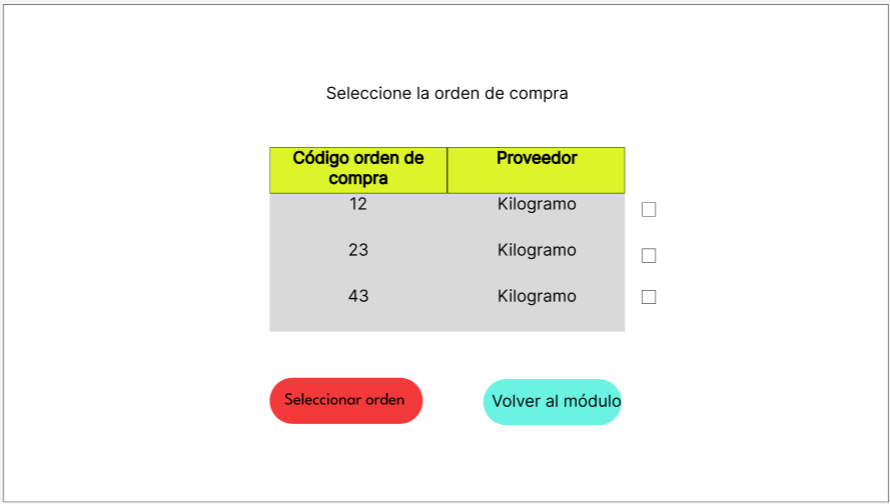

# 8.1. Sentencias SQL por módulo / prototipo
# Modulo 4: Gestion de personal y turno

# Modulo 4: Gestion de personal y turno

### 1. Página pricipal

<table border="1" cellpadding="5" cellspacing="0">
    <tr>
        <td><strong>Código Requerimiento</strong></td>
        <td>CU001</td>
    </tr>
    <tr>
        <td><strong>Código Interfaz</strong></td>
        <td>I04</td>
    </tr>
    <tr>
        <td><strong>Imagen Interfaz</strong></td>
        <td>
            
        </td>
    </tr>
    <tr>
        <td><strong>Sentencias SQL</strong></td>
        <td></td>
    </tr>
    <tr>
        <td><strong>Eventos</strong></td>
        <td>
            <ol>
                <li>
                    <strong>Trabajadores activos: </strong> Se muestra la cantidad de trabajadores que marcaron su asistencia y están laborando en el día.<br>
                    <code>SELECT COUNT(cod_asistencia) AS "Total activos"
                    FROM ASISTENCIA 
                    WHERE cod_estado in (1,3) and 
                    fecha=CURRENT_DATE;</code>
                </li>
                <li>
                    <strong>Solicitudes: </strong> Se muestra la cantidad de solicitudes no revisadas ni procesadas.<br>
                    <code>SELECT COUNT(cod_sd) AS "Total solicitudes"
                    FROM SOLICITUD_O_DESCARGO
                    WHERE cod_estado_sd=1;
                    </code>
                </li>
            </ol>
        </td>
    </tr>
</table>

### 2.Perfiles de usuario

<table border="1" cellpadding="5" cellspacing="0">
    <tr>
        <td><strong>Código Requerimiento</strong></td>
        <td>CU003</td>
    </tr>
    <tr>
        <td><strong>Código Interfaz</strong></td>
        <td>I05</td>
    </tr>
    <tr>
        <td><strong>Imagen Interfaz</strong></td>
        <td>
            
        </td>
    </tr>
    <tr>
        <td><strong>Sentencias SQL</strong></td>
        <td></td>
    </tr>
    <tr>
        <td><strong>Eventos</strong></td>
        <td>
            <ol>
                <li>
                    <strong>Boton Buscar(Lupa): </strong> Cuando el usuario presione el boton buscar se mostrará el resultado del siguiente codigo.<br>
                    <code>SELECT e.primer_nombre as Nombre, ca.nombre_cargo as cargo,
                    e.DNI,tu.nombre_turno as Turno FROM EMPLEADO e
                    INNER JOIN CARGO ca ON e.cod_cargo=ca.cod_cargo
                    INNER JOIN TURNO tu ON e.cod_cargo=tu.cod_turno
                    WHERE e.primer_nombre ILIKE('<1>') or 
                    e.Primer_apellido ILIKE('<1>') or 
                    e.Segundo_apellido ILIKE('<1>') or
                    e.DNI ILIKE('<1>');
                    </code>
                    <br>
                    Donde <1> puede ser el nombre, apellido o DNI mediante el cual se desea buscar a un empleado.
                </li>
                  <li>
                    <strong>Boton Editar: </strong> Cuando el usuario presione el boton editar se ejecutará las siguientes consultas cuyos resultados se mostrarán                     en la ventana I06. <br>
                    BLOQUE PRINCIPAL:
                    </br>
                    <code>SELECT e.Primer_Nombre,e.Primer_apellido,e.Segundo_Apellido,
                    e.DNI,e.Direccion,e.contacto,ca.Nombre_cargo,ar.nombre_area,
                    lo.nombre_local,tco.nombre_tipo_contrato,co.fecha_contratacion
                    FROM EMPLEADO e
                    INNER JOIN CARGO ca ON e.cod_cargo=ca.cod_cargo
                    INNER JOIN AREA ar ON ca.cod_cargo=ar.cod_cargo
                    INNER JOIN LOCAL lo ON e.cod_local=lo.cod_local
                    INNER JOIN CONTRATO co ON e.cod_contrato=co.cod_contrato
                    INNER JOIN TIPO_CONTRATO tco ON co.cod_tipo_contrato=tco.cod_tipo_contrato
                    WHERE e.codigo_empleado=<1>;
                    </code>
                    <br>
                     BLOQUE HORARIO LIBRE:
                    <code>
                    SELECT hld.Dias,hl.Hora_inicio,hl.Hora_fin
                    FROM EMPLEADO e
                    INNER JOIN HORARIO_LIBRE hl ON hl.codigo_empleado=e.codigo_empleado
                    INNER JOIN HORARIO_LIBRE_DIAS hld ON hld.cod_horario=hl.cod_horario
                    WHERE e.codigo_empleado=<1>;
                    </code>
                    <br>
                    BLOQUE HISTORIAL LABORAL:
                    </br>
                    <code>
                    SELECT hld.Dias,hl.Hora_inicio,hl.Hora_fin
                    FROM EMPLEADO e
                    INNER JOIN HORARIO_LIBRE hl ON hl.codigo_empleado=e.codigo_empleado
                    INNER JOIN HORARIO_LIBRE_DIAS hld ON hld.cod_horario=hl.cod_horario
                    WHERE e.codigo_empleado=<1>;
                    </code>
                    <br>
                    BLOQUE HABILIDADES:
                    </br>
                    <code>
                    SELECT h.Nombre_habilidad,h.Descripcion
                    FROM EMPLEADO e
                    INNER JOIN POSEE po ON po.codigo_empleado=e.codigo_empleado
                    INNER JOIN HABILIDAD h ON po.cod_habilidad=h.cod_habilidad
                    WHERE e.codigo_empleado=<1>;
                    </code>
                    <br>Donde <1> es el codigo del empleado del cual se preciona el boton editar.
                    </br>
                </li>
            </ol>
        </td>
    </tr>
</table>


# Módulo 5: Gestión de inventario
## Ingreso de insumos: Funcionalidad
### Nuevo insumo
Cod requerimiento: R501

Pantalla: R101


Sentencia SQL:

```sql 
INSERT INTO insumo (nombre_insumo, cod_unidad, cod_condiciones, cod_categoriainsumo, cod_subcategoria, umbral, tolerancia)
values
(
	'<1>',
	(select um.cod_unidad from unidad_medidad um where um.nombre_unidad='<2>' ),
	(select c.cod_condiciones from condiciones c where c.nombre_condiciones='<3>'),
	(select ci.cod_categoriainsumo from categoria_insumo ci where ci.nombre_categoriainsumo='<4>'),
	(select s.cod_subcategoria from subcategoria s where s.nombre_subcategoria='<5>'),
	<6>,
	<7>
);
```

<1>, <2>, <3>, <4>, <5>, <6> y <7> son ingresados por el usuario. <2>, <3>, <4> y <5> se seleccionan con listas desplegables.   


### Verificación de la orden de compra

#### Ver órdenes de compra para el día


Eventos:
Botón "Ingresar Insumo":
```sql
select oc.cod_ordencompra ,p.nombre_empresa from orden_compra oc 
inner join proveedor p on p.cod_proveedor = oc.cod_proveedor 
where oc.fecha_requeridaentrega = current_date;
```

#### Seleccionar orden de compra a ingresar



Eventos:
Botón "Seleccionar orden":

- Mostrar proveedor:
```sql
select p.nombre_empresa from orden_compra oc 
inner join proveedor p on p.cod_proveedor = oc.cod_proveedor 
where oc.cod_ordencompra = 20
```

- Mostrar insumos y cantidad de la orden de compra:
```sql
select i.nombre_insumo, um.nombre_unidad, oc2.cantidad_compra from orden_compra oc 
inner join orden_comprainsumo oc2 on oc2.cod_ordencompra = oc.cod_ordencompra
inner join insumo i on oc2.cod_insumo = i.cod_insumo 
inner join unidad_medidad um on um.cod_unidad = i.cod_unidad 
where oc.cod_ordencompra = <1>
```

### Generación de Revision_Cantidad y Revision_Calidad


- Botón "Desplegar lista" (el triángulo):
```sql
select 
e.codigo_empleado,
CONCAT(e.primer_nombre,' ', e.primer_apellido,' ', e.segundo_apellido) as "Nombre"
from empleado e 
inner join posee p on p.codigo_empleado = e.codigo_empleado 
where p.cod_habilidad = 6
and e.cod_local = <1>
```

- Botón confirmar asignaciones:
```sql
INSERT INTO Revision_Cantidad (cod_ordencompra, cod_insumo, cantidad_revisada, fecha_revision, cod_supervisor)
SELECT 
    oci.cod_ordencompra,
    oci.cod_insumo,
    NULL,                      
    NULL,      
    <1>   
FROM 
    Orden_comprainsumo oci
WHERE 
    oci.cod_ordencompra = <2>;

```

<1> es el código del empleado asignado como supervisor de la revisión de la cantidad, <2> es el código de la orden de compra


```sql
INSERT INTO Revision_Calidad (Cod_ordencompra, Cod_insumo, Cod_calidad, fecha_revision, Cod_supervisor, descripcion)
SELECT 
    oci.cod_ordencompra,
    oci.cod_insumo,
    NULL,
    null,
    <1>,
    NULL
FROM 
    Orden_comprainsumo oci
WHERE 
    oci.cod_ordencompra = <2>;
```
<1> es el código del empleado asignado como supervisor de la revisión de la cantidad, <2> es el código de la orden de compra

### Revisión cantidad

Ver cantidades solicitadas y recibidas:


Código requerimiento: R502
Código Interfaz:


```sql

SELECT 
    i.nombre_insumo, 
    um.nombre_unidad as "Unidad de medida", 
    oc2.cantidad_compra as "Cantidad solicitada", 
    rc.cantidad_revisada as "Cantidad de la revisión", 
    concat(e.primer_nombre, e.primer_apellido, e.segundo_apellido) AS supervisor_nombre
FROM 
    orden_compra oc
left JOIN 
    orden_comprainsumo oc2 ON oc2.cod_ordencompra = oc.cod_ordencompra 
left JOIN 
    revision_cantidad rc ON rc.cod_ordencompra = oc.cod_ordencompra 
    AND rc.cod_insumo = oc2.cod_insumo
left JOIN insumo i ON oc2.cod_insumo = i.cod_insumo 
left JOIN unidad_medidad um ON um.cod_unidad = i.cod_unidad 
left JOIN empleado e ON rc.cod_supervisor = e.codigo_empleado 
WHERE oc.cod_ordencompra = <1>;
```

Agregar cantidad recibida:
```sql
UPDATE Revision_Cantidad rc
SET cantidad_revisada = <1>
FROM Orden_comprainsumo oc2
WHERE 
    rc.cod_ordencompra = oc2.cod_ordencompra
    AND rc.cod_insumo = oc2.cod_insumo
    AND oc2.cod_ordencompra = '<2>'
    AND oc2.Cod_Insumo = <3>;
```


Botón "Terminado":

```sql
update revision_cantidad rc
set fecha_revision = now()
where rc.cod_ordencompra = 18
```

### Revisión calidad

Ver insumos de la orden de compra
```sql
SELECT 
    i.nombre_insumo,  
    concat(e.primer_nombre, e.primer_apellido, e.segundo_apellido) AS "Nombre del supervisor",
    c.estado,
    rc.descripcion
FROM 
    orden_compra oc
left JOIN 
    orden_comprainsumo oc2 ON oc2.cod_ordencompra = oc.cod_ordencompra 
left JOIN 
    revision_calidad rc on rc.cod_ordencompra = oc.cod_ordencompra 
    AND rc.cod_insumo = oc2.cod_insumo
left JOIN insumo i ON oc2.cod_insumo = i.cod_insumo 
left join calidad c on rc.cod_calidad = c.cod_calidad 
left JOIN empleado e ON rc.cod_supervisor = e.codigo_empleado 
WHERE oc.cod_ordencompra = <1>;
```

Agregar calidad y descripción:

```sql
UPDATE revision_calidad rc
SET Cod_calidad = c.cod_calidad,
descripcion = '<>'
FROM Orden_comprainsumo oc2
JOIN calidad c ON c.estadp = '<>'
WHERE 
    oc2.cod_ordencompra = rc.cod_ordencompra
    AND rc.cod_insumo = oc2.cod_insumo
    AND oc2.cod_ordencompra = '<>'
    AND oc2.Cod_Insumo = <>;
```

Botón "Terminar":

```sql
UPDATE Revision_Calidad rc
SET fecha_revision = NOW()
WHERE rc.cod_ordencompra = <1>;
```

### Seleccionar ubicación en almacén
Ver insumos en orden de compra y condiciones de almacenamiento
```sql
select oc.cod_ordencompra, i.nombre_insumo, rc.cantidad_revisada, c.nombre_condiciones from orden_comprainsumo oc 
inner join insumo i ON oc.cod_insumo =i.cod_insumo 
inner join revision_cantidad rc on rc.cod_ordencompra = oc.cod_ordencompra
inner join condiciones c on c.cod_condiciones = i.cod_condiciones 
where oc.cod_ordencompra = '1'
```

Ver almacenes
```sql
select a.nombre_almacen, ta.nombre_tipo_almacen, a.Cantidad_actual, a.Cantidad_actual, l.nombre_local from almacen a 
inner join "local" l on a.cod_local = l.cod_local
inner join empleado e on a.cod_local = e.cod_local 
inner join tipo_almacen ta on ta.cod_tipo_almacen = a.cod_tipo_almacen 
where a.cod_local = 1
```


## Elaboración de hoja de producción


- Botón "Crear hoja de producción"
```sql
insert into hojaproduccion (fecha_elaboracion, codigo_empleado)
values (current_date, 102)
```


- Botón "Agregar a hoja de producción"
```sql
insert into incluye (cantidad, cod_hoja, cod_prodfriday)
values (1, 
(select h.cod_hoja from hojaproduccion h where h.fecha_elaboracion = current_date),
(select pf.cod_prodfriday from producto_friday pf where pf.cod_prodfriday = 'APP1000001')
)
```

- Botón "Modificar hoja de producción"
```sql
update incluye i
set cantidad = 10
where cod_prodfriday = (select p.cod_prodfriday from producto_friday p where p.nombre_producto='Fried Mozzarella')
and i.cod_hoja = (select h.cod_hoja from hojaproduccion h where h.fecha_elaboracion=CURRENT_DATE)
```

Generación de lista de insumos a retirar:
```sql
select 
    i.Cod_Insumo,
    i.Nombre_Insumo,
    SUM(se.Cantidad_Receta) AS Cantidad_Necesaria
from HojaProduccion h
inner join Incluye inc ON h.Cod_Hoja = inc.Cod_Hoja
inner join SeConviertenEn se ON inc.Cod_prodFriday = se.Cod_Producto
inner join Insumo i ON se.Cod_Insumo = i.Cod_Insumo
where h.Cod_Hoja = (select h.cod_hoja from hojaproduccion h where h.fecha_elaboracion = current_date)
group by h.Cod_Hoja, i.Cod_Insumo, i.Nombre_Insumo
order by Cantidad_Necesaria desc
```

Botón "Ver hojas de producción"

```sql
select * from hojaproduccion h 
order by h.fecha_elaboracion desc
```

Botón "Ver insumos necesarios"
```sql
select 
    i.Cod_Insumo,
    i.Nombre_Insumo,
    SUM(se.Cantidad_Receta) AS Cantidad_Necesaria
from HojaProduccion h
inner join Incluye inc ON h.Cod_Hoja = inc.Cod_Hoja
inner join SeConviertenEn se ON inc.Cod_prodFriday = se.Cod_Producto
inner join Insumo i ON se.Cod_Insumo = i.Cod_Insumo
where h.Cod_Hoja = 1
group by h.Cod_Hoja, i.Cod_Insumo, i.Nombre_Insumo
order by Cantidad_Necesaria DESC
```

## Revisar inventario
Inventario extendido:

```sql
select ci.nombre_categoriainsumo, s.nombre_subcategoria, i.cod_insumo, i.nombre_insumo,
um.nombre_unidad, s2.cantidad, ta.nombre_tipo_almacen, a.cod_almacen ,l.nombre_local, s2.fecha_vencimiento,
p.nombre_empresa, s2.cod_stock 
from insumo i 
inner join categoria_insumo ci on ci.cod_categoriainsumo = i.cod_categoriainsumo 
inner join subcategoria s on s.cod_subcategoria = i.cod_subcategoria 
inner join unidad_medidad um on um.cod_unidad = i.cod_unidad 
inner join stock s2 on i.cod_insumo =s2.cod_insumo
inner join almacen a on a.cod_almacen = s2.cod_almacen
inner join "local" l on l.cod_local = a.cod_local
inner join tipo_almacen ta on ta.cod_tipo_almacen = a.cod_almacen
inner join proveedor p on p.cod_proveedor = s2.cod_proveedor
where l.cod_local = 1
AND (ci.nombre_categoriainsumo = COALESCE('<1>', ci.nombre_categoriainsumo))
AND (s.nombre_subcategoria = COALESCE('<2>', s.nombre_subcategoria))
AND (i.nombre_insumo ILIKE COALESCE('%' || '<3>' || '%', '%'))
```

Inventario "compacto"
```sql

SELECT 
    i.cod_insumo, 
    i.nombre_insumo,
    ci.nombre_categoriainsumo,
    s.nombre_subcategoria,
    um.nombre_unidad,
    SUM(s2.cantidad) AS Cantidad_total,
    l.nombre_local
FROM 
    insumo i 
INNER JOIN 
    categoria_insumo ci ON ci.cod_categoriainsumo = i.cod_categoriainsumo 
INNER JOIN 
    subcategoria s ON s.cod_subcategoria = i.cod_subcategoria 
INNER JOIN 
    unidad_medidad um ON um.cod_unidad = i.cod_unidad 
INNER JOIN 
    stock s2 ON i.cod_insumo = s2.cod_insumo
INNER JOIN 
    almacen a ON a.cod_almacen = s2.cod_almacen
INNER JOIN 
    "local" l ON l.cod_local = a.cod_local
WHERE 
    l.cod_local = 1
    AND (ci.nombre_categoriainsumo = COALESCE('<1>', ci.nombre_categoriainsumo))
    AND (s.nombre_subcategoria = COALESCE('<2>', s.nombre_subcategoria))
    AND (i.nombre_insumo ILIKE COALESCE('%' || '<3>' || '%', '%'))
GROUP BY 
    i.cod_insumo, 
    i.nombre_insumo,
    ci.nombre_categoriainsumo,
    s.nombre_subcategoria,
    um.nombre_unidad,
    l.nombre_local
ORDER BY 
    Cantidad_total DESC;


```


## Revisar historial de movimientos
```sql
select ci.nombre_categoriainsumo, s2.nombre_subcategoria, i.cod_insumo, i.nombre_insumo,
um.nombre_unidad , tm.nombre_tipomovimiento, m.cantidad_movimiento, m.fecha_movimiento , m.fecha_fin ,
ta.nombre_tipo_almacen , a.cod_almacen , p.nombre_empresa , s.cod_stock , 
concat(e.primer_nombre, ' ', e.primer_apellido) as "Supervisor"
from movimiento m 
inner join tipo_movimiento tm on tm.cod_tipomovimiento = m.cod_tipomovimiento 
inner join stock s on s.cod_stock = m.cod_stock 
inner join insumo i on i.cod_insumo = s.cod_insumo
inner join categoria_insumo ci on ci.cod_categoriainsumo = i.cod_categoriainsumo 
inner join subcategoria s2 on s2.cod_subcategoria = i.cod_subcategoria
inner join unidad_medidad um on um.cod_unidad = i.cod_unidad 
inner join almacen a on a.cod_almacen = s.cod_almacen 
inner join tipo_almacen ta on ta.cod_tipo_almacen = a.cod_tipo_almacen 
inner join proveedor p on p.cod_proveedor =s.cod_proveedor 
inner join empleado e on e.codigo_empleado = m.codigo_empleado 
where e.cod_local =1
AND (ci.nombre_categoriainsumo = COALESCE(NULL, ci.nombre_categoriainsumo))
    AND (s2.nombre_subcategoria = COALESCE(NULL, s2.nombre_subcategoria))
    AND (i.nombre_insumo ILIKE COALESCE('%' || '' || '%', '%'))
```


## Salida de insumos


Sample content for section 8.1.

