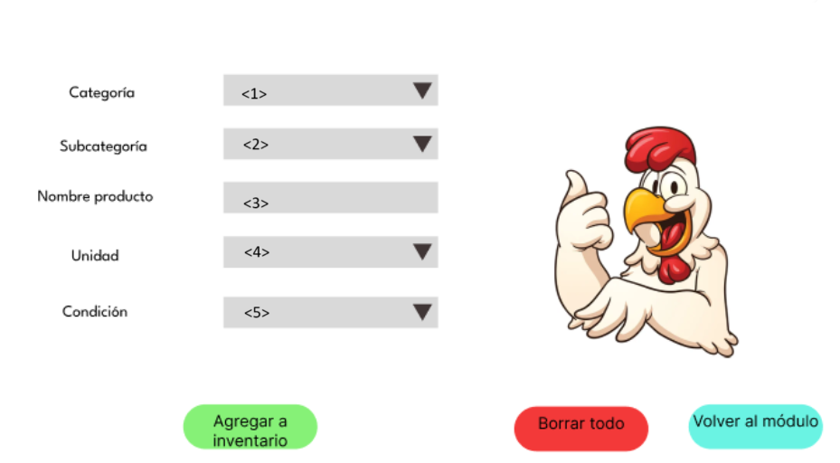

# 8.1. Sentencias SQL por módulo / prototipo

# Módulo de gestión de inventario
## Nuevo producto
Cod requerimiento:

Pantalla:



Sentencia SQL:

```sql 
INSERT INTO insumo (cod_categoriainsumo, cod_subcategoria, nombre_insumo, cod_unidad, cod_condiciones, cantidad_total, umbral)
SELECT 
    ci.cod_categoriainsumo,
    s.cod_subcategoria,
    '<3>',
    um.cod_unidad,
    c.cod_condiciones,
    0,  -- Siempre es 0
    20
FROM 
    categoria_insumo ci
JOIN 
    subcategoria s ON s.nombre_subcategoria = '<2>'
JOIN 
    unidad_medidad um ON um.nombre_unidad = '<4>'
JOIN 
    condiciones c ON c.nombre_condiciones = '<5>'
WHERE 
    ci.nombre_categoriainsumo = '<1>';
```

## Revisión cantidad

Ver cantidades solicitadas y recibidas:
```sql
SELECT 
    i.nombre_insumo, 
    um.nombre_unidad, 
    oc2.cantidad_compra, 
    rc.cantidad_revisada, 
    concat(e.primer_nombre, e.primer_apellido, e.segundo_apellido) AS supervisor_nombre
FROM 
    orden_compra oc
INNER JOIN 
    orden_comprainsumo oc2 ON oc2.cod_ordencompra = oc.cod_ordencompra 
INNER JOIN 
    revision_cantidad rc ON rc.cod_ordencompra = oc.cod_ordencompra 
    AND rc.cod_insumo = oc2.cod_insumo
INNER JOIN insumo i ON oc2.cod_insumo = i.cod_insumo 
INNER JOIN unidad_medidad um ON um.cod_unidad = i.cod_unidad 
INNER JOIN empleado e ON rc.cod_supervisor = e.codigo_empleado 
WHERE oc.cod_ordencompra = '<>';
```

Agregar cantidad recibida:
```sql
UPDATE Revision_Cantidad rc
SET cantidad_revisada = <>
FROM Orden_comprainsumo oc2
WHERE 
    rc.cod_ordencompra = oc2.cod_ordencompra
    AND rc.cod_insumo = oc2.cod_insumo
    AND oc2.cod_ordencompra = '<cod_ordencompra>'
    AND oc2.Cod_Insumo = <>;
```

## Revisión calidad

Ver insumos de la orden de compra
```sql
SELECT 
    i.nombre_insumo,  
    concat(e.primer_nombre, e.primer_apellido, e.segundo_apellido) AS supervisor_nombre,
    c.estadp,
    rc.descripcion
FROM 
    orden_compra oc
INNER JOIN 
    orden_comprainsumo oc2 ON oc2.cod_ordencompra = oc.cod_ordencompra 
INNER JOIN 
    revision_calidad rc on rc.cod_ordencompra = oc.cod_ordencompra 
    AND rc.cod_insumo = oc2.cod_insumo
INNER JOIN insumo i ON oc2.cod_insumo = i.cod_insumo 
inner join calidad c on rc.cod_calidad = c.cod_calidad 
INNER JOIN empleado e ON rc.cod_supervisor = e.codigo_empleado 
WHERE oc.cod_ordencompra = '<>';
```

Agregar calidad y descripción:

```sql
UPDATE revision_calidad rc
SET Cod_calidad = c.cod_calidad,
descripcion = '<>'
FROM Orden_comprainsumo oc2
JOIN calidad c ON c.estadp = '<>'
WHERE 
    oc2.cod_ordencompra = rc.cod_ordencompra
    AND rc.cod_insumo = oc2.cod_insumo
    AND oc2.cod_ordencompra = '<>'
    AND oc2.Cod_Insumo = <>;
```

Sample content for section 8.1.