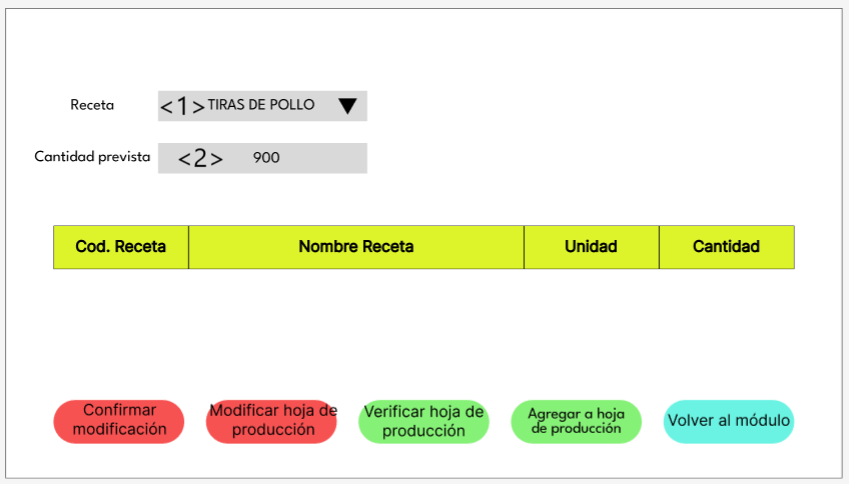
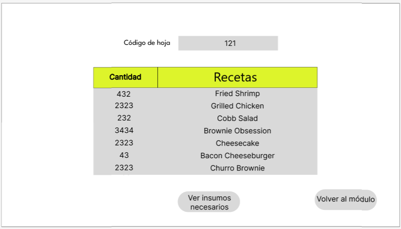

# 8.1. Sentencias SQL por módulo / prototipo

# Modulo 1: Sistema de Pedido de compras
## Ingreso de pedidos de compra: Funcionalidad primaria

### CASO 1

<table border="1" cellpadding="5" cellspacing="0">
    <tr>
        <td><strong>Código Requerimiento</strong></td>
        <td>R101</td>
    </tr>
    <tr>
        <td><strong>Código Interfaz</strong></td>
        <td>I101</td>
    </tr>
    <tr>
        <td><strong>Imagen Interfaz</strong></td>
        <td>
            
        </td>
    </tr>
    <tr>
        <td><strong>Sentencias SQL</strong></td>
        <td></td>
    </tr>
    <tr>
        <td><strong>Eventos</strong></td>
        <td>    
            <ol>
                <li>
                    Cuando se cargue la pagina se dara una presentacion de bienvenida al cliente mostrando como identenficacion su nombre.<br>
                    <code>select Empleado as Primer_nombre from Empleado where Cod_cargo = 'VE';</code>
                </li>
</table>

### CASO 2

<table border="1" cellpadding="5" cellspacing="0">
    <tr>
        <td><strong>Código Requerimiento</strong></td>
        <td>R102</td>
    </tr>
    <tr>
        <td><strong>Código Interfaz</strong></td>
        <td>I102,I103,I104</td>
    </tr>
    <tr>
        <td><strong>Imagen Interfaz</strong></td>
        <td>
            
            
            
        </td>
    </tr>
    <tr>
        <td><strong>Sentencias SQL</strong></td>
        <td></td>
    </tr>
    <tr>
        <td><strong>Eventos</strong></td>
        <td>    
            <ol>
                <li>
                    El usuario selecciona "Crear pedido" en el módulo. 
                    Cargar todos los productos disponibles en el sistema con su categoría, subcategoría, código de producto, nombre, unidad, cantidad, ubicación, fecha de vencimiento y proveedor.<br>
                    <code>SELECT i.Cod_Insumo, i.Nombre_Insumo, i.umbral, i.tolerancia, i.Cod_unidad, 
                    i.Cod_condiciones, s.Nombre_subcategoria, c.Nombre_categoriainsumo, 
                    p.Nombre_proveedor, e.Fecha_vencimiento
                    FROM Insumo i
                    JOIN Subcategoria s ON i.Cod_subcategoria = s.Cod_subcategoria
                    JOIN Categoria_insumo c ON i.Cod_categoriainsumo = c.Cod_categoriainsumo
                    JOIN Proveedor p ON i.Cod_Proveedor = p.Cod_Proveedor
                    JOIN Existencia e ON i.Cod_Insumo = e.Cod_Insumo
                    WHERE i.umbral > i.cantidad_actual;</code>
                </li>
                <li>
                    El usuario selecciona los productos faltantes o con poco stock
                    Selección de productos por el usuario para incluir en la solicitud de compra
                </li>
                <li>El usuario genera la solicitud de compra:  Generar la solicitud de compra en la base de datos con los productos seleccionados. <code>INSERT INTO Solicitud_compra (fecha_creacion, Estado_solicicompra, Codigo_empleado)
VALUES (CURRENT_DATE, 'Pendiente', <Codigo_empleado>);

INSERT INTO Solicitud_comprainsumo (cantidad_solicitud, cod_solicitudcompra, Cod_Insumo)
VALUES (<cantidad>, <cod_solicitudcompra>, <Cod_Insumo>);</code>
                </li>
                <li>El sistema registra todos los productos y genera la solicitud de compra: Confirmación y actualización del estado de la solicitud<code>UPDATE Solicitud_compra
SET Estado_solicicompra = 'Generada'
WHERE Cod_solicitudcompra = <cod_solicitudcompra>;</code></li>
</table>

### CASO 3

<table border="1" cellpadding="5" cellspacing="0">
    <tr>
        <td><strong>Código Requerimiento</strong></td>
        <td>R103</td>
    </tr>
    <tr>
        <td><strong>Código Interfaz</strong></td>
        <td>I105,I106,I107</td>
    </tr>
    <tr>
        <td><strong>Imagen Interfaz</strong></td>
        <td>
            
            
            
        </td>
    </tr>
    <tr>
        <td><strong>Sentencias SQL</strong></td>
        <td></td>
    </tr>
    <tr>
        <td><strong>Eventos</strong></td>
        <td>    
            <ol>
                <li>
                    Visualizar Pedidos de Compra<br>El usuario selecciona "Revisar pedidos" en el módulo.
El sistema muestra una lista de pedidos con columnas de usuario, código de pedido, y una opción para ver el detalle.
                    <code>SELECT E.Primer_nombre || ' ' || E.Primer_apellido AS Usuario,
       SC.Cod_solicitudcompra AS Codigo_de_pedido
FROM Solicitud_compra SC
JOIN Empleado E ON SC.Codigo_empleado = E.Codigo_empleado;</code>
                </li>
                <li>
                    Ver Detalle del Pedido.<br>El usuario hace clic en "Ver detalle" en uno de los pedidos.
El sistema muestra la lista de insumos solicitados en el pedido, con información como la categoría, subcategoría, código de producto, nombre del producto, unidad, cantidad, ubicación, y fecha de vencimiento.
                    <code>SELECT C.Nombre_categoria AS Categoria,
       S.Nombre_subcategoria AS Subcategoria,
       I.Cod_Insumo AS Cod_Producto,
       I.Nombre_Insumo AS Nombre,
       U.Nombre_unidad AS Unidad,
       SCI.cantidad_solicitud AS Cantidad,
       L.Nombre_local AS Ubicacion,
       CI.Fecha_vencimiento AS Fecha_de_vencimiento
FROM Solicitud_comprainsumo SCI
JOIN Insumo I ON SCI.Cod_Insumo = I.Cod_Insumo
JOIN Subcategoria S ON I.Cod_subcategoria = S.Cod_subcategoria
JOIN Categoria C ON I.Cod_categoriainsumo = C.Cod_categoriainsumo
JOIN Unidad U ON I.Cod_unidad = U.Cod_unidad
JOIN Local L ON I.Cod_local = L.Cod_local
JOIN Condiciones_insumo CI ON I.Cod_condiciones = CI.Cod_condiciones
WHERE SCI.cod_solicitudcompra = :codigo_pedido;</code>
                </li>
                <li>
                    Aceptar o Rechazar Solicitud de Pedido.<br>El usuario selecciona "Aceptar" o "Rechazar" en el detalle del pedido.
El sistema actualiza el estado del pedido en la base de datos y muestra un mensaje de confirmación.
                    <code>-- Aceptar el pedido
UPDATE Solicitud_compra
SET Estado_solicicompra = 'Aceptado'
WHERE Cod_solicitudcompra = :codigo_pedido;

-- Rechazar el pedido
UPDATE Solicitud_compra
SET Estado_solicicompra = 'Rechazado'
WHERE Cod_solicitudcompra = :codigo_pedido;</code>
                </li>
             
</table>

### CASO 4

<table border="1" cellpadding="5" cellspacing="0">
    <tr>
        <td><strong>Código Requerimiento</strong></td>
        <td>R104</td>
    </tr>
    <tr>
        <td><strong>Código Interfaz</strong></td>
        <td>I108,I109</td>
    </tr>
    <tr>
        <td><strong>Imagen Interfaz</strong></td>
        <td>
            
            
        </td>
    </tr>
    <tr>
        <td><strong>Sentencias SQL</strong></td>
        <td></td>
    </tr>
    <tr>
        <td><strong>Eventos</strong></td>
        <td>    
            <ol>
                <li>
                    Selección de "Solicitar cotizaciones<br>El usuario selecciona la opción "Solicitar cotizaciones" en el módulo.El sistema muestra una lista de los pedidos de compra existentes.
                    <code>SELECT 
  Solicitud_compra.Cod_solicitudcompra, 
  Solicitud_compra.fecha_creacion, 
  Solicitud_compra.Estado_solicicompra,
  Empleado.Primer_nombre || ' ' || Empleado.Primer_apellido AS Nombre_Empleado
FROM 
  Solicitud_compra
INNER JOIN 
  Empleado ON Solicitud_compra.Codigo_empleado = Empleado.Codigo_empleado
WHERE 
  Solicitud_compra.Estado_solicicompra = 'Pendiente';</code>
                </li>
                <li>
                    Generar solicitud de cotización para un pedido<br>El usuario selecciona un pedido y elige un proveedor de la lista para enviarle una solicitud de cotización.
                    <code>SELECT 
  Cod_Proveedor, 
  Nombre_Empresa, 
  RUC, 
  Direccion_Proveedor, 
  Correo_Proveedor 
FROM 
  Proveedor;</code>
                </li>
                <li>
                    Enviar solicitudes de cotización a todos los proveedores<br>El usuario elige enviar solicitudes de cotización a todos los proveedores registrados.
                    <code>select Empleado as Primer_nombre from Empleado where Cod_cargo = 'VE';</code>
                </li>
                <li>
                    Cuando se cargue la pagina se dara una presentacion de bienvenida al cliente mostrando como identenficacion su nombre.<br>
                    <code>INSERT INTO Solicitud_cotizacion (Cod_solicitudcompra, Cod_Proveedor, fecha_solicitud, estado_solicitud)
VALUES (:Cod_solicitudcompra, :Cod_Proveedor, CURRENT_DATE, 'Pendiente');</code>
                </li>
</table>

### CASO 5

<table border="1" cellpadding="5" cellspacing="0">
    <tr>
        <td><strong>Código Requerimiento</strong></td>
        <td>R105</td>
    </tr>
    <tr>
        <td><strong>Código Interfaz</strong></td>
        <td>I110</td>
    </tr>
    <tr>
        <td><strong>Imagen Interfaz</strong></td>
        <td>
            
        </td>
    </tr>
    <tr>
        <td><strong>Sentencias SQL</strong></td>
        <td></td>
    </tr>
    <tr>
        <td><strong>Eventos</strong></td>
        <td>    
            <ol>
                <li>
                    El usuario selecciona "Crear orden de compra" en el módulo.
                    Al hacer clic en "Crear orden de compra", se inicia el proceso.
                </li>
                <li>
                    El sistema muestra un resumen de los productos seleccionados, proveedor y fecha requerida<br>El usuario selecciona un pedido y elige un proveedor de la lista para enviarle una solicitud de cotización.<br>
                    <code>SELECT sc.cod_solicitudcompra, sci.Cod_Insumo, i.Nombre_Insumo, sci.cantidad_solicitud, p.Nombre_Empresa, s.fecha_requeridaentrega
FROM Solicitud_comprainsumo sci
JOIN Insumo i ON sci.Cod_Insumo = i.Cod_Insumo
JOIN Solicitud_compra s ON sci.cod_solicitudcompra = s.cod_solicitudcompra
JOIN Proveedor p ON s.Codigo_empleado = p.Cod_Proveedor
WHERE sc.cod_solicitudcompra = ?;</code>
                </li>
                <li>
                    El usuario emite la orden de compra<br>El usuario confirma la orden de compra desde la interfaz.
                    <code>select Empleado as Primer_nombre from Empleado where Cod_cargo = 'VE';</code>
                </li>
                <li>
                    El sistema genera un código para la orden de compra y la registra en la base de datos<br>
                    <code>INSERT INTO Orden_compra (fecha_ordencompra, Codigo_empleado, fecha_requeridaentrega, Cod_Proveedor, cod_Recepcion)
VALUES (CURRENT_DATE, ?, ?, ?, NULL) 
RETURNING Cod_ordencompra;</code>
                </li>
</table>


# Modulo 2: Sistema de Registro de Pedidos
### 1. Autenticación del Mesero

<table border="1" cellpadding="5" cellspacing="0">
    <tr>
        <td><strong>Código Requerimiento</strong></td>
        <td>RP001</td>
    </tr>
    <tr>
        <td><strong>Código Interfaz</strong></td>
        <td>IRP01</td>
    </tr>
    <tr>
        <td><strong>Imagen Interfaz</strong></td>
        <td>
            
        </td>
    </tr>
    <tr>
        <td><strong>Sentencias SQL</strong></td>
        <td></td>
    </tr>
    <tr>
        <td><strong>Eventos</strong></td>
        <td>
            <ol>
                <li>
                    <strong>Meseros activos en su local (hoy): </strong> Se muestran los meseros que marcaron su asistencia y están laborando en el día. Eso servirá para poder filtrar internamente quiénes podran realizar un pedido de mesa.<br>
                    <code>select re.Codigo_empleado codigos_permitidos
                    from Registra re
                    INNER JOIN Asistencia asis
                    on re.cod_asistencia = asis.cod_asistencia
                    INNER JOIN empleado e
                    on re.Codigo_empleado = e.Codigo_empleado and e.cod_cargo = '7' -- SOLO MESEROS
                    where asis.fecha = '2023-06-28' and asis.cod_estado in (1) -- QUE HAYAN MARCADO CORRECTAMENTE SU ASISTENCIA</code>
                </li>
                <li>
                    <strong>Boton (Sign in): </strong> Se ingresa un nuevo IDENTIFICACION_MESERO que le permitirá al mesero poder registrar su pedido.<br>
                    <code>
                    INSERT INTO IDENTIFICACION_MESERO(Codigo_empleado)
                    VALUES (71); -- Ejemplo si el mesero ingresa su código igual a 71
                    </code>
                </li>
            </ol>
        </td>
    </tr>
</table>

### 2. Asignación de la mesa por mesero

<table border="1" cellpadding="5" cellspacing="0">
    <tr>
        <td><strong>Código Requerimiento</strong></td>
        <td>RP002</td>
    </tr>
    <tr>
        <td><strong>Código Interfaz</strong></td>
        <td>IRP02</td>
    </tr>
    <tr>
        <td><strong>Imagen Interfaz</strong></td>
        <td>
            
        </td>
    </tr>
    <tr>
        <td><strong>Sentencias SQL</strong></td>
        <td></td>
    </tr>
    <tr>
        <td><strong>Eventos</strong></td>
        <td>
            <ol>
                <li>
                    <strong>Disponibilidad de mesa (hoy): </strong> Se muestran las mesas que están disponibles para que los meseros puedan hacer su pedido exclusivamente en dichas mesas.<br>
                    <code>drop view DISPONIBILIDAD_MESA;
                        CREATE VIEW DISPONIBILIDAD_MESA
                        AS
                        SELECT  me.cod_mesa, 
                                me.cod_tipo_de_mesa,
                                dp.cod_estado_dp estado_mesa,
                                CASE 
                                    WHEN dp.cod_estado_dp is NULL OR dp.cod_estado_dp = 'TD' THEN 'DISPONIBLE'
                                    ELSE 'NO DISPONIBLE'
                                END AS DISPONIBILIDAD
                        from MESA me
                        LEFT JOIN DETALLE_PEDIDO dp
                        on me.cod_mesa = dp.cod_mesa
                        select * from DISPONIBILIDAD_MESA
                </code>
                </li>
                <li>
                    <strong>Boton (NUEVA MESA): </strong> Se creará un nuevo PEDIDO DE MESA para dicha mesa seleccionada por el mesero. Si la mesa no está disponible (otro mesero encargado en dicha esa), entonces el mesero no podrá hacer su pedido<br>
                    <code>
                    (1: NO DISPONIBLE, 0:DISPONIBLE)
                    -- Supongamos que el mesero seleccione la mesa '30'
                    -- Ver Resultado
                    SELECT COUNT(*) DISP_MESA
                    FROM DISPONIBILIDAD_MESA
                    WHERE cod_mesa = '30' and DISPONIBILIDAD = 'NO DISPONIBLE'
                    -- Luego,
                    -- Click en botón "NUEVA MESA"
                    -- Variables guardadas : 44, cod_im (último COD_IM)
                    -- Variables guardadas : 30, cod_mesa
                    INSERT INTO DETALLE_PEDIDO (cod_estado_dp,cod_im, cod_mesa) VALUES 
                    ('RE', 44, '30');
                    </code>
                </li>
            </ol>
        </td>
    </tr>
</table>


### 3. Registro del pedido de mesa

<table border="1" cellpadding="5" cellspacing="0">
    <tr>
        <td><strong>Código Requerimiento</strong></td>
        <td>RP003</td>
    </tr>
    <tr>
        <td><strong>Código Interfaz</strong></td>
        <td>IRP03</td>
    </tr>
    <tr>
        <td><strong>Imagen Interfaz</strong></td>
        <td>
            
            
            
            
        </td>
    </tr>
    <tr>
        <td><strong>Sentencias SQL</strong></td>
        <td></td>
    </tr>
    <tr>
        <td><strong>Eventos</strong></td>
        <td>
            <ol>
                <li>
                    <strong>Catalogo de los Productos Fridays (hoy): </strong> Se muestran las distintas categorías que maneja T.G.I Fridays.<br>
                    <code>SELECT * FROM Categoria
                </code>
                </li>
                <li>
                    <strong>Click en alguna categoría: </strong> Se mostrarán los Productos Friday que pertecen a la categoría seleccionada<br>
                    <code>
                    -- Click en alguna categoria (Burguers And Sandwich, BS, por ejemplo)       
                        SELECT nombre_producto
                        FROM Producto_Friday
                        WHERE cod_categoria = 'BS'
                    </code>
                </li>
                <li>
                    <strong>Botón ("AÑADIR" o "QUITAR" de algún Producto Friday): </strong> Se registrará un nuevo ITEM_DETALLE_PEDIDO de acuerdo al Producto Friday que haya añadido. Dado que el mesero puede añadir y quitar tantas veces un Producto Friday, se realizó el siguiente Trigger para optimizar este proceso cada vez que seleccione el mismo Producto Friday<br>
                    <code>
                    -- AÑADIR PRECIO_ITEM
                    CREATE OR REPLACE FUNCTION calcular_precio_item()
                    RETURNS TRIGGER AS $$
                    BEGIN -- NEW es el nuego registro
                        IF NEW.cantidad <= 0 THEN
                            DELETE FROM ITEM_DETALLE_PEDIDO 
                            WHERE cod_item_dp = NEW.cod_item_dp;
                            RETURN NULL; -- Se evita que se inserte o actualice un registro con cantidad <= 0
                        END IF;

                        -- Si la cantidad es mayor que cero, calculamos el precio
                        SELECT Precio_producto INTO NEW.precio
                        FROM Producto_Friday
                        WHERE Cod_prodFriday = NEW.Cod_prodFriday;

                        NEW.precio := NEW.cantidad * NEW.precio;

                        RETURN NEW; 
                    END;
                    $$ LANGUAGE plpgsql;

                    -- Crear el Trigger cada vez que se crea o se actualiza un registro 
                    drop trigger trigger_calcular_precio on ITEM_DETALLE_PEDIDO;
                    CREATE TRIGGER trigger_calcular_precio
                    BEFORE INSERT OR UPDATE ON ITEM_DETALLE_PEDIDO
                    FOR EACH ROW
                    EXECUTE FUNCTION calcular_precio_item();

                    -- Finalmente, se ingresan los ITEMS
                    INSERT INTO ITEM_DETALLE_PEDIDO (Cod_prodFriday, cantidad, cod_estado_item_dp, cod_dp) VALUES 
                    ('BS10000002', 1,'EP', 'DP27');
                    INSERT INTO ITEM_DETALLE_PEDIDO (Cod_prodFriday, cantidad, cod_estado_item_dp, cod_dp) VALUES 
                    ('BEV1000001', 1,'EP', 'DP27');
                    -- Pero el mesero puede AÑADIR o QUITAR ITEMS del mismo Producto Friday, por tanto, se ejecutan estas consultas:

                    -- Actualizar cada vez que da click en "AÑADIR" cuando ya está registrado dicho item
                    UPDATE ITEM_DETALLE_PEDIDO
                    SET cantidad = cantidad +1
                    WHERE cod_prodfriday = 'BS10000002' and cod_dp = 'DP27'
                    -- Actualizar cada vez que da click en "AÑADIR" cuando ya está registrado dicho item
                    UPDATE ITEM_DETALLE_PEDIDO
                    SET cantidad = cantidad +1
                    WHERE cod_prodfriday = 'BEV1000001' and cod_dp = 'DP27'
                    -- Actualizar cada vez que da click en "QUITAR" cuando ya está registrado dicho item
                    UPDATE ITEM_DETALLE_PEDIDO
                    SET cantidad = cantidad -1
                    WHERE cod_prodfriday = 'BS10000002' and cod_dp = 'DP27'
</code>
                </li>
                <li>
                    <strong>Botón (Listo) Summary del DETALLE PEDIDO: </strong> Se mostrará el resumen final de su Pedido de Mesa<br>
                    <code>
                    SELECT idp.cod_item_dp, idp.cod_dp,pf.nombre_producto , 
                    idp.cantidad , idp.precio, dp.cod_im,dp.cod_mesa num_mesa,
                    e.primer_apellido || ' ' || SUBSTRING(e.segundo_apellido FROM 1 FOR 1) || '. ' || 
                    e.primer_nombre mesero, 
                    SUM(idp.precio) OVER (PARTITION BY idp.cod_dp) AS TOTAL
                    --  Suma de precios de todas las filas que contengan el mismo "cod_dp"
                    FROM ITEM_DETALLE_PEDIDO idp
                    LEFT JOIN Producto_Friday pf
                    on idp.cod_prodfriday = pf.cod_prodfriday
                    LEFT JOIN DETALLE_PEDIDO dp
                    on dp.cod_dp = idp.cod_dp
                    LEFT JOIN IDENTIFICACION_MESERO im 
                    ON dp.cod_im = im.cod_im
                    LEFT JOIN Empleado e 
                    ON im.Codigo_empleado = e.Codigo_empleado
                    WHERE idp.cod_dp = 'DP27'
                    </code>
                </li>
            </ol>
        </td>
    </tr>

</table>

### 4. Visualización de items de cada pedido en su respectivo KDS

<table border="1" cellpadding="5" cellspacing="0">
    <tr>
        <td><strong>Código Requerimiento</strong></td>
        <td>RP004</td>
    </tr>
    <tr>
        <td><strong>Código Interfaz</strong></td>
        <td>IRP04</td>
    </tr>
    <tr>
        <td><strong>Imagen Interfaz</strong></td>
        <td>
            
            
        </td>
    </tr>
    <tr>
        <td><strong>Sentencias SQL</strong></td>
        <td></td>
    </tr>
    <tr>
        <td><strong>Eventos</strong></td>
        <td>
            <ol>
                <li>
                    <strong>Botón (Confirmar pedido) KDS: </strong> Se distribuyen en cada KDS los items que aún faltan en terminar. Para distribuir estos items de acuerdo a su área_de_cocina, se crea la siguiente Función.<br>
                    <code>-- DISTRIBUIR LOS ITEMS EN KDS
                        CREATE OR REPLACE FUNCTION distribuir_items_kds_manual(cod_dp_input CHAR(10))
                        RETURNS VOID AS $$
                        DECLARE
                            kds_exists BOOLEAN;
                            new_cod_kds CHAR(10);
                            area_ec CHAR(2);
                            idp RECORD;  -- Variable para iterar sobre los ítems
                        BEGIN
                            -- Recorremos cada ítem del pedido
                            FOR idp IN 
                                SELECT * FROM ITEM_DETALLE_PEDIDO WHERE cod_dp = cod_dp_input 
                            LOOP
                                -- Obtener el área correspondiente del producto
                                SELECT pf.cod_area_ec INTO area_ec
                                FROM Producto_Friday pf
                                WHERE pf.cod_prodfriday = idp.cod_prodfriday;

                                -- Generamos el código de KDS para el área correspondiente
                                new_cod_kds := 'KDS000' || area_ec;

                                -- Verificamos si ya existe un registro en KDS para esta combinación de cod_kds y cod_area_ec
                                SELECT EXISTS(
                                    SELECT 1 
                                    FROM KDS 
                                    WHERE cod_kds = new_cod_kds 
                                    AND cod_area_ec = area_ec
                                ) INTO kds_exists;

                                -- Si no existe, insertamos una nueva entrada en KDS
                                IF NOT kds_exists THEN
                                    INSERT INTO KDS (cod_kds, cod_area_ec, cod_item_dp)
                                    VALUES (new_cod_kds, area_ec, idp.cod_item_dp);
                                ELSE
                                    -- Si ya existe, simplemente insertamos el ítem en el KDS correspondiente
                                    INSERT INTO KDS (cod_kds, cod_area_ec, cod_item_dp)
                                    VALUES (new_cod_kds, area_ec, idp.cod_item_dp);
                                END IF;
                            END LOOP;
                        END;
                        $$ LANGUAGE plpgsql;

                        -- Click en "CONFIRMAR PEDIDO"
                        UPDATE DETALLE_PEDIDO
                        SET cod_estado_dp = 'TP',
                            fecha_pedido = CURRENT_TIMESTAMP
                        WHERE cod_dp = 'DP27'
                        -- Tambien se ejecuta esto
                        SELECT distribuir_items_kds_manual('DP27');
</code>
                </li>
                <li>
                    <strong>KDS (Visualización): </strong> Se mostrará los items que aún faltan preparar en su repectivo KDS<br>
                    <code>
                    SELECT 
                        KDS.cod_kds, 
                        idp.cod_item_dp, 
                        idp.cod_dp, 
                        pf.nombre_producto, 
                        idp.cantidad, 
                        dp.cod_im, 
                        dp.cod_mesa AS num_mesa,
                        e.primer_apellido || ' ' || SUBSTRING(e.segundo_apellido FROM 1 FOR 1) || '. ' || e.primer_nombre AS mesero
                    FROM 
                        ITEM_DETALLE_PEDIDO idp
                    LEFT JOIN 
                        Producto_Friday pf ON idp.cod_prodFriday = pf.cod_prodFriday
                    LEFT JOIN 
                        DETALLE_PEDIDO dp ON dp.cod_dp = idp.cod_dp
                    LEFT JOIN 
                        IDENTIFICACION_MESERO im ON dp.cod_im = im.cod_im
                    LEFT JOIN 
                        Empleado e ON im.Codigo_empleado = e.Codigo_empleado
                    LEFT JOIN 
                        KDS ON KDS.cod_item_dp = idp.cod_item_dp
                    WHERE dp.cod_estado_dp != 'TD'
                    ORDER BY KDS.cod_kds
                    </code>
                </li>
            </ol>
        </td>
    </tr>
</table>

# Modulo 3: Reporte de costos
### El compañero Mallma Pardo dejo de participar en el trabajo a partir de la pc3 (no presentó pc3 ni pc4). De la misma manera, tampoco presentó la presente monografía.


# Modulo 4: Gestion de personal y turno

### 1.Página pricipal

<table border="1" cellpadding="5" cellspacing="0">
    <tr>
        <td><strong>Código Requerimiento</strong></td>
        <td>CU001</td>
    </tr>
    <tr>
        <td><strong>Código Interfaz</strong></td>
        <td>I04</td>
    </tr>
    <tr>
        <td><strong>Imagen Interfaz</strong></td>
        <td>
            
        </td>
    </tr>
    <tr>
        <td><strong>Sentencias SQL</strong></td>
        <td></td>
    </tr>
    <tr>
        <td><strong>Eventos</strong></td>
        <td>
            <ol>
                <li>
                    <strong>Trabajadores activos: </strong> Se muestra la cantidad de trabajadores que marcaron su asistencia y están laborando en el día.<br>
                    <code>
                    SELECT COUNT(cod_asistencia) AS "Total activos"
                    FROM ASISTENCIA 
                    WHERE cod_estado in (1,3) and 
                    fecha=CURRENT_DATE;</code>
                </li>
                <li>
                    <strong>Solicitudes: </strong> Se muestra la cantidad de solicitudes no revisadas ni procesadas.<br>
                    <code>SELECT COUNT(cod_sd) AS "Total solicitudes"
                    FROM SOLICITUD_O_DESCARGO
                    WHERE cod_estado_sd=1;
                    </code>
                </li>
            </ol>
        </td>
    </tr>
</table>

### 2.Perfiles de usuario

<table border="1" cellpadding="5" cellspacing="0">
    <tr>
        <td><strong>Código Requerimiento</strong></td>
        <td>CU003</td>
    </tr>
    <tr>
        <td><strong>Código Interfaz</strong></td>
        <td>I05</td>
    </tr>
    <tr>
        <td><strong>Imagen Interfaz</strong></td>
        <td>
            
        </td>
    </tr>
    <tr>
        <td><strong>Sentencias SQL</strong></td>
        <td></td>
    </tr>
    <tr>
        <td><strong>Eventos</strong></td>
        <td>
            <ol>
                <li>
                    <strong>Boton Buscar(Lupa): </strong> Cuando el usuario presione el boton buscar se mostrará el resultado del siguiente codigo.<br>
                    <code>SELECT e.primer_nombre as Nombre, ca.nombre_cargo as cargo,
                    e.DNI,tu.nombre_turno as Turno FROM EMPLEADO e
                    INNER JOIN CARGO ca ON e.cod_cargo=ca.cod_cargo
                    INNER JOIN TURNO tu ON e.cod_cargo=tu.cod_turno
                    WHERE e.primer_nombre ILIKE('<1>') or 
                    e.Primer_apellido ILIKE('<1>') or 
                    e.Segundo_apellido ILIKE('<1>') or
                    e.DNI ILIKE('<1>');
                    </code>
                    <br>
                    Donde <1> puede ser el nombre, apellido o DNI mediante el cual se desea buscar a un empleado.
                </li>
                  <li>
                    <strong>Boton Editar: </strong> Cuando el usuario presione el boton editar se ejecutaran la siguientes consultas cuyos resulatdos se mostrarán en la ventana I06. <br>
                    BLOQUE PRINCIPAL:
                    </br>
                    <code>SELECT e.Primer_Nombre,e.Primer_apellido,e.Segundo_Apellido,
                    e.DNI,e.Direccion,e.contacto,ca.Nombre_cargo,ar.nombre_area,
                    lo.nombre_local,tco.nombre_tipo_contrato,co.fecha_contratacion
                    FROM EMPLEADO e
                    INNER JOIN CARGO ca ON e.cod_cargo=ca.cod_cargo
                    INNER JOIN AREA ar ON ca.cod_cargo=ar.cod_cargo
                    INNER JOIN LOCAL lo ON e.cod_local=lo.cod_local
                    INNER JOIN CONTRATO co ON e.cod_contrato=co.cod_contrato
                    INNER JOIN TIPO_CONTRATO tco ON co.cod_tipo_contrato=tco.cod_tipo_contrato
                    WHERE e.codigo_empleado=<1>;
                    </code>
                    <br>
                     BLOQUE HORARIO LIBRE:
                    <code>
                    SELECT hld.Dias,hl.Hora_inicio,hl.Hora_fin
                    FROM EMPLEADO e
                    INNER JOIN HORARIO_LIBRE hl ON hl.codigo_empleado=e.codigo_empleado
                    INNER JOIN HORARIO_LIBRE_DIAS hld ON hld.cod_horario=hl.cod_horario
                    WHERE e.codigo_empleado=<1>;
                    </code>
                    <br>
                    BLOQUE HISTORIAL LABORAL:
                    </br>
                    <code>
                    SELECT hld.Dias,hl.Hora_inicio,hl.Hora_fin
                    FROM EMPLEADO e
                    INNER JOIN HORARIO_LIBRE hl ON hl.codigo_empleado=e.codigo_empleado
                    INNER JOIN HORARIO_LIBRE_DIAS hld ON hld.cod_horario=hl.cod_horario
                    WHERE e.codigo_empleado=<1>;
                    </code>
                    <br>
                    BLOQUE HABILIDADES:
                    </br>
                    <code>
                    SELECT h.Nombre_habilidad,h.Descripcion
                    FROM EMPLEADO e
                    INNER JOIN POSEE po ON po.codigo_empleado=e.codigo_empleado
                    INNER JOIN HABILIDAD h ON po.cod_habilidad=h.cod_habilidad
                    WHERE e.codigo_empleado=<1>;
                    </code>
                    <br>Donde <1> es el codigo del empleado del cual se preciona el boton editar.
                    </br>
                </li>
            </ol>
        </td>
    </tr>
</table>

### 3. Añadir o editar perfil

<table border="1" cellpadding="5" cellspacing="0">
    <tr>
        <td><strong>Código Requerimiento</strong></td>
        <td>CU003,CU011</td>
    </tr>
    <tr>
        <td><strong>Código Interfaz</strong></td>
        <td>I06</td>
    </tr>
    <tr>
        <td><strong>Imagen Interfaz</strong></td>
        <td>
            
        </td>
    </tr>
    <tr>
        <td><strong>Sentencias SQL</strong></td>
        <td></td>
    </tr>
    <tr>
        <td><strong>Eventos</strong></td>
        <td>
            <ol>
                <li>
                    <strong>BONTON GUARDAR:</strong> Se actulizaár el perfil de un empleado o se creará un perfil de un empleado.
                    <br>
                    EDITAR PERFIL:
                    <1> Representa el codigo del empleado del cual se está editando el perfil.
                    </br>
                    <pre><code>
                    BEGIN;
                    -- Actualizar datos básicos en la tabla Empleado
                    UPDATE Empleado
                    SET 
                        Primer_nombre = '1',
                        Primer_apellido = '2',
                        Segundo_apellido = '2',
                        DNI = '3',
                        Direccion = '4',
                        Contacto = '5',
                        Cod_cargo = (SELECT Cod_cargo FROM Cargo WHERE Nombre_cargo = '6'),
                        Cod_local = (SELECT Cod_local FROM Local WHERE Nombre_local = '7'),
                        Cod_contrato = (SELECT Cod_contrato FROM Tipo_contrato WHERE Nombre_tipo_contrato = '8')
                    WHERE 
                        Codigo_empleado = <1>; 
                    -- Actualizar la fecha del contrato en la tabla Contrato
                    UPDATE Contrato
                    SET 
                        Fecha_contratacion = '10'
                    WHERE 
                        Cod_contrato = (SELECT Cod_contrato FROM Empleado WHERE Codigo_empleado = <1>);
                    -- Actualizar el horario libre en la tabla Horario_libre y Horario_libre_Dias
                    UPDATE Horario_libre
                    SET 
                        Hora_inicio = '12',
                        Hora_fin = '13'
                    WHERE 
                        Codigo_empleado = <1>;
                    UPDATE Horario_libre_Dias
                    SET 
                        Dias = '11'
                    WHERE 
                        Cod_horario = (SELECT Cod_horario FROM Horario_libre WHERE Codigo_empleado = 2);
                    -- Actualizar historial laboral en la tabla Historial_laboral
                    UPDATE Historial_laboral
                    SET 
                        Empresa = '15',
                        Cargo = '14',
                        Duración = '16'
                    WHERE 
                        Codigo_empleado = <1>;
                    -- Actualizar habilidades en la tabla Posee y Habilidad
                    UPDATE Habilidad
                    SET 
                        Nombre_habilidad = '17',
                        Descripcion = '18'
                    WHERE 
                        Cod_habilidad = (SELECT Cod_habilidad FROM Posee WHERE Codigo_empleado = <1>);
                    COMMIT;</code></pre>
                    <br>
                    REGISTRAR NUEVO PERFIL:
                    </br>
                    <pre><code>
                    DO $$
                    DECLARE
                        nueva_contrato_id INT;
                        nuevo_empleado_id INT;
                        nuevo_horario_id INT;
                        nueva_habilidad_id INT;
                    BEGIN
                        -- 1. Insertar un nuevo contrato en la tabla Contrato y obtener su `Cod_contrato`
                        INSERT INTO Contrato (Fecha_contratacion, Cod_tipo_contrato)
                        VALUES ('2023-11-05', (SELECT Cod_tipo_contrato FROM Tipo_contrato WHERE Nombre_tipo_contrato = 'Temporal'))
                        RETURNING Cod_contrato INTO nueva_contrato_id;
                        -- 3. Insertar un nuevo empleado en la tabla `Empleado`
                        INSERT INTO Empleado (Direccion, Contacto, DNI, Primer_nombre, Primer_apellido, Segundo_apellido, Cod_turno, Cod_contrato, Cod_cargo, Cod_local)
                        VALUES 
                        (
                            '4',
                            '5',
                            '3',
                            '1',
                            '2',
                            '2',
                            (SELECT Cod_turno FROM Turno WHERE Nombre_turno = '19'),
                            nueva_contrato_id,
                            (SELECT Cod_cargo FROM Cargo WHERE Nombre_cargo = '6'),
                            (SELECT Cod_local FROM Local WHERE Nombre_local = '8')
                        )
                        RETURNING Codigo_empleado INTO nuevo_empleado_id;
                        -- 4. Insertar un horario libre para el nuevo empleado en `Horario_libre`
                        INSERT INTO Horario_libre (Hora_inicio, Hora_fin, Codigo_empleado)
                        VALUES 
                        (12, 13, nuevo_empleado_id)
                        RETURNING Cod_horario INTO nuevo_horario_id;
                        -- 5. Insertar los días en la tabla `Horario_libre_Dias` para el nuevo `Cod_horario`
                        INSERT INTO Horario_libre_Dias (Dias, Cod_horario)
                        VALUES ('11', nuevo_horario_id);
                        -- 6. Insertar historial laboral en `Historial_laboral`
                        INSERT INTO Historial_laboral (Empresa, Cargo, Duración, Codigo_empleado)
                        VALUES 
                        ('15', '14', 16, nuevo_empleado_id);
                        -- 7. Insertar habilidades para el nuevo empleado en `Habilidad` y `Posee`
                        -- Primero, insertar la habilidad en `Habilidad` si aún no existe
                        INSERT INTO Habilidad (Nombre_habilidad, Descripcion)
                        VALUES 
                        ('17', '18')
                        RETURNING Cod_habilidad INTO nueva_habilidad_id;
                        -- Relacionar la habilidad con el nuevo empleado en `Posee`
                        INSERT INTO Posee (Codigo_empleado, Cod_habilidad)
                        VALUES 
                        (nuevo_empleado_id, nueva_habilidad_id);
                        COMMIT;
                    END $$;
                </code></pre>
            </ol>
        </td>
    </tr>
</table>

### 4. Confirmar eliminacion de perfil

<table border="1" cellpadding="5" cellspacing="0">
    <tr>
        <td><strong>Código Requerimiento</strong></td>
        <td>CU003</td>
    </tr>
    <tr>
        <td><strong>Código Interfaz</strong></td>
        <td>I07</td>
    </tr>
    <tr>
        <td><strong>Imagen Interfaz</strong></td>
        <td>
            
        </td>
    </tr>
    <tr>
        <td><strong>Sentencias SQL</strong></td>
        <td></td>
    </tr>
    <tr>
        <td><strong>Eventos</strong></td>
        <td>
            <ol>
                <li>
                    <strong>Boton confirmar: </strong> Se ejecuta la script de la elimación de los datos que están presentes en diversas tablas del  perfil a eliminar.<br>
                    <pre><code>
                    -- 1. Eliminar las relaciones en la tabla Posee
                    DELETE FROM Posee 
                    WHERE Codigo_empleado = 101;
                    -- 2. Eliminar el historial laboral del empleado
                    DELETE FROM Historial_laboral 
                    WHERE Codigo_empleado = 101;
                    -- 3. Eliminar los días del horario libre del empleado
                    DELETE FROM Horario_libre_Dias 
                    WHERE Cod_horario = (SELECT Cod_horario FROM Horario_libre WHERE Codigo_empleado = 101);
                    -- 4. Eliminar el horario libre del empleado
                    DELETE FROM Horario_libre 
                    WHERE Codigo_empleado =101;
                    -- 6. Eliminar el empleado
                    DELETE FROM Empleado 
                    WHERE Codigo_empleado = 101;
                    -- 5. Eliminar el contrato del empleado
                    DELETE FROM Contrato 
                    WHERE Cod_contrato = (SELECT Cod_contrato FROM Empleado WHERE Codigo_empleado = 101);</code></pre>
                </li>
            </ol>
        </td>
    </tr>
</table>

### 5. Asistencia

<table border="1" cellpadding="5" cellspacing="0">
    <tr>
        <td><strong>Código Requerimiento</strong></td>
        <td>CU005</td>
    </tr>
    <tr>
        <td><strong>Código Interfaz</strong></td>
        <td>I08</td>
    </tr>
    <tr>
        <td><strong>Imagen Interfaz</strong></td>
        <td>
            
        </td>
    </tr>
    <tr>
        <td><strong>Sentencias SQL</strong></td>
        <td></td>
    </tr>
    <tr>
        <td><strong>Eventos</strong></td>
        <td>
            <ol>
                <li>
                    <strong>Boton actualizar asistencia: </strong> Se ejecutará un script que muestre el registro de asistencia que se tiene<br>
                    <pre><code>
                                    SELECT 
                    e.DNI,
                    e.Primer_apellido,
                    a.Hora_ingreso AS hora_entrada,
                    a.Hora_salida AS hora_salida,
                    c.Nombre_cargo AS cargo,
                    ea.Nombre_Estado AS estado_asistencia
                FROM 
                    Empleado e
                JOIN 
                    Asistencia a ON e.Codigo_empleado = (SELECT r.Codigo_empleado 
                                                        FROM Registra r 
                                                        WHERE r.Cod_asistencia = a.Cod_asistencia)
                JOIN 
                    Cargo c ON e.Cod_cargo = c.Cod_cargo
                JOIN 
                    Estado_Asistencia ea ON a.Cod_estado = ea.Cod_estado
                JOIN 
                    Local l ON e.Cod_local = l.Cod_local
                JOIN 
                    Area ar ON ar.Cod_area = e.Cod_cargo
                WHERE 
                    a.Fecha = '1' AND
                    e.DNI = '2' AND
                    c.Nombre_cargo = '3' AND
                    ar.Nombre_area = '4' AND
                    l.Nombre_local = '5';
                    </code></pre>
                </li>
            </ol>
        </td>
    </tr>
</table>

### 6. Turnos

<table border="1" cellpadding="5" cellspacing="0">
    <tr>
        <td><strong>Código Requerimiento</strong></td>
        <td>CU005</td>
    </tr>
    <tr>
        <td><strong>Código Interfaz</strong></td>
        <td>I09</td>
    </tr>
    <tr>
        <td><strong>Imagen Interfaz</strong></td>
        <td>
            
        </td>
    </tr>
    <tr>
        <td><strong>Sentencias SQL</strong></td>
        <td></td>
    </tr>
    <tr>
        <td><strong>Eventos</strong></td>
        <td>
            <ol>
                <li>
                    <strong>Botón Buscar: </strong> Se muestra los empleados disponibles a partir de los requisitos pedidos.<br>
                    <PRE><code>
                    SELECT 
                        e.DNI,
                        e.Primer_apellido
                    FROM 
                        Empleado e
                    JOIN 
                        Horario_libre hl ON e.Codigo_empleado = hl.Codigo_empleado
                    JOIN 
                        Horario_libre_Dias hld ON hl.Cod_horario = hld.Cod_horario
                    JOIN 
                        Turno t ON t.Cod_turno = (SELECT cod_turno FROM TURNO WHERE nombre_turno='2')
                    JOIN 
                        Cargo c ON e.Cod_cargo = c.Cod_cargo
                    WHERE 
                        hld.Dias = '1' AND                     
                        c.Nombre_cargo = '3' AND              
                        hl.Hora_inicio <= t.Hora_inicio AND      
                        hl.Hora_fin >= t.Hora_fin;               
                    </code></pre>
                </li>
                <li>
                    <strong>Botón asignar: </strong> Se actualiza el turno del empleado, además se borra la disponiblidad que presentaba<br>
                    <code>BEGIN;

-- Paso 1: Actualizar el turno del empleado
UPDATE
Empleado
SET
Cod_turno = (SELECT cod_turno FROM TURNO WHERE Nombre_turno='2')
WHERE
Codigo_empleado = ;

-- Paso 2: Eliminar la disponibilidad previa en la tabla Horario_libre_Dias
DELETE FROM
Horario_libre_Dias
WHERE
Cod_horario IN (
SELECT Cod_horario
FROM Horario_libre
WHERE Codigo_empleado = <1>
);

-- Paso 3: Eliminar la disponibilidad previa en la tabla Horario_libre
DELETE FROM
Horario_libre
WHERE
Codigo_empleado = <1>;

COMMIT;
</code>
<br>
<1> Representa el codigo de empleado de quien se actualiza el turno.
</br>
</li>
<li>
<strong>Botón buscar(lupa): </strong>
Muestra los resultados de la busqueda, orientados principalamente a conocer los turnos de los empleados.
<br>
<code>
SELECT
e.DNI,
t.Nombre_turno AS Turno,
c.Nombre_cargo AS Cargo,
l.Nombre_local AS Local
FROM
Empleado e
JOIN
Turno t ON e.Cod_turno = t.Cod_turno
JOIN
Cargo c ON e.Cod_cargo = c.Cod_cargo
JOIN
Local l ON e.Cod_local = l.Cod_local
WHERE
('' IS NULL OR e.DNI = '') OR
('' IS NULL OR t.Nombre_turno ILIKE '') OR
('' IS NULL OR c.Nombre_cargo ILIKE 'COCINERO') OR
('' IS NULL OR l.Nombre_local ILIKE '');
</code>
</br>
</li>
<li><strong>Botón editar: </strong> Se ejecuta la siguiente consulta cuyo resultado se mostrará en I10.
<br><code>
SELECT
e.DNI,
e.Primer_nombre,
e.Primer_apellido,
t.Nombre_turno AS Turno,
c.Nombre_cargo AS Cargo,
l.Nombre_local AS Local
FROM
Empleado e
JOIN
Turno t ON e.Cod_turno = t.Cod_turno
JOIN
Cargo c ON e.Cod_cargo = c.Cod_cargo
JOIN
Local l ON e.Cod_local = l.Cod_local
WHERE
e.codigo_empleado=<1>;
</code></br>
</li>
</ol>
</td>
</tr>

</table>

### 7. Editar turno

<table border="1" cellpadding="5" cellspacing="0">
    <tr>
        <td><strong>Código Requerimiento</strong></td>
        <td>CU005,CU012,CU011</td>
    </tr>
    <tr>
        <td><strong>Código Interfaz</strong></td>
        <td>I10</td>
    </tr>
    <tr>
        <td><strong>Imagen Interfaz</strong></td>
        <td>
            
        </td>
    </tr>
    <tr>
        <td><strong>Sentencias SQL</strong></td>
        <td></td>
    </tr>
    <tr>
        <td><strong>Eventos</strong></td>
        <td>
            <ol>
                <li>
                    <strong>Botón Guardar: </strong> Se actualiza el turno del empleado,<br>
                    <code>
                    UPDATE EMPLEADO
SET cod_turno=(SELECT cod_turno FROM turno where nombre_turno='Mañana')
WHERE codigo_empleado=1;</code><br>
<1> Codigo del empleado de quien se actualiza el turno.
                </li>
            </ol>
        </td>
    </tr>
</table>

### 8. Solicitudes

<table border="1" cellpadding="5" cellspacing="0">
    <tr>
        <td><strong>Código Requerimiento</strong></td>
        <td>CU006</td>
    </tr>
    <tr>
        <td><strong>Código Interfaz</strong></td>
        <td>I13</td>
    </tr>
    <tr>
        <td><strong>Imagen Interfaz</strong></td>
        <td>
            
        </td>
    </tr>
    <tr>
        <td><strong>Sentencias SQL</strong></td>
        <td></td>
    </tr>
    <tr>
        <td><strong>Eventos</strong></td>
        <td>
            <ol>
                <li>
                    <strong>Ingreso a la ventana Ausencias y permisos: </strong> Se muestra de manera general todas las solicitudes o descargos presentados.<br>
                    <code>
                    SELECT 
    e.DNI,
    e.Primer_apellido,
    c.Nombre_cargo AS Cargo,
    t.Nombre_turno AS Turno,
    tsd.Nombre_tipo_sd AS Tipo_Solicitud,
    esd.Nombre_estado_sd AS Estado_Solicitud
FROM 
    Solicitud_o_descargo sd
JOIN 
    Empleado e ON sd.Codigo_empleado = e.Codigo_empleado
JOIN 
    Cargo c ON e.Cod_cargo = c.Cod_cargo
JOIN 
    Turno t ON e.Cod_turno = t.Cod_turno
JOIN 
    Tipo_SD tsd ON sd.Cod_tipo_sd = tsd.Cod_tipo_sd
JOIN 
    Estado_SD esd ON sd.Cod_estado_SD = esd.Cod_estado_SD;</code>
                </li>
                <li>
                    <strong>Filtrado: </strong> Se muestra el resultado de haber filtrado según un determinado parametro.<br>
                    <code>SELECT 
    e.DNI,
    e.Primer_apellido,
    c.Nombre_cargo AS Cargo,
    t.Nombre_turno AS Turno,
    tsd.Nombre_tipo_sd AS Tipo_Solicitud,
    esd.Nombre_estado_sd AS Estado_Solicitud
FROM 
    Solicitud_o_descargo sd
JOIN 
    Empleado e ON sd.Codigo_empleado = e.Codigo_empleado
JOIN 
    Cargo c ON e.Cod_cargo = c.Cod_cargo
JOIN 
    Turno t ON e.Cod_turno = t.Cod_turno
JOIN 
    Tipo_SD tsd ON sd.Cod_tipo_sd = tsd.Cod_tipo_sd
JOIN 
    Estado_SD esd ON sd.Cod_estado_SD = esd.Cod_estado_SD
WHERE
    ('' IS NULL OR e.DNI = '') OR
    ('' IS NULL OR t.Nombre_turno ILIKE '') OR
	('' IS NULL OR tsd.Nombre_tipo_sd ILIKE '') OR
    ('' IS NULL OR c.Nombre_cargo ILIKE '') OR
    ('' IS NULL OR esd.Nombre_estado_sd ILIKE '1');
                    </code>
                    </li>
                    <li>
                    <strong>Boton ver: </strong> Se ejecuta el siguiente script cuyo resultado se verá en I14.<br>
                    <code>SELECT titulo,descripcion,evidencia
FROM SOLICITUD_O_DESCARGO
WHERE Cod_sd=<1>;
                    </code>
                    <br><1> Es el codigo de la solicitude o descargo del cual se quiere mistrar su contenido.
                </li>
            </ol>
        </td>
    </tr>
</table>

### 9. Ver solicitud

<table border="1" cellpadding="5" cellspacing="0">
    <tr>
        <td><strong>Código Requerimiento</strong></td>
        <td>CU006</td>
    </tr>
    <tr>
        <td><strong>Código Interfaz</strong></td>
        <td>I14</td>
    </tr>
    <tr>
        <td><strong>Imagen Interfaz</strong></td>
        <td>
            
        </td>
    </tr>
    <tr>
        <td><strong>Sentencias SQL</strong></td>
        <td></td>
    </tr>
    <tr>
        <td><strong>Eventos</strong></td>
        <td>
            <ol>
                <li>
                    <strong>Botoón Guardar: </strong> Se actualiza la tabla de solicitudes o descargos, presentado dos situaciones: 1. Aceptar,2.Denegar.<br>
                    Aceptar:
                    <code>
                   UPDATE SOLICITUD_O_DESCARGO
SET Respuesta=CONCAT('ACEPTADO','1')
WHERE Cod_sd=<1>;</code>
                <br>Denegar:<code>
                UPDATE SOLICITUD_O_DESCARGO
SET Respuesta=CONCAT('Rechazado','1')
WHERE Cod_sd=<1>;
                </code></br>
                <br>
                <1> Es el codigo de la solicitud o descargo que se se está actualizando su respuesta.
                </li>
            </ol>
        </td>
    </tr>
</table>

### 10. Notificaciones

<table border="1" cellpadding="5" cellspacing="0">
    <tr>
        <td><strong>Código Requerimiento</strong></td>
        <td>CU006,CU009</td>
    </tr>
    <tr>
        <td><strong>Código Interfaz</strong></td>
        <td>I15</td>
    </tr>
    <tr>
        <td><strong>Imagen Interfaz</strong></td>
        <td>
            
            <br>Ver notificación</br>
             
        </td>
    </tr>
    <tr>
        <td><strong>Sentencias SQL</strong></td>
        <td></td>
    </tr>
    <tr>
        <td><strong>Eventos</strong></td>
        <td>
            <ol>
                <li>
                    <strong>Ventana de notificaciones: </strong> Se muestra todas las notificaciones que se tienen.<br>
                    <code>
                    SELECT e.Primer_nombre,ca.nombre_cargo,n.mensaje,
                    n.fecha_envio,n.hora_envio
FROM NOTIFICACION n
INNER JOIN EMPLEADO E ON n.codigo_empleado=e.codigo_empleado
INNER JOIN CARGO  ca ON e.cod_cargo=ca.cod_cargo;
                </code>
                <br>
                Ver notificación:
                <code>
                SELECT e.codigo_empleado,ca.nombre_cargo,n.mensaje,tn.nombre_tipo_notificacion
FROM NOTIFICACION N
INNER JOIN EMPLEADO E ON n.codigo_empleado=e.codigo_empleado
INNER JOIN CARGO ca ON e.cod_cargo=ca.cod_cargo
INNER JOIN TIPO_NOTIFICACION tn ON 
n.cod_tipo_notificacion=tn.cod_tipo_notificacion
WHERE n.cod_notificacion=<1>;
                </code><br><1> Es el codigo de la notificación a ver.
                </br>
                </li>
            </ol>
        </td>
    </tr>
</table>

### 11. Redactar Notificaciones

<table border="1" cellpadding="5" cellspacing="0">
    <tr>
        <td><strong>Código Requerimiento</strong></td>
        <td>CU006,CU009</td>
    </tr>
    <tr>
        <td><strong>Código Interfaz</strong></td>
        <td>I16</td>
    </tr>
    <tr>
        <td><strong>Imagen Interfaz</strong></td>
        <td>
            
        </td>
    </tr>
    <tr>
        <td><strong>Sentencias SQL</strong></td>
        <td></td>
    </tr>
    <tr>
        <td><strong>Eventos</strong></td>
        <td>
            <ol>
                <li>
                    <strong>Botón enviar: </strong> Se envía y se registra en la base de datos el mensaje enviado.<br>
                    <code>
INSERT INTO Notificacion (
    Fecha_envio,
    Hora_envio,
    Mensaje,
    Destino,
    Codigo_empleado,
    Cod_tipo_notificacion
)
VALUES (
    CURRENT_DATE,                             
    CURRENT_TIME,                            
    '1',                                
    '1,                                
    <1>,                        
    (SELECT Cod_tipo_notificacion           
     FROM Tipo_notificacion
     WHERE Nombre_tipo_notificacion ILIKE '3') 
); </code><br><1> Es el codigo del empleado que está actualmente en el sistema y enviando en mensaje.
                </li>
            </ol>
        </td>
    </tr>
</table>

### 12. Desempeño Personal

<table border="1" cellpadding="5" cellspacing="0">
    <tr>
        <td><strong>Código Requerimiento</strong></td>
        <td>CU007</td>
    </tr>
    <tr>
        <td><strong>Código Interfaz</strong></td>
        <td>I18</td>
    </tr>
    <tr>
        <td><strong>Imagen Interfaz</strong></td>
        <td>
            
        </td>
    </tr>
    <tr>
        <td><strong>Sentencias SQL</strong></td>
        <td></td>
    </tr>
    <tr>
        <td><strong>Eventos</strong></td>
        <td>
            <ol>
                <li>
                    <strong>Datos preliminares: </strong> Se muestran todos los desempeños de manera general.<br>
                    <code>
                    SELECT 
    e.DNI,
    e.Primer_apellido,
    c.Nombre_cargo AS Cargo,
    COUNT(CASE WHEN a.Cod_estado IN (1,3,6) THEN 1 END) AS Dias_trabajados,
    COUNT(CASE WHEN a.Cod_estado IN (2, 4, 5) THEN 1 END) AS Ausenciasjustificada)
FROM 
    Empleado e
JOIN 
	Registra r On e.codigo_empleado=r.codigo_empleado
JOIN 
    Asistencia a ON r.Cod_asistencia = a.Cod_asistencia
JOIN 
    Estado_Asistencia es ON a.Cod_estado = es.Cod_estado
JOIN 
    Cargo c ON e.Cod_cargo = c.Cod_cargo
GROUP BY 
    e.DNI, e.Primer_apellido, c.Nombre_cargo;</code>
                </li>
                <li>
                    <strong>Botón filtrar: </strong> Se muestra los resultado despues de filtrar con determinados parametros<br>
                    <code>SELECT 
    e.DNI,
    e.Primer_apellido,
    c.Nombre_cargo AS Cargo,
    COUNT(CASE WHEN a.Cod_estado IN (1,3,6) THEN 1 END) AS Dias_trabajados,  
    COUNT(CASE WHEN a.Cod_estado IN (2, 4, 5) THEN 1 END) AS Ausencias 
FROM 
    Empleado e
JOIN 
    Asistencia a ON e.Codigo_empleado = a.Codigo_empleado
JOIN 
    Estado_Asistencia es ON a.Cod_estado = es.Cod_estado
JOIN 
    Cargo c ON e.Cod_cargo = c.Cod_cargo
JOIN 
    Local l ON e.Cod_local = l.Cod_local 
WHERE 
    (e.DNI ILIKE 1 OR 1IS NULL) AND
    (e.Primer_apellido ILIKE 2 OR 2 IS NULL) AND
    (l.Nombre_local ILIKE 3 OR 3 IS NULL) AND
    (c.Nombre_cargo ILIKE 4 OR 4 IS NULL)
GROUP BY 
    e.DNI, e.Primer_apellido, c.Nombre_cargo, l.Nombre_local;
                    </code>
                </li>
            </ol>
        </td>
    </tr>
</table>

### 13. Nómina

<table border="1" cellpadding="5" cellspacing="0">
    <tr>
        <td><strong>Código Requerimiento</strong></td>
        <td>CU008</td>
    </tr>
    <tr>
        <td><strong>Código Interfaz</strong></td>
        <td>I19</td>
    </tr>
    <tr>
        <td><strong>Imagen Interfaz</strong></td>
        <td>
            
        </td>
    </tr>
    <tr>
        <td><strong>Sentencias SQL</strong></td>
        <td></td>
    </tr>
    <tr>
        <td><strong>Eventos</strong></td>
        <td>
            <ol>
                <li>
                    <strong>Botón Generar: </strong> Genera la tabla de nomina<br>
                    <code>
                    SELECT 
    CURRENT_DATE AS Fecha_Actual,
    e.Primer_nombre || ' ' || e.Primer_apellido AS Nombre_Empleado,
    e.DNI,
    c.Nombre_cargo AS Cargo,
    SUM(
        EXTRACT(EPOCH FROM (a.Hora_salida - a.Hora_ingreso)) / 3600  
    ) AS Horas_Trabajadas,
    SUM(
        CASE
            WHEN a.Hora_salida > t.Hora_fin THEN
                EXTRACT(EPOCH FROM (a.Hora_salida - t.Hora_fin)) / 3600  
            ELSE 0
        END
    ) AS Horas_Extra
FROM 
    Empleado e
JOIN 
	Registra r ON e.codigo_empleado=r.codigo_empleado
JOIN
    Asistencia a ON r.Cod_asistencia = a.Cod_asistencia
JOIN 
    Turno t ON e.Cod_turno = t.Cod_turno 
JOIN 
    Cargo c ON e.Cod_cargo = c.Cod_cargo  
WHERE 
    a.Fecha >= CURRENT_DATE - INTERVAL '1 MONTH'   
GROUP BY 
    e.Primer_nombre, e.Primer_apellido, e.DNI, c.Nombre_cargo;</code>
                </li>
            </ol>
        </td>
    </tr>
</table>


# Módulo 5: Gestión de inventario
## Ingreso de insumos: Funcionalidad primaria
### Nuevo insumo: Requerimiento  R501


Sentencia SQL:


- Valores de las listas desplegables

valores de unidad
```sql
select um.nombre_unidad from unidad_medidad um 
```

valores de categoria
```sql
SELECT DISTINCT ci.nombre_categoriainsumo, ci.cod_categoriainsumo
FROM subcategoria s
INNER JOIN categoria_insumo ci ON ci.cod_categoriainsumo = s.cod_categoria
ORDER BY ci.cod_categoriainsumo asc;
```

valores de la subcategoria
```sql
select s.nombre_subcategoria from subcategoria s 
where s.cod_categoria = (select ci.cod_categoriainsumo from categoria_insumo ci where ci.Nombre_categoriainsumo='<4>');
```
<> es el nombre de la categoría seleccionada

valores de condiciones
```sql
select c.nombre_condiciones from condiciones c 
```

Botón agregar a inventario
```sql
INSERT INTO insumo (nombre_insumo, cod_unidad, cod_condiciones, cod_subcategoria)
VALUES
(
    '<1>', -- Nombre del insumo
    (SELECT um.cod_unidad FROM unidad_medidad um WHERE um.nombre_unidad = '<2>'),
    (SELECT c.cod_condiciones FROM condiciones c WHERE c.nombre_condiciones = '<4>'),
    (SELECT s.cod_subcategoria FROM subcategoria s WHERE s.nombre_subcategoria = '<5>')
);
```


### Revisión de órdenes de compra: Requerimiento R502

#### Ver órdenes de compra para el día


Eventos:
Botón "Ingresar Insumo":
```sql
select oc.cod_ordencompra ,p.nombre_empresa, pi2.nombre_proceso from orden_compra oc 
inner join proveedor p on p.cod_proveedor = oc.cod_proveedor 
inner join proceso_ingreso pi2 on pi2.cod_proceso = oc.cod_proceso 
inner join empleado e on e.codigo_empleado = oc.codigo_empleado 
where e.cod_local = <1>
and oc.fecha_requeridaentrega = current_date
order by pi2.cod_proceso asc;
```
<1> es determinado por la cuenta que se usa en ese momento.

#### Seleccionar orden de compra a ingresar


Eventos:
Botón "Seleccionar orden":

- Mostrar proveedor:
```sql
select p.nombre_empresa from orden_compra oc 
inner join proveedor p on p.cod_proveedor = oc.cod_proveedor 
where oc.cod_ordencompra = <1>
```

- Mostrar insumos y cantidad de la orden de compra:
```sql
select i.nombre_insumo, um.nombre_unidad, oc2.cantidad_compra from orden_compra oc 
inner join orden_comprainsumo oc2 on oc2.cod_ordencompra = oc.cod_ordencompra
inner join insumo i on oc2.cod_insumo = i.cod_insumo 
inner join unidad_medidad um on um.cod_unidad = i.cod_unidad 
where oc.cod_ordencompra = <1>
```
<1> es el código de la orden de compra seleccionada

#### Generación de Revision_Cantidad y Revision_Calidad


- Botón "Desplegar lista" (el triángulo):
```sql
select 
e.codigo_empleado,
CONCAT(e.primer_nombre,' ', e.primer_apellido,' ', e.segundo_apellido) as "Nombre"
from empleado e 
inner join posee p on p.codigo_empleado = e.codigo_empleado 
where p.cod_habilidad = 6
and e.cod_cargo = 1
and e.cod_local = <1>
```
<1> es el local del usuario

- Botón confirmar asignaciones:
```sql
INSERT INTO Revision (cod_ordencompra, cod_insumo, cod_supcantidad, cod_supcalidad, cantidad_recibida, fechahora_cantidad, Cod_Calidad, fechahora_calidad, descripcion)
SELECT 
    oci.cod_ordencompra,
    oci.cod_insumo,
    <1>,
    <3>,
    NULL,
    NULL,
    NULL,
    NULL,
    NULL
FROM 
    Orden_comprainsumo oci
WHERE 
    oci.cod_ordencompra = <2>;
```


<1> y <3> son los códigos de los empleados asignados como supervisores de las revisiones, <2> es el código de la orden de compra


#### Actualización del proceso
```sql
update orden_compra set cod_proceso = 2
where cod_ordencompra = <1>
```
<1> es el código de la orden de compra

### Revisión cantidad: Requerimiento R503

- Ver cantidades solicitadas y recibidas:


```sql

SELECT 
    i.nombre_insumo, 
    um.nombre_unidad, 
    r.cantidad_recibida, 
    oc.cantidad_compra
FROM 
    revision r
INNER JOIN 
    insumo i ON r.cod_insumo = i.cod_insumo
INNER JOIN 
    unidad_medidad um ON um.cod_unidad = i.cod_unidad
INNER JOIN 
    orden_comprainsumo oc ON oc.cod_ordencompra = r.cod_ordencompra AND oc.cod_insumo = r.cod_insumo
WHERE 
    r.cod_ordencompra = 16;
```


- Agregar cantidad recibida:
```sql
UPDATE Revision r
SET cantidad_recibida = <1>
FROM Orden_comprainsumo oci
WHERE 
    r.cod_ordencompra = oci.cod_ordencompra
    AND r.cod_insumo = oci.cod_insumo
    AND oci.cod_ordencompra = <2>
    AND oci.cod_insumo = <3>;
```
<1> es la cantidad que se obtuve en el conteo, <2> es el código de la orden de compra asignado, <3> es el código del insumo seleccionado

- Botón "Terminado":
Coloca fecha de "hoy":
```sql
UPDATE Revision r
SET fechahora_cantidad = NOW()
WHERE r.cod_ordencompra = <2>;

```

<2> es el codigo de la orden de compra

```sql
update orden_compra set cod_proceso = 3
where cod_ordencompra = <2>
```

<2> es el codigo de la orden de compra


### Revisión calidad: Requerimiento R504


- Ver insumos de la orden de compra

Ver supervisor:
```sql
SELECT 
    CONCAT(e.primer_nombre, ' ', e.primer_apellido, ' ', e.segundo_apellido) AS "Nombre del supervisor"
FROM 
    Empleado e
INNER JOIN 
    Revision r ON r.cod_supcalidad = e.codigo_empleado
WHERE 
    r.cod_ordencompra = 16
LIMIT 1;

```

```sql
SELECT 
    i.cod_insumo,
    i.nombre_insumo,  
    c.estado,
    r.descripcion
FROM 
    Orden_Compra oc
LEFT JOIN 
    Orden_CompraInsumo oc2 ON oc2.cod_ordencompra = oc.cod_ordencompra 
LEFT JOIN 
    Revision r ON r.cod_ordencompra = oc.cod_ordencompra 
    AND r.cod_insumo = oc2.cod_insumo
LEFT JOIN 
    Insumo i ON oc2.cod_insumo = i.cod_insumo 
LEFT JOIN 
    Calidad c ON r.cod_calidad = c.cod_calidad 
WHERE 
    oc.cod_ordencompra = <1>;
```
<1> es el codigo de la orden de compra

- Agregar calidad y descripción:

```sql
UPDATE Revision r
SET 
    Cod_calidad = c.cod_calidad,
    descripcion = '<2>'
FROM 
    Orden_CompraInsumo oc2
JOIN 
    Calidad c ON c.estado = '<1>'
WHERE 
    oc2.cod_ordencompra = r.cod_ordencompra
    AND r.cod_insumo = oc2.cod_insumo
    AND oc2.cod_ordencompra = <4>
    AND oc2.cod_insumo = <1>;
```
<4> es el codigo de la orden de compra.

- Botón "Terminar":

```sql
UPDATE Revision r
SET fechahora_calidad = NOW()
WHERE r.cod_ordencompra = <1>;
```
```sql
update orden_compra set cod_proceso = 4
where cod_ordencompra = <1>
```

### Ingreso de insumos: Requerimiento R505
- Revisión de cantidad y calidad


```sql
SELECT 
    i.cod_insumo, 
    i.nombre_insumo, 
    oc2.cantidad_compra, 
    r.cantidad_recibida, 
    c.estado, 
    r.descripcion  
FROM 
    revision r
INNER JOIN 
    insumo i ON r.cod_insumo = i.cod_insumo 
INNER JOIN 
    orden_compra oc ON oc.cod_ordencompra = r.cod_ordencompra
INNER JOIN 
    orden_comprainsumo oc2 ON oc.cod_ordencompra = oc2.cod_ordencompra 
AND 
    oc2.cod_insumo = r.cod_insumo
INNER JOIN 
    calidad c ON c.cod_calidad = r.cod_calidad 
WHERE 
    r.cod_ordencompra = <1>;
```
<1> es el código del reporte de compra.

- Botón aprobar y botón rechazar
Aprobar:
```sql
update orden_compra set cod_proceso = 5
where cod_ordencompra = <1>
```

Rechazar:
```sql
update orden_compra set cod_proceso = 6
where cod_ordencompra = <1>
```
- Botón aceptar:


Ver insumos en orden de compra y condiciones de almacenamiento
```sql
select oc.cod_ordencompra, i.nombre_insumo, rc.cantidad_revisada, c.nombre_condiciones from orden_comprainsumo oc 
inner join insumo i ON oc.cod_insumo =i.cod_insumo 
inner join revision_cantidad rc on rc.cod_ordencompra = oc.cod_ordencompra
inner join condiciones c on c.cod_condiciones = i.cod_condiciones 
where oc.cod_ordencompra = '1'
```


```sql
SELECT ci.nombre_categoriainsumo 
FROM insumo i
INNER JOIN subcategoria s ON s.cod_subcategoria = i.cod_subcategoria
INNER JOIN categoria_insumo ci ON ci.cod_categoriainsumo = s.cod_categoria
WHERE i.cod_insumo = 23;

```

```sql
select s.nombre_subcategoria from insumo i
inner join subcategoria s on s.cod_subcategoria = i.cod_subcategoria 
where i.cod_insumo = 23
```

```sql
select i.nombre_insumo from insumo i where i.cod_insumo =23
```

```sql
select um.nombre_unidad from insumo i 
inner join unidad_medidad um on um.cod_unidad =i.cod_unidad 
where i.cod_insumo =23
```
```sql
select c.nombre_condiciones from insumo i 
inner join condiciones c on c.cod_condiciones =i.cod_condiciones 
where i.cod_insumo =23
```
```sql
select p.nombre_empresa from orden_compra oc
inner join proveedor p on oc.cod_proveedor = p.cod_proveedor 
where oc.cod_proveedor = 18
```


Se ingresan los datos del stock que se ingresa:
```sql
insert into stock (fecha_vencimiento, cantidad, cod_insumo, cod_proveedor, cod_almacen)
values ('1996-12-03', 12, 1, 1, 1)
```

se crea el movimiento correspondiente al ingreso de insumos, sin la fecha de inicio y salida ya que no se definen todavía.
```sql
insert into movimiento(fecha_movimiento, cantidad_movimiento, fecha_fin, codigo_empleado, cod_stock, cod_tipomovimiento) values
(null, 12, null, 102, (select MAX(cod_stock) from stock), 1 )
```

- Botón "Triángulo" en Ubicación:


Ver almacenes
```sql
select ta.nombre_tipo_almacen, a.cod_almacen ,l.nombre_local from almacen a 
inner join "local" l on a.cod_local = l.cod_local
inner join tipo_almacen ta on ta.cod_tipo_almacen = a.cod_tipo_almacen 
inner join condiciones c on c.cod_condiciones = ta.cod_tipo_almacen
where a.cod_local = 1
and c.cod_condiciones = (SELECT i.cod_condiciones
    FROM insumo i
    WHERE i.cod_insumo = 23)
```
<1> es el código del local del usuario

- Botón "Iniciar ingreso a almacen"
```sql
update movimiento 
set fecha_movimiento = now()
WHERE cod_movimiento = (
    SELECT MAX(cod_movimiento)
    FROM movimiento
); 
```

- Botón "Terminar ingreso a almacen"

```sql
update movimiento 
set fecha_fin = now()
WHERE cod_movimiento = (
    SELECT MAX(cod_movimiento)
    FROM movimiento
); 
```

```sql
update stock 
set fecha_vencimiento = '<1>', cod_almacen =2
WHERE cod_stock = (
    SELECT MAX(cod_stock) 
    FROM stock
);
```

## Salida de almacén: Requerimiento 506

Se repite lo del R511 (las consultas para mostrar la categoría, subcategoría, unidad, etc.)


- Luego de seleccionar un botón "triángulo"


- Botón "Triángulo"
Ver ubicaciones del insumo en el local (se selecciona el stock)
```sql
select i.cod_insumo, i.nombre_insumo, um.nombre_unidad, s.cantidad, s.cod_stock ,ta.nombre_tipo_almacen, a.cod_almacen from insumo i 
inner join unidad_medidad um on um.cod_unidad = i.cod_unidad 
inner join stock s on i.cod_insumo = s.cod_insumo 
inner join almacen a on a.cod_almacen = s.cod_almacen 
inner join tipo_almacen ta on ta.cod_tipo_almacen = a.cod_tipo_almacen
where i.cod_insumo =1 and a.cod_local =1
order by s.fecha_vencimiento desc;
```


Registrar movimiento:
```sql
insert into movimiento (cantidad_movimiento, codigo_empleado, cod_stock, cod_tipomovimiento, fecha_movimiento, fecha_fin)
values (20, 20, 20, 2, null, NULL)
```

- Botón "Iniciar salida de almacen"
```sql
update movimiento 
set fecha_movimiento = now()
WHERE cod_movimiento = (
    SELECT MAX(cod_movimiento)
    FROM movimiento
); 
```
- Botón "Terminar salida de almacen"
```sql
update movimiento 
set fecha_fin = now()
WHERE cod_movimiento = (
    SELECT MAX(cod_movimiento)
    FROM movimiento
); 
```
```sql
DELETE FROM stock
WHERE cantidad = 0;
```

## Revisar inventario extendido: Requerimiento R507


Inventario extendido:

```sql
SELECT ci.Nombre_categoriainsumo, 
       s.Nombre_subcategoria, 
       i.Nombre_Insumo, 
       um.Nombre_unidad, 
       s2.Cantidad, 
       ta.Nombre_tipo_almacen, 
       a.Cod_almacen, 
       l.Nombre_local, 
       s2.Fecha_vencimiento, 
       p.Nombre_empresa, 
       s2.Cod_stock
FROM Insumo i 
INNER JOIN Subcategoria s ON s.Cod_subcategoria = i.Cod_subcategoria  -- Subcategoria debe ser primero
INNER JOIN Categoria_insumo ci ON ci.Cod_categoriainsumo = s.Cod_categoria  -- Relacionar Subcategoria con Categoria
INNER JOIN Unidad_medidad um ON um.Cod_unidad = i.Cod_unidad 
INNER JOIN Stock s2 ON i.Cod_insumo = s2.Cod_insumo
INNER JOIN Almacen a ON a.Cod_almacen = s2.Cod_almacen
INNER JOIN "local" l ON l.Cod_local = a.Cod_local
INNER JOIN Tipo_almacen ta ON ta.Cod_tipo_almacen = a.Cod_almacen
INNER JOIN Proveedor p ON p.Cod_proveedor = s2.Cod_proveedor
WHERE l.Cod_local = 1
AND (ci.Nombre_categoriainsumo = COALESCE('<1>', ci.Nombre_categoriainsumo))
AND (s.Nombre_subcategoria = COALESCE('<2>', s.Nombre_subcategoria))
AND (i.Nombre_Insumo ILIKE COALESCE('%' || '<3>' || '%', '%'))

```

## Revisar inventario compacto: Requerimiento R508


```sql
SELECT 
    i.cod_insumo, 
    i.nombre_insumo,
    ci.nombre_categoriainsumo,  -- Referencia correcta a la tabla Categoria_insumo
    s.nombre_subcategoria,
    um.nombre_unidad,
    SUM(s2.cantidad) AS Cantidad_total,
    l.nombre_local
FROM 
    insumo i 
INNER JOIN 
    categoria_insumo ci ON ci.cod_categoriainsumo = i.cod_subcategoria  -- Relación con Subcategoria, no directamente con Cod_categoriainsumo
INNER JOIN 
    subcategoria s ON s.cod_subcategoria = i.cod_subcategoria  -- Relación correcta entre Insumo y Subcategoria
INNER JOIN 
    unidad_medidad um ON um.cod_unidad = i.cod_unidad 
INNER JOIN 
    stock s2 ON i.cod_insumo = s2.cod_insumo
INNER JOIN 
    almacen a ON a.cod_almacen = s2.cod_almacen
INNER JOIN 
    "local" l ON l.cod_local = a.cod_local
WHERE 
    l.cod_local = 1
    AND (ci.nombre_categoriainsumo = COALESCE('<1>', ci.nombre_categoriainsumo))
    AND (s.nombre_subcategoria = COALESCE('<2>', s.nombre_subcategoria))
    AND (i.nombre_insumo ILIKE COALESCE('%' || '<3>' || '%', '%'))
GROUP BY 
    i.cod_insumo, 
    i.nombre_insumo,
    ci.nombre_categoriainsumo,
    s.nombre_subcategoria,
    um.nombre_unidad,
    l.nombre_local
ORDER BY 
    Cantidad_total DESC;


```
En R507 Y R508, los códigos del local se determinan por el usuario que está usando el módulo.

## Revisar historial de movimientos: Requerimiento R509


```sql
SELECT 
    ci.nombre_categoriainsumo, 
    s2.nombre_subcategoria, 
    i.cod_insumo, 
    i.nombre_insumo,
    um.nombre_unidad, 
    tm.nombre_tipomovimiento, 
    m.cantidad_movimiento, 
    m.fecha_movimiento, 
    m.fecha_fin,
    ta.nombre_tipo_almacen, 
    a.cod_almacen, 
    l.nombre_local, 
    p.nombre_empresa, 
    s.cod_stock, 
    concat(e.primer_nombre, ' ', e.primer_apellido) as "Supervisor"
FROM 
    movimiento m 
INNER JOIN 
    tipo_movimiento tm ON tm.cod_tipomovimiento = m.cod_tipomovimiento 
INNER JOIN 
    stock s ON s.cod_stock = m.cod_stock 
INNER JOIN 
    insumo i ON i.cod_insumo = s.cod_insumo
INNER JOIN 
    categoria_insumo ci ON ci.cod_categoriainsumo = i.cod_subcategoria 
INNER JOIN 
    subcategoria s2 ON s2.cod_subcategoria = i.cod_subcategoria
INNER JOIN 
    unidad_medidad um ON um.cod_unidad = i.cod_unidad 
INNER JOIN 
    almacen a ON a.cod_almacen = s.cod_almacen 
INNER JOIN 
    tipo_almacen ta ON ta.cod_tipo_almacen = a.cod_tipo_almacen 
INNER JOIN 
    proveedor p ON p.cod_proveedor = s.cod_proveedor 
INNER JOIN 
    empleado e ON e.codigo_empleado = m.codigo_empleado
INNER JOIN 
    "local" l ON l.cod_local = a.cod_local 
WHERE 
    e.cod_local = 1
    AND (ci.nombre_categoriainsumo = COALESCE('<1>', ci.nombre_categoriainsumo))
    AND (s2.nombre_subcategoria = COALESCE('<2>', s2.nombre_subcategoria))
    AND (i.nombre_insumo ILIKE COALESCE('%' || '<3>' || '%', '%'))
ORDER BY 
    m.fecha_movimiento DESC;
```

- Botón "Ver más antiguos primero"

```sql
SELECT 
    ci.nombre_categoriainsumo, 
    s2.nombre_subcategoria, 
    i.cod_insumo, 
    i.nombre_insumo,
    um.nombre_unidad, 
    tm.nombre_tipomovimiento, 
    m.cantidad_movimiento, 
    m.fecha_movimiento, 
    m.fecha_fin,
    ta.nombre_tipo_almacen, 
    a.cod_almacen, 
    l.nombre_local, 
    p.nombre_empresa, 
    s.cod_stock, 
    concat(e.primer_nombre, ' ', e.primer_apellido) as "Supervisor"
FROM 
    movimiento m 
INNER JOIN 
    tipo_movimiento tm ON tm.cod_tipomovimiento = m.cod_tipomovimiento 
INNER JOIN 
    stock s ON s.cod_stock = m.cod_stock 
INNER JOIN 
    insumo i ON i.cod_insumo = s.cod_insumo
INNER JOIN 
    categoria_insumo ci ON ci.cod_categoriainsumo = i.cod_subcategoria 
INNER JOIN 
    subcategoria s2 ON s2.cod_subcategoria = i.cod_subcategoria
INNER JOIN 
    unidad_medidad um ON um.cod_unidad = i.cod_unidad 
INNER JOIN 
    almacen a ON a.cod_almacen = s.cod_almacen 
INNER JOIN 
    tipo_almacen ta ON ta.cod_tipo_almacen = a.cod_tipo_almacen 
INNER JOIN 
    proveedor p ON p.cod_proveedor = s.cod_proveedor 
INNER JOIN 
    empleado e ON e.codigo_empleado = m.codigo_empleado
INNER JOIN 
    "local" l ON l.cod_local = a.cod_local 
WHERE 
    e.cod_local = 1
    AND (ci.nombre_categoriainsumo = COALESCE('<1>', ci.nombre_categoriainsumo))
    AND (s2.nombre_subcategoria = COALESCE('<2>', s2.nombre_subcategoria))
    AND (i.nombre_insumo ILIKE COALESCE('%' || '<3>' || '%', '%'))
ORDER BY 
    m.fecha_movimiento ASC;
```

## Elaboración de hoja de producción: Requerimiento R510


- Botón "Crear hoja de producción"
```sql
insert into hojaproduccion (fecha_elaboracion, codigo_empleado)
values (current_date, <1>)
```
<1> es el código de empleado del usuario



- Botón "Agregar a hoja de producción"
```sql
insert into incluye (cantidad, cod_hoja, cod_prodfriday)
values (<2>, 
(select h.cod_hoja from hojaproduccion h where h.fecha_elaboracion = current_date),
(select pf.cod_prodfriday from producto_friday pf where p.nombre_producto='<1>')
)
```

<1> y <2> son datos ingresados por el usuario

- Botón "Modificar hoja de producción"
```sql
update incluye i
set cantidad = 10
where cod_prodfriday = (select p.cod_prodfriday from producto_friday p where p.nombre_producto='Fried Mozzarella')
and i.cod_hoja = (select h.cod_hoja from hojaproduccion h where h.fecha_elaboracion=CURRENT_DATE)
```

## Revisar insumos de la hoja de producción: Requerimiento R511





- Ver hojas de producción:
Botón "Ver hojas de producción"

```sql
select * from hojaproduccion h 
order by h.fecha_elaboracion desc
```
- Botón "Ver hoja"
```sql
select i.cantidad, pf.nombre_producto from incluye i
inner join producto_friday pf on pf.cod_prodfriday = i.cod_prodfriday 
where i.cod_hoja = 16
```
- Botón "Ver insumos necesarios"
Generación de lista de insumos a retirar:
```sql
select 
    i.Cod_Insumo,
    i.Nombre_Insumo,
    SUM(se.Cantidad_Receta) AS Cantidad_Necesaria
from HojaProduccion h
inner join Incluye inc ON h.Cod_Hoja = inc.Cod_Hoja
inner join SeConviertenEn se ON inc.Cod_prodFriday = se.Cod_Producto
inner join Insumo i ON se.Cod_Insumo = i.Cod_Insumo
where h.Cod_Hoja = 16
group by h.Cod_Hoja, i.Cod_Insumo, i.Nombre_Insumo
order by Cantidad_Necesaria desc
```


Sample content for section 8.1.

