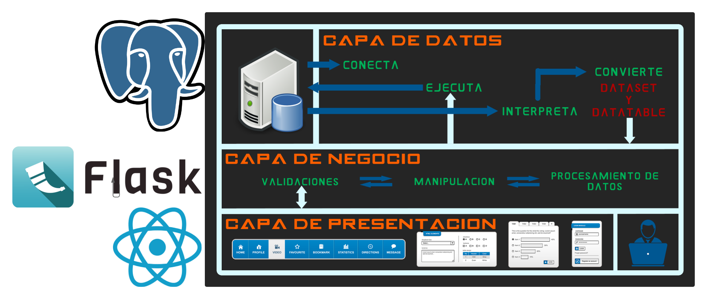

# 8.3. Stack Tecnológico Elegido
## BACKEND
### FLASK
  Flask es un microframework web para Python, conocido por su simplicidad y flexibilidad. Permite desarrollar aplicaciones web rápidamente sin la sobrecarga de un framework completo, lo que lo hace ideal para proyectos ligeros o prototipos. Flask proporciona las herramientas básicas necesarias para manejar solicitudes HTTP, rutas, y plantillas, pero también permite la integración de otras bibliotecas para agregar funcionalidades adicionales según las necesidades del proyecto.

  Motivo de elección: Se eligió debido a su simplicidad, flexibilidad y facilidad de uso.

[DOCUMENTACIÓN FLASK](https://flask-es.readthedocs.io/)
## FRONTEND
### REACT
  React es una biblioteca de JavaScript para construir interfaces de usuario, desarrollada por Meta (anteriormente Facebook). Permite crear aplicaciones web dinámicas y de alto rendimiento, especialmente adecuadas para interfaces de usuario interactivas y SPA (aplicaciones de una sola página). React emplea un modelo de componentes que facilita la creación de interfaces reutilizables y un DOM virtual que optimiza el rendimiento al minimizar las actualizaciones del DOM real en el navegador.

### TAILWIND (CSS)
bla bla bla

  [DOCUMENTACIÓN REACT](https://es.react.dev/learn)
### VITE
Vite (palabra en francés para "rápido", pronunciado como /vit/, como "veet") es una herramienta de compilación que tiene como objetivo proporcionar una experiencia de desarrollo más rápida y ágil para proyectos web modernos. Consta de dos partes principales:

- Un servidor de desarrollo que proporciona mejoras enriquecidas de funcionalidades sobre módulos ES nativos, por ejemplo Hot Module Replacement (HMR) extremadamente rápido.

- Un comando de compilación que empaqueta tu código con Rollup, preconfigurado para generar recursos estáticos altamente optimizados para producción.
  
  Motivo de elección: Facilidad para el uso con react.
  
  [DOCUMENTACIÓN VITE](https://es.vite.dev/guide/)
  
## FRAMEWORK EXTRA
### TAAILWIND
Tailwind es un framework de CSS que, a diferencia de los tradicionales como Bootstrap, no crea componentes con una sola clase, sino que tiene algo llamado Utility Classes, que son clases específicas para casa cosa. Por ejemplo, una clase para los textos, otra clase para las sobras, una para el color, entre otros. 

  Motivo de elección: Facilidad y necesidad de UI en la implementación de los módulos.
  
[DOCUMENTACIÓN TAILWIND](https://tailwindcss.com/docs/guides/create-react-app)

## MOTOR DE BASE DE DATOS
### PostgreSQL
  PostgreSQL: PostgreSQL es un sistema de gestión de bases de datos relacional y de código abierto, conocido por su robustez, extensibilidad y cumplimiento con los estándares SQL. Soporta transacciones ACID (Atomicidad, Consistencia, Aislamiento, Durabilidad) y permite el uso de datos estructurados y no estructurados. Además, PostgreSQL tiene capacidades avanzadas como JSON, XML, y búsquedas de texto completo, lo que lo hace ideal para aplicaciones complejas y de alta carga.

  Motivo de elección: Mayor conocimiento y experiencia que Oracle, la otra opción del curso.
 
[DOCUMENTACIÓN POSTGRESQL](https://www.postgresql.org/docs/)

## DIAGRAMA DE INTERACCIÓN

Sample content for section 8.3.
