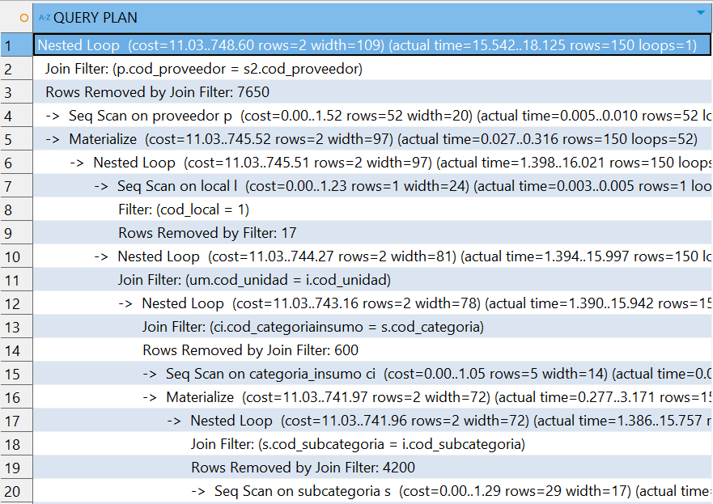

# 9.1. Índices

# Módulo 2

CONSULTA: Permite visualizar los items de producto de un Pedido de Mesa
```sql
SELECT idp.cod_item_dp, idp.cod_dp,pf.nombre_producto , 
	idp.cantidad , idp.precio, dp.cod_im,dp.cod_mesa num_mesa,
	e.primer_apellido || ' ' || SUBSTRING(e.segundo_apellido FROM 1 FOR 1) || '. ' || 
	e.primer_nombre mesero, 
	SUM(idp.precio) OVER (PARTITION BY idp.cod_dp) AS TOTAL
	--  Suma de precios de todas las filas que contengan el mismo "cod_dp"
FROM ITEM_DETALLE_PEDIDO idp
LEFT JOIN Producto_Friday pf
on idp.cod_prodfriday = pf.cod_prodfriday
LEFT JOIN DETALLE_PEDIDO dp
on dp.cod_dp = idp.cod_dp
LEFT JOIN IDENTIFICACION_MESERO im 
ON dp.cod_im = im.cod_im
LEFT JOIN Empleado e 
ON im.Codigo_empleado = e.Codigo_empleado
WHERE idp.cod_dp = 'DP25'
```

Análisis del Costo sin índice
```sql
EXPLAIN ANALYZE SELECT idp.cod_item_dp, idp.cod_dp, pf.nombre_producto, 
                        idp.cantidad, idp.precio, dp.cod_im, dp.cod_mesa num_mesa,
                        e.primer_apellido || ' ' || SUBSTRING(e.segundo_apellido FROM 1 FOR 1) || '. ' || 
                        e.primer_nombre mesero, 
                        SUM(idp.precio) OVER (PARTITION BY idp.cod_dp) AS TOTAL
FROM ITEM_DETALLE_PEDIDO idp
LEFT JOIN Producto_Friday pf
  ON idp.cod_prodfriday = pf.cod_prodfriday
LEFT JOIN DETALLE_PEDIDO dp
  ON dp.cod_dp = idp.cod_dp
LEFT JOIN IDENTIFICACION_MESERO im 
  ON dp.cod_im = im.cod_im
LEFT JOIN Empleado e 
  ON im.Codigo_empleado = e.Codigo_empleado
WHERE idp.cod_dp = 'DP25';
```

Resultado:


Aplicando índice
CREATE INDEX idx_cod_dp ON ITEM_DETALLE_PEDIDO (cod_dp);

Análisis del Costo con índice
```sql
EXPLAIN ANALYZE SELECT idp.cod_item_dp, idp.cod_dp, pf.nombre_producto, 
                        idp.cantidad, idp.precio, dp.cod_im, dp.cod_mesa num_mesa,
                        e.primer_apellido || ' ' || SUBSTRING(e.segundo_apellido FROM 1 FOR 1) || '. ' || 
                        e.primer_nombre mesero, 
                        SUM(idp.precio) OVER (PARTITION BY idp.cod_dp) AS TOTAL
FROM ITEM_DETALLE_PEDIDO idp
LEFT JOIN Producto_Friday pf
  ON idp.cod_prodfriday = pf.cod_prodfriday
LEFT JOIN DETALLE_PEDIDO dp
  ON dp.cod_dp = idp.cod_dp
LEFT JOIN IDENTIFICACION_MESERO im 
  ON dp.cod_im = im.cod_im
LEFT JOIN Empleado e 
  ON im.Codigo_empleado = e.Codigo_empleado
WHERE idp.cod_dp = 'DP25';
```
Resultado:


# Módulo 4
Consulta a realizar: Busqueda de personales con horario disponible para asignación de turno.
```sql
SELECT 
	e.DNI,
	e.Primer_apellido
FROM 
	Empleado e
JOIN 
	Horario_libre hl ON e.Codigo_empleado = hl.Codigo_empleado
JOIN 
	Horario_libre_Dias hld ON hl.Cod_horario = hld.Cod_horario
JOIN 
	Turno t ON t.Cod_turno = (SELECT cod_turno FROM TURNO WHERE nombre_turno='Mañana')
JOIN 
	Cargo c ON e.Cod_cargo = c.Cod_cargo
WHERE 
	hld.Dias = 'Viernes' AND                     
	c.Nombre_cargo = 'COCINERO' AND              
	hl.Hora_inicio <= t.Hora_inicio AND      
	hl.Hora_fin >= t.Hora_fin;
```
Análisis sin indices:
```sql
## Análisis sin indices
"Nested Loop  (cost=27.50..63.83 rows=1 width=16) (actual time=0.137..0.263 rows=1 loops=1)"
"  InitPlan 1 (returns $0)"
"    ->  Seq Scan on turno  (cost=0.00..16.12 rows=2 width=4) (actual time=0.010..0.010 rows=1 loops=1)"
"          Filter: ((nombre_turno)::text = 'Mañana'::text)"
"          Rows Removed by Filter: 1"
"  ->  Nested Loop  (cost=11.22..45.75 rows=9 width=20) (actual time=0.110..0.250 rows=6 loops=1)"
"        ->  Nested Loop  (cost=10.94..42.02 rows=9 width=4) (actual time=0.103..0.233 rows=6 loops=1)"
"              Join Filter: ((hl.hora_inicio <= t.hora_inicio) AND (hl.hora_fin >= t.hora_fin))"
"              Rows Removed by Join Filter: 71"
"              ->  Index Scan using turno_pkey on turno t  (cost=0.15..8.17 rows=1 width=16) (actual time=0.020..0.021 rows=1 loops=1)"
"                    Index Cond: (cod_turno = $0)"
"              ->  Hash Join  (cost=10.80..32.70 rows=77 width=20) (actual time=0.067..0.207 rows=77 loops=1)"
"                    Hash Cond: (hl.cod_horario = hld.cod_horario)"
"                    ->  Seq Scan on horario_libre hl  (cost=0.00..19.00 rows=1100 width=24) (actual time=0.007..0.064 rows=1100 loops=1)"
"                    ->  Hash  (cost=9.83..9.83 rows=77 width=4) (actual time=0.051..0.051 rows=77 loops=1)"
"                          Buckets: 1024  Batches: 1  Memory Usage: 11kB"
"                          ->  Bitmap Heap Scan on horario_libre_dias hld  (cost=4.87..9.83 rows=77 width=4) (actual time=0.028..0.041 rows=77 loops=1)"
"                                Recheck Cond: ((dias)::text = 'Viernes'::text)"
"                                Heap Blocks: exact=4"
"                                ->  Bitmap Index Scan on horario_libre_dias_pkey  (cost=0.00..4.85 rows=77 width=0) (actual time=0.023..0.023 rows=77 loops=1)"
"                                      Index Cond: ((dias)::text = 'Viernes'::text)"
"        ->  Index Scan using empleado_pkey on empleado e  (cost=0.28..0.41 rows=1 width=24) (actual time=0.002..0.002 rows=1 loops=6)"
"              Index Cond: (codigo_empleado = hl.codigo_empleado)"
"  ->  Index Scan using cargo_pkey on cargo c  (cost=0.15..0.21 rows=1 width=4) (actual time=0.002..0.002 rows=0 loops=6)"
"        Index Cond: (cod_cargo = e.cod_cargo)"
"        Filter: ((nombre_cargo)::text = 'COCINERO'::text)"
"        Rows Removed by Filter: 1"
"Planning Time: 0.451 ms"
"Execution Time: 0.718 ms"

```

# Módulo 5
Consulta a realizar:


```sql
SELECT ci.Nombre_categoriainsumo, 
       s.Nombre_subcategoria, 
       i.Nombre_Insumo, 
       um.Nombre_unidad, 
       s2.Cantidad, 
       ta.Nombre_tipo_almacen, 
       a.Cod_almacen, 
       l.Nombre_local, 
       s2.Fecha_vencimiento, 
       p.Nombre_empresa, 
       s2.Cod_stock
FROM Insumo i 
INNER JOIN Subcategoria s ON s.Cod_subcategoria = i.Cod_subcategoria  -- Subcategoria debe ser primero
INNER JOIN Categoria_insumo ci ON ci.Cod_categoriainsumo = s.Cod_categoria  -- Relacionar Subcategoria con Categoria
INNER JOIN Unidad_medidad um ON um.Cod_unidad = i.Cod_unidad 
INNER JOIN Stock s2 ON i.Cod_insumo = s2.Cod_insumo
INNER JOIN Almacen a ON a.Cod_almacen = s2.Cod_almacen
INNER JOIN "local" l ON l.Cod_local = a.Cod_local
INNER JOIN Tipo_almacen ta ON ta.Cod_tipo_almacen = a.Cod_almacen
INNER JOIN Proveedor p ON p.Cod_proveedor = s2.Cod_proveedor
WHERE l.Cod_local = 1
AND i.Nombre_Insumo ilike COALESCE('onion' || '%')
```

Ejecución sin Indice:
```sql
explain analyze
SELECT ci.Nombre_categoriainsumo, 
       s.Nombre_subcategoria, 
       i.Nombre_Insumo, 
       um.Nombre_unidad, 
       s2.Cantidad, 
       ta.Nombre_tipo_almacen, 
       a.Cod_almacen, 
       l.Nombre_local, 
       s2.Fecha_vencimiento, 
       p.Nombre_empresa, 
       s2.Cod_stock
FROM Insumo i 
INNER JOIN Subcategoria s ON s.Cod_subcategoria = i.Cod_subcategoria  -- Subcategoria debe ser primero
INNER JOIN Categoria_insumo ci ON ci.Cod_categoriainsumo = s.Cod_categoria  -- Relacionar Subcategoria con Categoria
INNER JOIN Unidad_medidad um ON um.Cod_unidad = i.Cod_unidad 
INNER JOIN Stock s2 ON i.Cod_insumo = s2.Cod_insumo
INNER JOIN Almacen a ON a.Cod_almacen = s2.Cod_almacen
INNER JOIN "local" l ON l.Cod_local = a.Cod_local
INNER JOIN Tipo_almacen ta ON ta.Cod_tipo_almacen = a.Cod_almacen
INNER JOIN Proveedor p ON p.Cod_proveedor = s2.Cod_proveedor
WHERE l.Cod_local = 1
AND i.Nombre_Insumo ilike COALESCE('onion' || '%')
```

Resultado:


Creación del índice:

```sql
CREATE INDEX IDX_nombre_insumo_trgm ON insumo USING gin (nombre_insumo gin_trgm_ops);
```

Ejecución con índice:

```sql
explain analyze
SELECT ci.Nombre_categoriainsumo, 
       s.Nombre_subcategoria, 
       i.Nombre_Insumo, 
       um.Nombre_unidad, 
       s2.Cantidad, 
       ta.Nombre_tipo_almacen, 
       a.Cod_almacen, 
       l.Nombre_local, 
       s2.Fecha_vencimiento, 
       p.Nombre_empresa, 
       s2.Cod_stock
FROM Insumo i 
INNER JOIN Subcategoria s ON s.Cod_subcategoria = i.Cod_subcategoria  -- Subcategoria debe ser primero
INNER JOIN Categoria_insumo ci ON ci.Cod_categoriainsumo = s.Cod_categoria  -- Relacionar Subcategoria con Categoria
INNER JOIN Unidad_medidad um ON um.Cod_unidad = i.Cod_unidad 
INNER JOIN Stock s2 ON i.Cod_insumo = s2.Cod_insumo
INNER JOIN Almacen a ON a.Cod_almacen = s2.Cod_almacen
INNER JOIN "local" l ON l.Cod_local = a.Cod_local
INNER JOIN Tipo_almacen ta ON ta.Cod_tipo_almacen = a.Cod_almacen
INNER JOIN Proveedor p ON p.Cod_proveedor = s2.Cod_proveedor
WHERE l.Cod_local = 1
AND i.Nombre_Insumo ilike COALESCE('onion' || '%')
```

Resultado:




Consulta a realizar:


```sql
select oc.cod_ordencompra ,p.nombre_empresa, pi2.nombre_proceso from orden_compra oc 
inner join proveedor p on p.cod_proveedor = oc.cod_proveedor 
inner join proceso_ingreso pi2 on pi2.cod_proceso = oc.cod_proceso 
inner join empleado e on e.codigo_empleado = oc.codigo_empleado 
where e.cod_local = (select e2.cod_local from empleado e2  where e2.codigo_empleado=33)
and oc.fecha_requeridaentrega = current_date
order by pi2.cod_proceso asc;
```

Ejecución sin Indice:
```sql
explain analyze
select oc.cod_ordencompra ,p.nombre_empresa, pi2.nombre_proceso from orden_compra oc 
inner join proveedor p on p.cod_proveedor = oc.cod_proveedor 
inner join proceso_ingreso pi2 on pi2.cod_proceso = oc.cod_proceso 
inner join empleado e on e.codigo_empleado = oc.codigo_empleado 
where e.cod_local = (select e2.cod_local from empleado e2  where e2.codigo_empleado=33)
and oc.fecha_requeridaentrega = current_date
order by pi2.cod_proceso asc;
```

Resultado:


Creación del índice:

```sql
CREATE INDEX idx_empleado_codigo_local ON empleado (codigo_empleado, cod_local);
CREATE INDEX idx_ordencompra_fecha_requerida ON orden_compra (fecha_requeridaentrega);
```

Ejecución con índice:

```sql
explain analyze
select oc.cod_ordencompra ,p.nombre_empresa, pi2.nombre_proceso from orden_compra oc 
inner join proveedor p on p.cod_proveedor = oc.cod_proveedor 
inner join proceso_ingreso pi2 on pi2.cod_proceso = oc.cod_proceso 
inner join empleado e on e.codigo_empleado = oc.codigo_empleado 
where e.cod_local = (select e2.cod_local from empleado e2  where e2.codigo_empleado=33)
and oc.fecha_requeridaentrega = current_date
order by pi2.cod_proceso asc;
```

Resultado:


Sample content for section 9.1.
