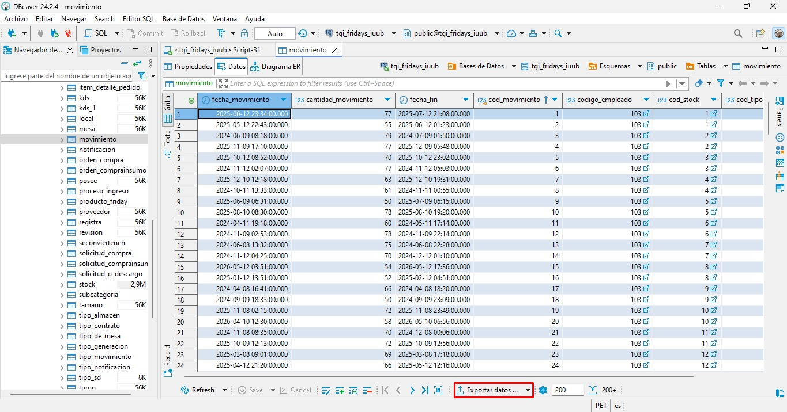
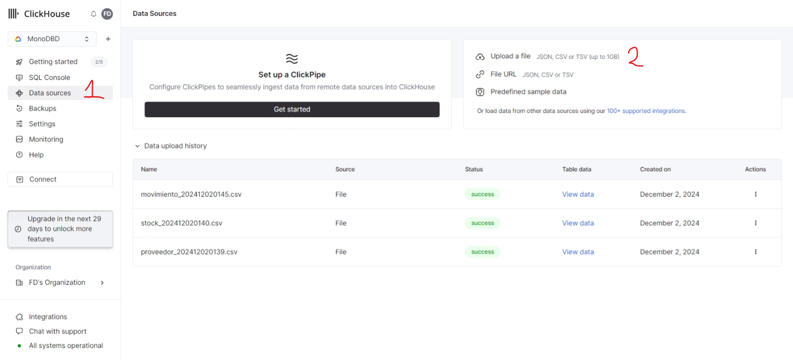
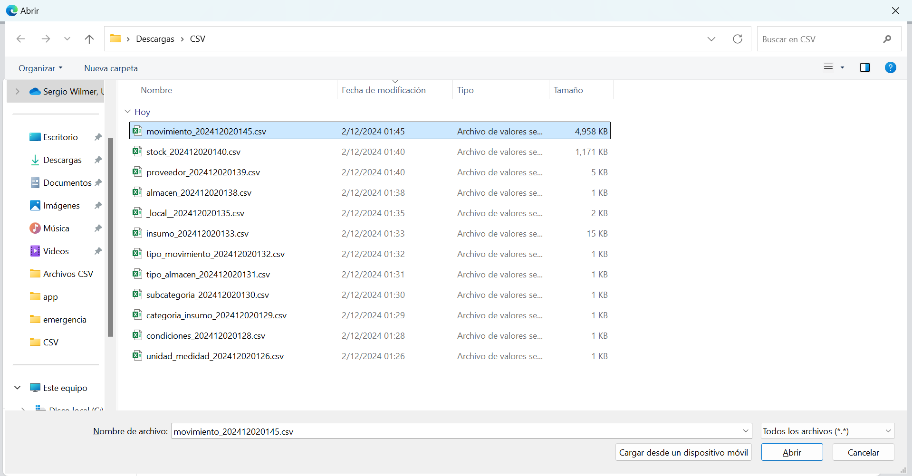
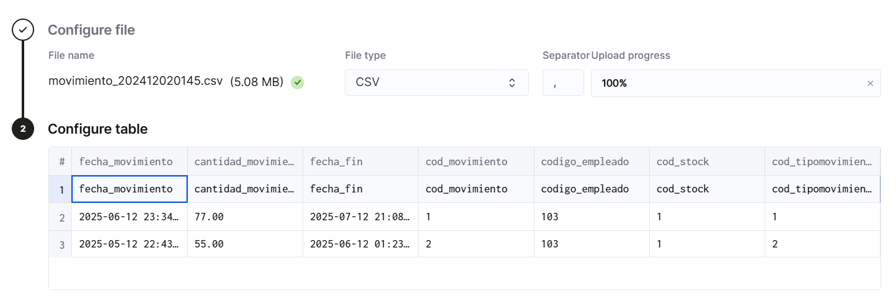
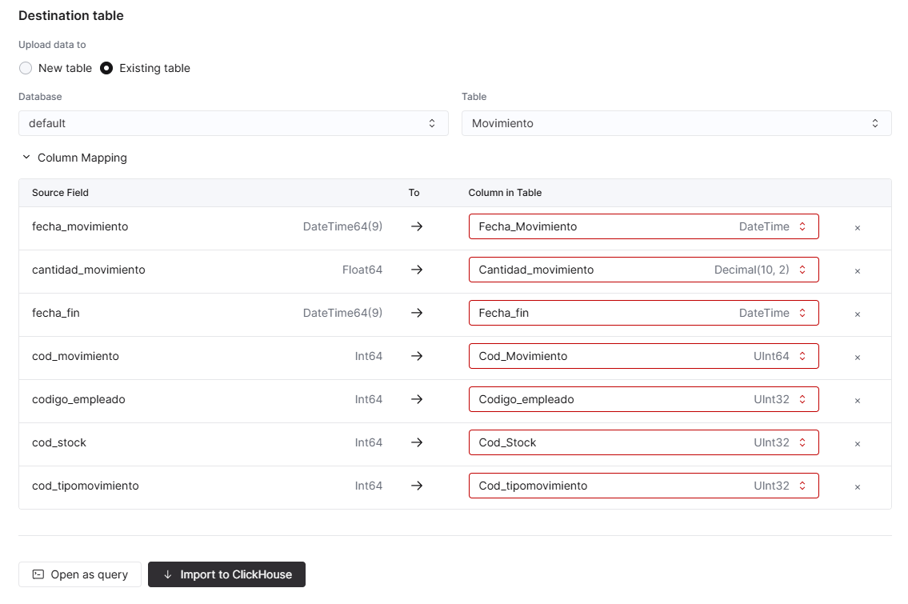
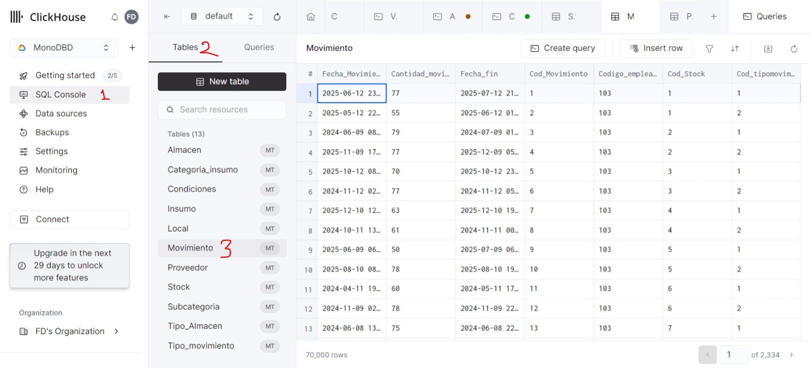
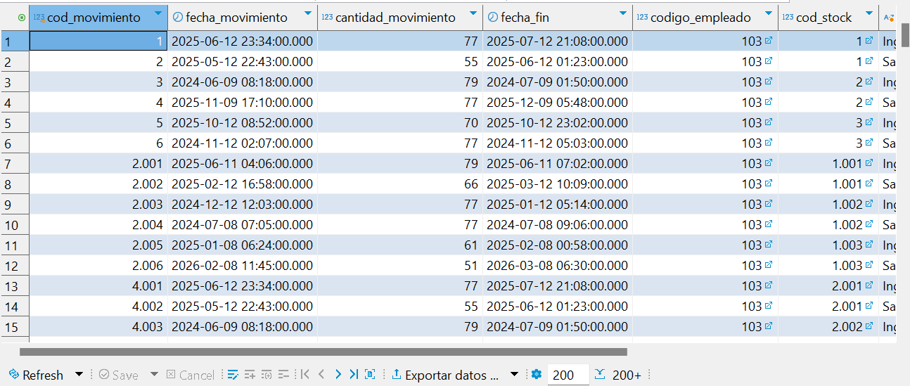
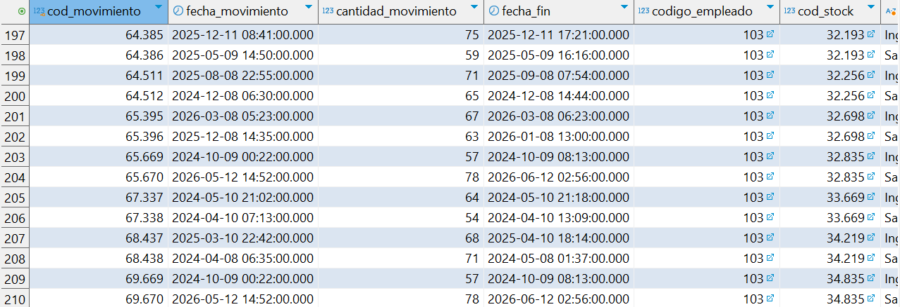
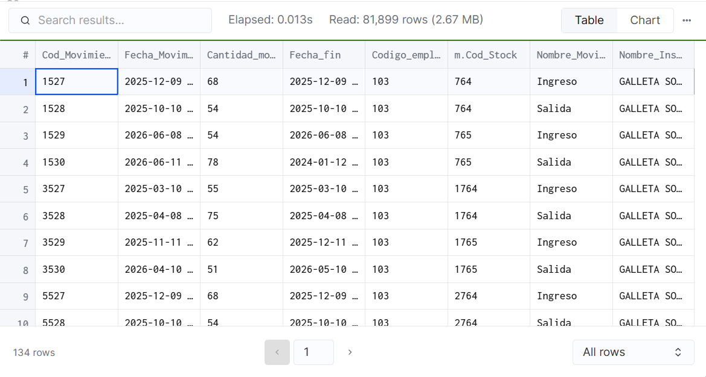

# Implementación

## Creación de tablas

### Consideraciones al crear las tablas:

1. Eliminación del tipo SERIAL: Se reemplazó el tipo de dato por UInt32 o UInt64. UInt32 se usó para las lookup tables o tablas "pequeñas" como los locales o insumos, mientras que UInt64 se usó para las entidades "Movimiento" y "Stock" que son las que tienen más registros.
2. Eliminación de PRIMARY KEY: En ClickHouse no se tiene que asegurar la unicidad.
3. Eliminación del tipo VARCHAR: Se reemplazó el tipo de dato por String, ClickHouse no usa longitudes fijas ni limitadas a diferencia de VARCHAR.
4. Eliminación de restricciones NOT NULL: ClickHouse no valida restricciones NOT NULL.
5. Eliminación de FOREIGN KEY: ClickHouse no soporta integridad referenciales, las relaciones entre tablas se manejan en la consulta.

### Código para crear las tablas:

```sql
DROP TABLE IF EXISTS Unidad_medidad;

DROP TABLE IF EXISTS Condiciones;

DROP TABLE IF EXISTS Categoria_insumo;

DROP TABLE IF EXISTS Subcategoria;

DROP TABLE IF EXISTS Insumo;

DROP TABLE IF EXISTS Tipo_Almacen;

DROP TABLE IF EXISTS "Local";

DROP TABLE IF EXISTS Almacen;

DROP TABLE IF EXISTS Proveedor;

DROP TABLE IF EXISTS Stock;

DROP TABLE IF EXISTS Tipo_movimiento;

DROP TABLE IF EXISTS Movimiento;


CREATE TABLE Unidad_medidad (
    Cod_unidad UInt32,
    Nombre_unidad String
) 
ENGINE = MergeTree()
ORDER BY Cod_unidad;

CREATE TABLE Condiciones (
    Cod_condiciones UInt32,
    Nombre_condiciones String
) 
ENGINE = MergeTree()
ORDER BY Cod_condiciones;

CREATE TABLE Categoria_insumo (
    Cod_categoriainsumo UInt32,
    Nombre_categoriainsumo String
) 
ENGINE = MergeTree()
ORDER BY Cod_categoriainsumo;

CREATE TABLE Subcategoria (
    Cod_subcategoria UInt32,
    Nombre_subcategoria String,
    Cod_categoria UInt32
) 
ENGINE = MergeTree()
ORDER BY Cod_subcategoria;

CREATE TABLE Insumo (
    Cod_Insumo UInt32,
    Nombre_Insumo String,
    Cod_unidad UInt32,
    Cod_condiciones UInt32,
    Cod_subcategoria UInt32
) 
ENGINE = MergeTree()
ORDER BY Cod_Insumo;


CREATE TABLE Tipo_Almacen (
    Cod_tipo_almacen UInt32,
    Nombre_tipo_almacen String
) 
ENGINE = MergeTree()
ORDER BY Cod_tipo_almacen;

CREATE TABLE "Local" (
    Cod_local UInt32,
    Ubicacion_local String, 
    Nombre_local String
)
ENGINE = MergeTree()
ORDER BY Cod_local;    

CREATE TABLE Almacen (
    Cod_Almacen UInt32,
    Cod_tipo_almacen UInt32,
    Cod_local UInt32
) 
ENGINE = MergeTree()
ORDER BY Cod_Almacen;


CREATE TABLE Proveedor (
    Cod_Proveedor UInt32,
    Nombre_Empresa String,
    RUC String,
    Direccion_Proveedor String,
    Correo_Proveedor String
) 
ENGINE = MergeTree()
ORDER BY Cod_Proveedor;


CREATE TABLE Stock (
    Fecha_Vencimiento Date,
    Cantidad Decimal(10, 2),
    Cod_Stock UInt64,
    Cod_Insumo UInt32,
    Cod_Proveedor UInt32,
    Cod_Almacen UInt32
) 
ENGINE = MergeTree()
ORDER BY (Cod_Insumo, Cod_Stock);


CREATE TABLE Tipo_movimiento (
    Cod_tipomovimiento UInt32,
    Nombre_tipomovimiento String
) 
ENGINE = MergeTree()
ORDER BY Cod_tipomovimiento;

CREATE TABLE Movimiento (
    Cod_Movimiento UInt64,
    Fecha_Movimiento DateTime,
    Cantidad_movimiento Decimal(10, 2),
    Fecha_fin DateTime,
    Codigo_empleado UInt32,
    Cod_Stock UInt32,
    Cod_tipomovimiento UInt32
) 
ENGINE = MergeTree()
ORDER BY (Cod_Stock, Cod_tipomovimiento, Cod_Movimiento);
```

Borrar datos de tablas:

```sql
TRUNCATE TABLE IF EXISTS Unidad_medidad;

TRUNCATE TABLE IF EXISTS Condiciones;

TRUNCATE TABLE IF EXISTS Categoria_insumo;

TRUNCATE TABLE IF EXISTS Subcategoria;

TRUNCATE TABLE IF EXISTS Insumo;

TRUNCATE TABLE IF EXISTS Tipo_Almacen;

TRUNCATE TABLE IF EXISTS Almacen;

TRUNCATE TABLE IF EXISTS Proveedor;

TRUNCATE TABLE IF EXISTS Stock;

TRUNCATE TABLE IF EXISTS Tipo_movimiento;

TRUNCATE TABLE IF EXISTS "Local";

TRUNCATE TABLE IF EXISTS Movimiento;
```

## Carga de datos
La inserción de datos se realizó mediante la importación de datos en archivos CSV, los cuales se obtuvieron con la opción "Exportar datos" que ofrece DBeaver:



En ClickHouse Cloud se seleccionó la opción "Data sources" y luego la opción "Upload a file":



Al seleccionar "Upload a file" se abre el explorador de archivos y se tiene que seleccionar el archivo .csv del que se van a importar los datos. En este caso de importará el archivo csv generado al exportar los datos de la entidad "Movimiento" de DBeaver:



Luego de seleccionarlo se configura el separador, en nuestro caso es una coma ",":



Luego se selecciona si es una tabla nueva o existente, en nuestro caso la tabla fue creada anteriormente en ClickHouse. Como la tabla es existente se verifica que los datos se inserten correctamente en las columnas, en nuestro caso estuvo bien por defecto por lo que no hubo necesidad de cambiarlo:



Finalmente, se selecciona la opción "Import to ClickHouse" y aparecerá un mensaje de confirmación en la esquina inferior derecha.
Para verificar la inserción vamos a "SQL Console", luego a "Tables" y seleccionamos "Movimiento" que fue la tabla a la que se insertó datos.



Este proceso de inserción de datos se realizó para cada una de las tablas creadas.


## Realizar operaciones

### Revisar historial de movimientos de almacén

Consulta en PostgreSQL:

```sql
SELECT
    m.Cod_Movimiento,
    m.Fecha_Movimiento,
    m.Cantidad_movimiento,
    m.Fecha_fin,
    m.Codigo_empleado,
    m.Cod_Stock,
    tm.Nombre_tipomovimiento AS Nombre_Movimiento,
    i.Nombre_Insumo AS Nombre_Insumo
FROM Movimiento m
JOIN Stock s
    ON m.Cod_Stock = s.Cod_Stock
JOIN Tipo_movimiento tm
    ON m.Cod_tipomovimiento = tm.Cod_tipomovimiento
JOIN Insumo i
    ON s.Cod_Insumo = i.Cod_Insumo
WHERE s.Cod_Insumo = 1;
```

Creación del índice para optimizar consulta:

```sql
CREATE INDEX idx_stock_cod_insumo ON Stock (Cod_Insumo);
```

Resultados:




El resultado fueron 210 filas.

Usando "explain analyze" para ver el plan de ejecución:

```sql
Nested Loop  (cost=128.55..1789.43 rows=325 width=60) (actual time=0.571..37.602 rows=278 loops=1)
  ->  Index Scan using insumo_pkey on insumo i  (cost=0.27..2.49 rows=1 width=24) (actual time=0.009..0.011 rows=1 loops=1)
        Index Cond: (cod_insumo = 395)
  ->  Hash Join  (cost=128.27..1783.69 rows=325 width=44) (actual time=0.560..30.513 rows=278 loops=1)
        Hash Cond: (m.cod_tipomovimiento = tm.cod_tipomovimiento)
        ->  Hash Join  (cost=127.23..1779.99 rows=325 width=41) (actual time=0.547..30.425 rows=278 loops=1)
              Hash Cond: (m.cod_stock = s.cod_stock)
              ->  Seq Scan on movimiento m  (cost=0.00..1448.20 rows=77920 width=37) (actual time=0.003..17.526 rows=70000 loops=1)
              ->  Hash  (cost=125.35..125.35 rows=150 width=8) (actual time=0.199..0.201 rows=144 loops=1)
                    Buckets: 1024  Batches: 1  Memory Usage: 14kB
                    ->  Bitmap Heap Scan on stock s  (cost=2.55..125.35 rows=150 width=8) (actual time=0.026..0.176 rows=144 loops=1)
                          Recheck Cond: (cod_insumo = 395)
                          Heap Blocks: exact=105
                          ->  Bitmap Index Scan on idx_stock_cod_insumo  (cost=0.00..2.52 rows=150 width=0) (actual time=0.011..0.011 rows=144 loops=1)
                                Index Cond: (cod_insumo = 395)
        ->  Hash  (cost=1.02..1.02 rows=2 width=11) (actual time=0.008..0.008 rows=2 loops=1)
              Buckets: 1024  Batches: 1  Memory Usage: 9kB
              ->  Seq Scan on tipo_movimiento tm  (cost=0.00..1.02 rows=2 width=11) (actual time=0.005..0.005 rows=2 loops=1)
Planning Time: 0.258 ms
Execution Time: 37.666 ms
```

Consulta en ClickHouse:

```sql
SELECT
    m.Cod_Movimiento,
    m.Fecha_Movimiento,
    m.Cantidad_movimiento,
    m.Fecha_fin,
    m.Codigo_empleado,
    m.Cod_Stock,
    tm.Nombre_tipomovimiento AS Nombre_Movimiento,
    i.Nombre_Insumo AS Nombre_Insumo
FROM Movimiento AS m
JOIN Stock AS s
    ON m.Cod_Stock = s.Cod_Stock
JOIN Tipo_movimiento AS tm
    ON m.Cod_tipomovimiento = tm.Cod_tipomovimiento
JOIN Insumo AS i
    ON s.Cod_Insumo = i.Cod_Insumo
WHERE s.Cod_Insumo = 1;

```

Resultado:



La consulta mostró 210 filas al igual que la consulta hecha en PostgreSQL, y el tiempo fue de 13ms, menor que el de PostgreSQL.

Usando "explain" para ver el plan de ejecución:

```sql
Expression ((Project names + (Projection + )))
Join (JOIN FillRightFirst)
Expression
Join (JOIN FillRightFirst)
Expression
Join (JOIN FillRightFirst)
Expression ((JOIN actions + Change column names to column identifiers))
ReadFromMergeTree (default.Movimiento)
Expression
ReadFromMergeTree (default.Stock)
Expression ((JOIN actions + Change column names to column identifiers))
ReadFromMergeTree (default.Tipo_movimiento)
Expression
ReadFromMergeTree (default.Insumo)
```